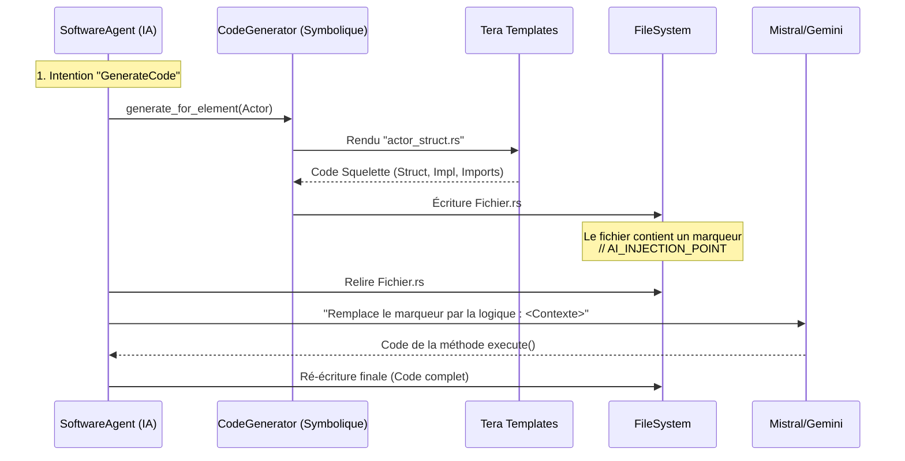

# Module `code_generator` — Usine Logicielle Hybride

## 🎯 Vue d'ensemble

Le module `code_generator` est le moteur de production de code source multi-langage de RAISE. Il permet de transformer automatiquement les modèles d'architecture (Arcadia/Capella) stockés dans la `json_db` en implémentations concrètes.

Il constitue le pont critique entre la **modélisation formelle MBSE** et l'**implémentation technique réelle**.

### Philosophie : Le "Sandwich Neuro-Symbolique"

Contrairement aux générateurs classiques (trop rigides) ou aux LLMs purs (trop hallucinatoires), RAISE utilise une approche hybride en deux passes :

1.  **Passe Symbolique (Squelette)** : Un moteur de templates déterministe (`Tera`) génère une structure de code garantie sans erreur de compilation (Imports, Classes, Types, Signatures).
2.  **Passe Neuronale (Chair)** : L'IA (via `SoftwareAgent`) repasse sur le fichier pour injecter la logique métier intelligente aux points d'extension prévus.

<!-- end list -->



---

## 🏗️ Architecture du Module

L'architecture est modulaire pour supporter l'extension progressive vers de nouveaux langages (Logiciels et Matériels).

```
code_generator/
├── mod.rs                           # Façade (CodeGeneratorService)
├── generators/                      # Implémentations par langage
│   ├── mod.rs                       # Trait `LanguageGenerator`
│   ├── rust_gen.rs                  # [Actif] Générateur Rust (Structs/Impls)
│   ├── typescript_gen.rs            # [Prévu] Générateur React/TS
│   ├── python_gen.rs                # [Prévu] Générateur Python (Pydantic)
│   ├── vhdl_gen.rs                  # [Prévu] Générateur Hardware
│   └── verilog_gen.rs               # [Prévu] Générateur Hardware
├── templates/                       # Moteur de Templates
│   ├── mod.rs
│   └── *.tera                       # Fichiers templates (Squelettes)
└── analyzers/                       # Analyse Statique (AST)
    ├── mod.rs
    └── rust_analyzer.rs             # Pour préserver le code existant lors des mises à jour
```

---

## 🛠️ Stack Technique

Le module repose sur des bibliothèques Rust robustes pour garantir performance et sécurité.

### Cœur (Implémenté)

- **`tera`** : Moteur de template (équivalent Jinja2) pour la génération de squelettes sûrs et maintenables.
- **`serde`** : Sérialisation/désérialisation universelle des modèles JSON-DB.
- **`anyhow`** : Gestion robuste des erreurs et du contexte.

### Avancé (Roadmap)

- **`syn` / `quote`** : Manipulation de l'AST Rust (pour modifier du code existant sans casser la syntaxe).
- **`swc`** : Parser TypeScript haute performance.
- **`tree-sitter`** : Parsing multi-langage générique pour l'analyse d'impact.
- **`rayon`** : Parallélisation de la génération pour les gros projets.

---

## 🚀 Utilisation

Ce module est conçu pour être piloté par le module `ai` (`SoftwareAgent`), mais peut être utilisé en standalone pour du scaffolding.

### Via le CLI (Mode Hybride)

```bash
# 1. Créer l'objet en base (Modélisation)
cargo run -p ai_cli -- classify "Crée un acteur Moteur" -x

# 2. Générer le code (Implémentation)
cargo run -p ai_cli -- classify "Génère le code Rust pour Moteur.rs. Contexte: Il doit gérer la surchauffe." -x
```

### Via le Code (Rust)

```rust
let service = CodeGeneratorService::new(path);
// Génère le squelette garanti sans erreur de syntaxe
let files = service.generate_for_element(&actor_json, TargetLanguage::Rust)?;
```

---

## 📏 Références et Standards

RAISE vise la conformité avec les standards industriels pour le code généré, afin d'assurer son intégration dans des chaînes critiques.

### Standards de code visés

- **Rust** : `rustfmt`, `clippy`, conformité Rust 2021.
- **TypeScript** : ESLint, Prettier, TSDoc.
- **Hardware** : IEEE 1076-2008 (VHDL), IEEE 1800-2017 (SystemVerilog).

### Méthodologies

- **MBSE** : Alignement strict avec la méthodologie Arcadia (Capella).
- **Traçabilité** : Le code généré contient des headers avec les UUIDs du modèle (Prêt pour **ISO 26262** / **DO-178C**).
- **MDA** : Approche Model-Driven Architecture conforme OMG.

---

## 📊 État d'avancement (v0.1.0)

| Composant           | Statut     | Description                                                         |
| :------------------ | :--------- | :------------------------------------------------------------------ |
| **Moteur Tera**     | ✅ Stable  | Intégration réussie, templates fonctionnels.                        |
| **Générateur Rust** | ✅ Actif   | Génère des structs propres avec `serde`.                            |
| **Injection IA**    | ✅ Actif   | Le `SoftwareAgent` remplit intelligemment les `AI_INJECTION_POINT`. |
| **Analyse AST**     | ⚠️ Partiel | Détection basique des marqueurs, pas encore de parsing complet.     |
| **Multi-Langage**   | ❌ Prévu   | TypeScript et Python sont les prochains sur la liste.               |
| **Hardware Gen**    | ❌ Prévu   | Génération VHDL/Verilog pour FPGA.                                  |

---

**Document version:** 1.1 (Fusion Architecture & Implémentation)
