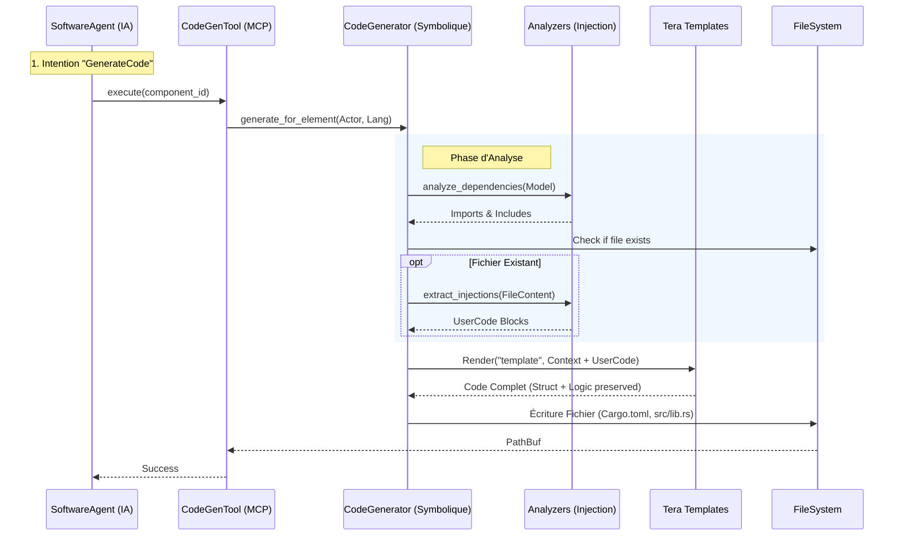

# Module `code_generator` — Usine Logicielle Hybride

## 🎯 Vue d'ensemble

Le module `code_generator` est le moteur de production de code source multi-langage de RAISE. Il permet de transformer automatiquement les modèles d'architecture (Arcadia/Capella) stockés dans la `json_db` en implémentations concrètes.

Il constitue le pont critique entre la **modélisation formelle MBSE** et l'**implémentation technique réelle**, orchestré par le `CodeGenTool` des agents IA.

### Philosophie : Le "Sandwich Neuro-Symbolique"

Contrairement aux générateurs classiques (trop rigides) ou aux LLMs purs (trop hallucinatoires), RAISE utilise une approche hybride en deux passes :

1.  **Passe Symbolique (Squelette & Préservation)** : Un moteur de templates déterministe (`Tera`) génère une structure de code garantie sans erreur de compilation, tout en préservant le code existant grâce à une analyse syntaxique fine.
2.  **Passe Neuronale (Chair)** : L'IA (via `SoftwareAgent`) repasse sur le fichier pour injecter la logique métier intelligente aux points d'extension prévus.



### Standards de code visés

- **Software** :
- **Rust** : Mode **Crate** (Cargo.toml + lib.rs) ou Fichier unique. Conformité Rust 2021, `serde`.
- **C++** : C++17/20, séparation Header/Source (`.hpp`/`.cpp`), `pragma once`.
- **TypeScript** : ESLint, Prettier, TSDoc, Classes exportées.

- **Hardware** :
- **VHDL** : IEEE 1076 (Entity/Architecture), Typage fort.
- **Verilog** : IEEE 1364 (Modules standard), gestion `clk`/`rst`.

### Méthodologies

- **MBSE** : Alignement strict avec la méthodologie Arcadia (Capella).
- **Traçabilité** : Le code généré contient des headers avec les UUIDs du modèle.
- **Round-Trip** : Capacité à régénérer le code sans écraser la logique métier manuelle grâce aux balises `AI_INJECTION_POINT`.

---

## 🏗️ Architecture Interne

Le module est subdivisé en trois sous-systèmes spécialisés :

1. **`analyzers/`** : L'intelligence contextuelle.

- `DependencyAnalyzer` : Construit le graphe d'imports.
- `InjectionAnalyzer` : Extrait chirurgicalement le code utilisateur existant via Regex.

2. **`generators/`** : La stratégie par langage.

- Implémentations spécifiques (`RustGenerator`, `CppGenerator`...) du trait `LanguageGenerator`.

3. **`templates/`** : La couche de présentation.

- Moteur `Tera` avec filtres typographiques (`pascal_case`, `snake_case`) et modèles `.tera`.

---

```
code_generator/
├── mod.rs                           # Façade (CodeGeneratorService)
├── generators/                      # Implémentations par langage
│   ├── mod.rs                       # Factory & Trait `LanguageGenerator`
│   ├── rust_gen.rs                  # [Actif] Rust (Mode Crate & Legacy)
│   ├── cpp_gen.rs                   # [Actif] C++ (Header + Source)
│   ├── typescript_gen.rs            # [Actif] TypeScript
│   ├── vhdl_gen.rs                  # [Actif] VHDL
│   └── verilog_gen.rs               # [Actif] Verilog
├── templates/                       # Moteur de Templates
│   ├── mod.rs
│   └── *.tera                       # Fichiers templates (Squelettes)
└── analyzers/                       # Analyse Statique (AST)
    ├── mod.rs
    └── injection_analyzer.rs        # Moteur de Round-Trip Engineering

```

## 📊 État d'avancement (v1.0.0)

| Composant           | Statut    | Description                                                |
| ------------------- | --------- | ---------------------------------------------------------- |
| **Moteur Tera**     | ✅ Stable | Intégration réussie, filtres `heck` actifs.                |
| **Générateur Rust** | ✅ Actif  | Support complet **Crate** (Cargo.toml + src) et Legacy.    |
| **Générateur C++**  | ✅ Actif  | Support multi-fichiers (Header + Source).                  |
| **Générateur Web**  | ✅ Actif  | Support TypeScript/JavaScript.                             |
| **Hardware Gen**    | ✅ Actif  | Support Verilog et VHDL pour FPGA/ASIC.                    |
| **Analyse Graph**   | ✅ Actif  | Déduction automatique des `imports` Arcadia.               |
| **Round-Trip**      | ✅ Actif  | Préservation totale du code manuel (`AI_INJECTION_POINT`). |
| **Integration MCP** | ✅ Actif  | Piloté par `CodeGenTool` pour les Agents.                  |

## 🚀 Utilisation Rapide

```bash
# Lancer toute la suite de tests de génération
cargo test code_generator

# Note: En production, ce service est appelé via l'outil MCP `codegen_tool`
# par le SoftwareAgent, et non directement par le frontend.


```
