# Module `code_generator` — Usine Logicielle Hybride

## 🎯 Vue d'ensemble

Le module `code_generator` est le moteur de production de code source multi-langage de RAISE. Il permet de transformer automatiquement les modèles d'architecture (Arcadia/Capella) stockés dans la `json_db` en implémentations concrètes.

Il constitue le pont critique entre la **modélisation formelle MBSE** et l'**implémentation technique réelle**.

### Philosophie : Le "Sandwich Neuro-Symbolique"

Contrairement aux générateurs classiques (trop rigides) ou aux LLMs purs (trop hallucinatoires), RAISE utilise une approche hybride en deux passes :

1. **Passe Symbolique (Squelette & Préservation)** : Un moteur de templates déterministe (`Tera`) génère une structure de code garantie sans erreur de compilation, tout en préservant le code existant grâce à une analyse syntaxique fine.
2. **Passe Neuronale (Chair)** : L'IA (via `SoftwareAgent`) repasse sur le fichier pour injecter la logique métier intelligente aux points d'extension prévus.

```mermaid
sequenceDiagram
    participant Agent as SoftwareAgent (IA)
    participant Gen as CodeGenerator (Symbolique)
    participant Analyzer as Analyzers (Injection/Deps)
    participant Tpl as Tera Templates
    participant FS as FileSystem

    Note over Agent: 1. Intention "GenerateCode"
    Agent->>Gen: generate_for_element(Actor, Lang)

    rect rgb(240, 248, 255)
        Note right of Gen: Phase d'Analyse
        Gen->>Analyzer: analyze_dependencies(Model)
        Analyzer-->>Gen: Imports & Includes

        Gen->>FS: Check if file exists
        opt Fichier Existant
            Gen->>Analyzer: extract_injections(FileContent)
            Analyzer-->>Gen: UserCode Blocks
        end
    end

    Gen->>Tpl: Render("template", Context + UserCode)
    Tpl-->>Gen: Code Complet (Struct + Logic preserved)
    Gen->>FS: Écriture Fichier
    FS-->>Agent: PathBuf

```



### Standards de code visés

- **Software** :
- **Rust** : `rustfmt`, `clippy`, conformité Rust 2021, Sérialisation `Serde`.
- **C++** : C++17/20, séparation Header/Source (`.hpp`/`.cpp`), `pragma once`.
- **TypeScript** : ESLint, Prettier, TSDoc, Classes exportées.

- **Hardware** :
- **VHDL** : IEEE 1076 (Entity/Architecture), Typage fort.
- **Verilog** : IEEE 1364 (Modules standard), gestion `clk`/`rst`.

### Méthodologies

- **MBSE** : Alignement strict avec la méthodologie Arcadia (Capella).
- **Traçabilité** : Le code généré contient des headers avec les UUIDs du modèle (Prêt pour **ISO 26262** / **DO-178C**).
- **Round-Trip** : Capacité à régénérer le code sans écraser la logique métier manuelle ("Injection Points").

---

## 🏗️ Architecture Interne

Le module est subdivisé en trois sous-systèmes spécialisés :

1. **`analyzers/`** : L'intelligence contextuelle.

- `DependencyAnalyzer` : Construit le graphe d'imports.
- `InjectionAnalyzer` : Extrait chirurgicalement le code utilisateur existant via Regex.

2. **`generators/`** : La stratégie par langage.

- Implémentations spécifiques (`RustGenerator`, `CppGenerator`, `VerilogGenerator`...) du trait `LanguageGenerator`.

3. **`templates/`** : La couche de présentation.

- Moteur `Tera` avec filtres typographiques (`pascal_case`, `snake_case`) et modèles `.tera`.

---

```
code_generator/
├── mod.rs                           # Façade (CodeGeneratorService)
├── generators/                      # Implémentations par langage
│   ├── mod.rs                       # Trait `LanguageGenerator`
│   ├── rust_gen.rs                  # [Actif] Générateur Rust (Structs/Impls)
│   ├── typescript_gen.rs            # [Prévu] Générateur React/TS
│   ├── python_gen.rs                # [Prévu] Générateur Python (Pydantic)
│   ├── vhdl_gen.rs                  # [Prévu] Générateur Hardware
│   └── verilog_gen.rs               # [Prévu] Générateur Hardware
├── templates/                       # Moteur de Templates
│   ├── mod.rs
│   └── *.tera                       # Fichiers templates (Squelettes)
└── analyzers/                       # Analyse Statique (AST)
    ├── mod.rs
    └── rust_analyzer.rs             # Pour préserver le code existant lors des mises à jour
```

## 📊 État d'avancement (v1.0.0)

| Composant           | Statut    | Description                                                |
| ------------------- | --------- | ---------------------------------------------------------- |
| **Moteur Tera**     | ✅ Stable | Intégration réussie, filtres `heck` actifs.                |
| **Générateur Rust** | ✅ Actif  | Génère des structs propres avec `serde`.                   |
| **Générateur C++**  | ✅ Actif  | Support multi-fichiers (Header + Source).                  |
| **Générateur Web**  | ✅ Actif  | Support TypeScript/JavaScript.                             |
| **Hardware Gen**    | ✅ Actif  | Support Verilog et VHDL pour FPGA/ASIC.                    |
| **Analyse Graph**   | ✅ Actif  | Déduction automatique des `imports` Arcadia.               |
| **Round-Trip**      | ✅ Actif  | Préservation totale du code manuel (`AI_INJECTION_POINT`). |
| **API Tauri**       | ✅ Actif  | Commande `generate_source_code` exposée au frontend.       |

## 🚀 Utilisation Rapide

```bash
# Lancer toute la suite de tests de génération
cargo test code_generator

# Invocation depuis le frontend (Tauri)
invoke('generate_source_code', {
  language: 'cpp',
  model: { name: "FlightControl", id: "UUID..." }
})

```
