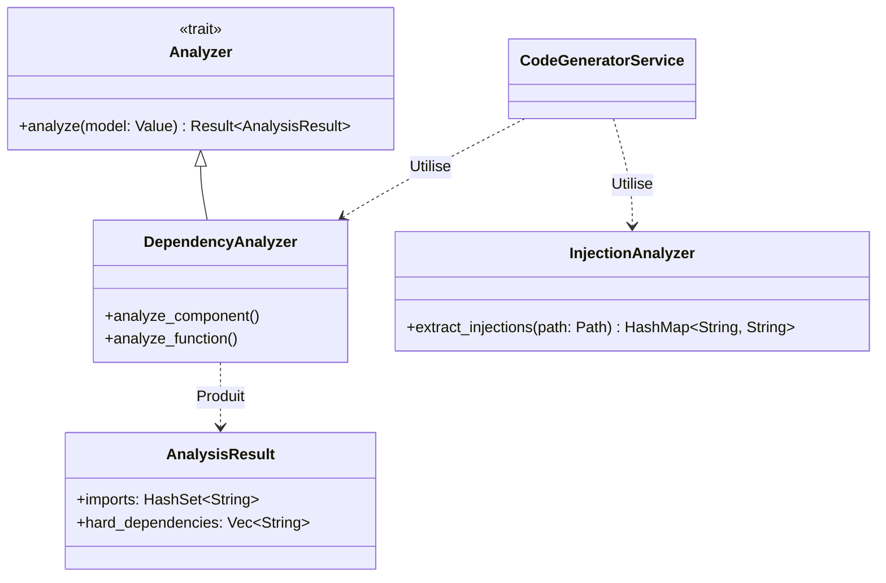
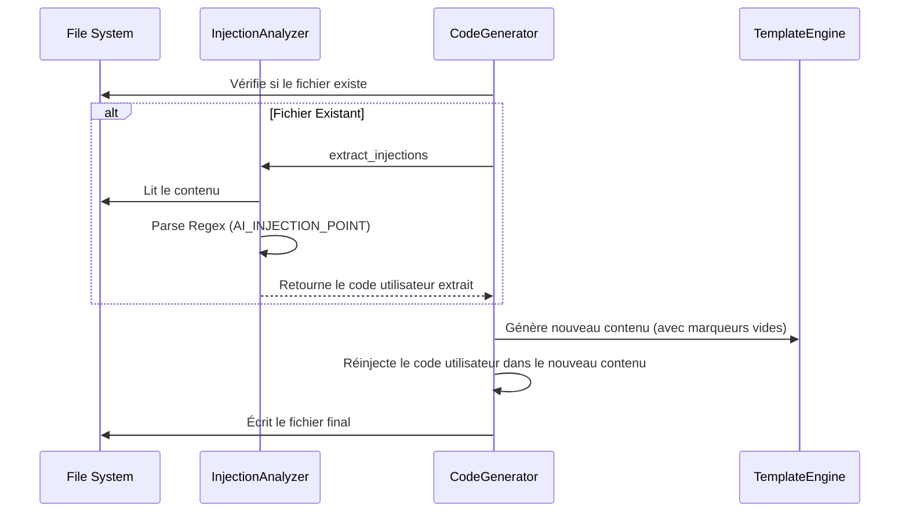

# Code Analyzers Module

Ce module apporte "l'intelligence" au processus de génération de code. Il ne se contente pas de traduire des templates ; il analyse le contexte (le modèle Arcadia et les fichiers existants) pour produire un code compilable et non-destructif.

## 🧠 Vue d'ensemble

Le module remplit deux fonctions critiques :

1. **Déduire les dépendances** : Comprendre qui a besoin de qui (pour les `import`, `#include`, etc.) en analysant le graphe Arcadia.
2. **Préserver le code humain** : Récupérer le code écrit manuellement par les développeurs dans les fichiers existants pour ne pas l'écraser lors de la régénération.

### Architecture



---

## 🔍 Dependency Analyzer

L'analyseur de dépendances (`dependency_analyzer.rs`) parcourt le modèle Arcadia (JSON/JSON-LD) pour traduire les relations sémantiques en instructions de compilation.

### Règles de Mappage

| Concept Arcadia | Relation JSON                 | Traduction Code                                   |
| --------------- | ----------------------------- | ------------------------------------------------- |
| **Composition** | `ownedLogicalComponents`      | Dépendance forte (ordre de build, instanciation). |
| **Allocation**  | `ownedFunctionalAllocation`   | `use crate::functions::...` ou `#include "..."`   |
| **Flux**        | `incomingFunctionalExchanges` | Import des gestionnaires d'échange.               |
| **Héritage**    | `base_class` / `implements`   | Import de la classe parente/interface.            |

### Exemple de Résultat

Pour un composant qui contient une fonction `Calculate` et un sous-composant `GPS` :

```rust
AnalysisResult {
    imports: ["crate::functions::Calculate", "crate::components::GPS"],
    hard_dependencies: ["GPS"] // GPS doit être défini avant
}

```

---

## 🛡️ Injection Analyzer (Preservation)

L'analyseur d'injection (`injection_analyzer.rs`) permet le **Round-Trip Engineering**. Il garantit que Raise est un outil collaboratif : l'IA génère la structure, l'humain écrit la logique métier, et Raise respecte cette logique lors des mises à jour.

### Workflow de Préservation



### Syntaxe des Marqueurs

Le système utilise des expressions régulières (Regex) pour détecter les blocs protégés, quel que soit le langage cible.

**Format supporté :**

```rust
// AI_INJECTION_POINT: [NomUniqueDuBloc]
    // Votre code manuel ici...
    // Il sera préservé pour toujours !
// END_AI_INJECTION_POINT

```

Compatible avec :

- `//` (Rust, C++, JS, TS, Java, Verilog)
- `--` (VHDL, SQL, Lua, Haskell)
- `#` (Python, Ruby, Shell, YAML)

---

## 🛠️ Utilisation dans le Service

Le `CodeGeneratorService` orchestre ces analyseurs automatiquement :

```rust
// 1. Analyse du modèle pour préparer les imports
let analysis = dep_analyzer.analyze(element)?;

// 2. Génération brute via Template
let mut file = generator.generate(element, &template_engine)?;

// 3. Récupération et Injection du code existant
if file_exists {
    let injections = InjectionAnalyzer::extract_injections(path)?;
    // Fusion intelligente...
}

```

## 🧪 Tests

Les tests unitaires couvrent :

- L'extraction correcte des dépendances complexes (imbrication Arcadia).
- La robustesse des Regex d'injection (espaces, sauts de ligne).
- L'extraction multilingue (Rust vs Python).

```bash
cargo test code_generator::analyzers

```
