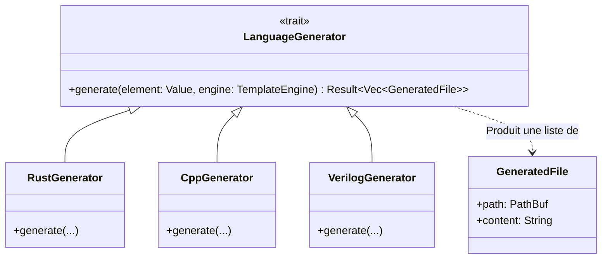
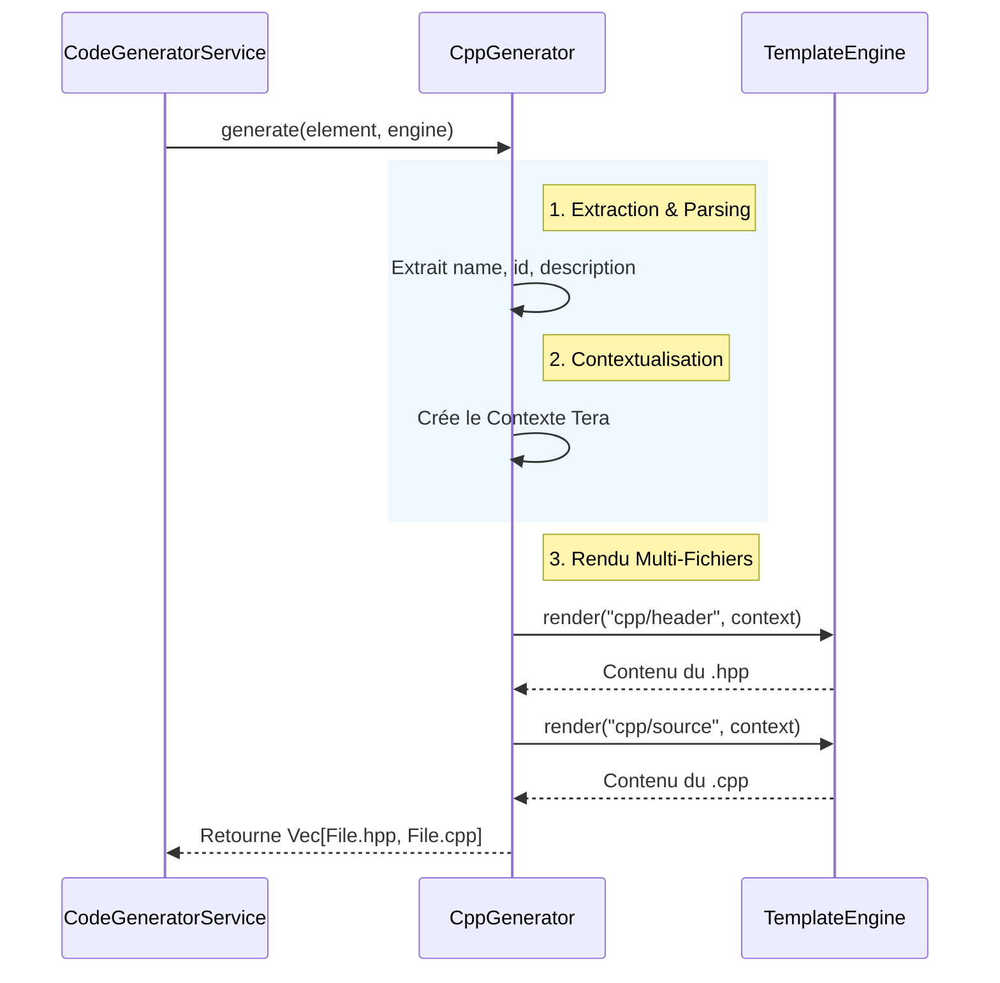

# Code Generators Module

Ce module contient les implémentations spécifiques pour chaque langage cible (Rust, C++, Verilog, VHDL, TypeScript, etc.). Il est le cœur de la "stratégie" de génération de Raise.

## 🏗️ Architecture

### 1. Structure des Classes

L'architecture repose sur le trait `LanguageGenerator` qui impose un contrat strict à tous les générateurs.



### 2. Flux de Génération (Workflow)

Ce diagramme montre comment un générateur (ex: C++) utilise le moteur de template pour produire plusieurs fichiers à partir d'un seul élément du modèle.



## 🔄 Neuro-Symbolic & Round-Trip

Les générateurs modernes de RAISE intègrent la **collaboration Homme-Machine**.
Ils injectent des balises spéciales dans le code pour permettre la préservation du code manuel lors des régénérations futures.

**Exemple de sortie (Rust Generator) :**

```rust
pub fn process_data() {
    // AI_INJECTION_POINT: process_data
    // ... Code manuel utilisateur ...
    // END_AI_INJECTION_POINT
}

```

## 🚀 Générateurs Disponibles

| Langage        | Fichier             | Templates Clés             | Description                                                                                                      |
| -------------- | ------------------- | -------------------------- | ---------------------------------------------------------------------------------------------------------------- |
| **Rust**       | `rust_gen.rs`       | `rust/lib`, `rust/cargo`   | Mode **Crate** complet (Cargo.toml + src) avec **Injection IA**. Supporte aussi le mode Legacy (Fichier unique). |
| **C++**        | `cpp_gen.rs`        | `cpp/header`, `cpp/source` | Génère des classes C++ modernes séparées en Header/Source.                                                       |
| **TypeScript** | `typescript_gen.rs` | `ts/class`                 | Classes typées pour le frontend ou Node.js.                                                                      |
| **Verilog**    | `verilog_gen.rs`    | `verilog/module`           | Modules hardware pour la synthèse FPGA.                                                                          |
| **VHDL**       | `vhdl_gen.rs`       | `vhdl/entity`              | Entités et Architectures pour la conception ASIC.                                                                |

## 🛠️ Guide d'Extension

Pour ajouter le support d'un nouveau langage (ex: Python), suivez ces 3 étapes :

1. **Création** : Ajoutez le fichier `python_gen.rs` implémentant `LanguageGenerator`.
2. **Templates** : Définissez le modèle `python/class` dans `templates/template_engine.rs`.
3. **Enregistrement** : Ajoutez le module dans `mod.rs` et complétez le `match` dans la factory.

## 🧪 Tests

Lancez les tests spécifiques aux générateurs pour vérifier la syntaxe produite et la présence des points d'injection :

```bash
cargo test code_generator::generators

```

```

```
