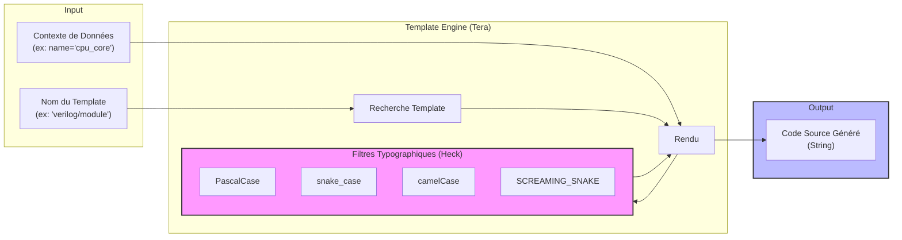

# Templates Engine Module

Ce module est le moteur de rendu de Raise. Il est responsable de la transformation des modèles de données (JSON/Context) en code source textuel, en utilisant le moteur de template **Tera** (inspiré de Jinja2).

Il assure une stricte séparation entre la logique d'extraction (Générateurs) et la logique de présentation (Templates).

## 🎨 Architecture et Flux de Données

Le moteur agit comme une "boîte noire" qui prend un nom de template et un contexte de données, applique des transformations typographiques (filtres), et recrache du code.



## 🛠️ Utilisation Technique

Le `TemplateEngine` est conçu pour être instancié une seule fois (Singleton pattern recommandé) et partagé entre les générateurs pour éviter de recompiler les templates à chaque appel.

```rust
use crate::code_generator::templates::template_engine::TemplateEngine;
use tera::Context;

// 1. Instanciation
let engine = TemplateEngine::new();

// 2. Préparation des données
let mut context = Context::new();
context.insert("name", "flight_controller");
context.insert("id", "FC_001");

// 3. Rendu
let code = engine.render("rust/actor", &context)?;
// Résultat : "pub struct FlightController { ... }"

```

## ✨ Filtres Disponibles

Les filtres sont essentiels pour générer du code qui respecte les conventions de chaque langage (ex: une classe en `PascalCase` mais un fichier en `snake_case`). Raise intègre la librairie **Heck** directement dans Tera.

| Filtre                   | Utilisation dans Template | Entrée                   | Sortie         | Usage Typique  |
| ------------------------ | ------------------------- | ------------------------ | -------------- | -------------- | ------------------------------------------------- |
| **pascal_case**          | `{{ name                  | pascal_case }}`          | `my_component` | `MyComponent`  | Classes, Structs, Types                           |
| **snake_case**           | `{{ name                  | snake_case }}`           | `MyComponent`  | `my_component` | Variables, Noms de fichiers, Fonctions (Rust/C++) |
| **camel_case**           | `{{ name                  | camel_case }}`           | `MyComponent`  | `myComponent`  | Variables (JS/TS), Méthodes (Java)                |
| **screaming_snake_case** | `{{ name                  | screaming_snake_case }}` | `my_var`       | `MY_VAR`       | Constantes, Macros, Defines                       |

## 📚 Catalogue des Templates

Les templates sont actuellement définis dans `template_engine.rs` (via `add_raw_template`). Voici la liste des clés disponibles :

### Rust

- **`rust/actor`** : Génère une structure avec dérivation Serde et constructeur `new()`.

### C++

- **`cpp/header`** : Génère le fichier `.hpp` avec les gardes `#pragma once` et la déclaration de classe.
- **`cpp/source`** : Génère le fichier `.cpp` avec l'implémentation des méthodes.

### Hardware (FPGA/ASIC)

- **`verilog/module`** : Génère un module Verilog standard avec entrées `clk` et `rst_n`.
- **`vhdl/entity`** : Génère une `entity` et son `architecture Behavioral` associée.

### Web / Scripting

- **`ts/class`** : Génère une classe TypeScript exportée.

## 📝 Syntaxe des Templates

Nous utilisons la syntaxe **Tera** (similaire à Django/Jinja2).

**Exemple de définition de template :**

```jinja2
// Entête statique
module {{ name | snake_case }} (
    input wire clk,
    input wire rst_n
);

    /* Description: {{ description | default(value="Aucune description") }}
    */

    
    always @(negedge rst_n) begin
        // Reset logic
    end
    

endmodule

```

## 🚀 Extension future

Actuellement, les templates sont "hardcodés" dans le binaire pour faciliter le déploiement (pas de fichiers externes à gérer).

Pour une version future, l'architecture prévoit de :

1. Scanner un dossier `assets/templates/`.
2. Permettre à l'utilisateur de surcharger les templates par défaut en déposant des fichiers `.tera` dans son dossier de configuration.
