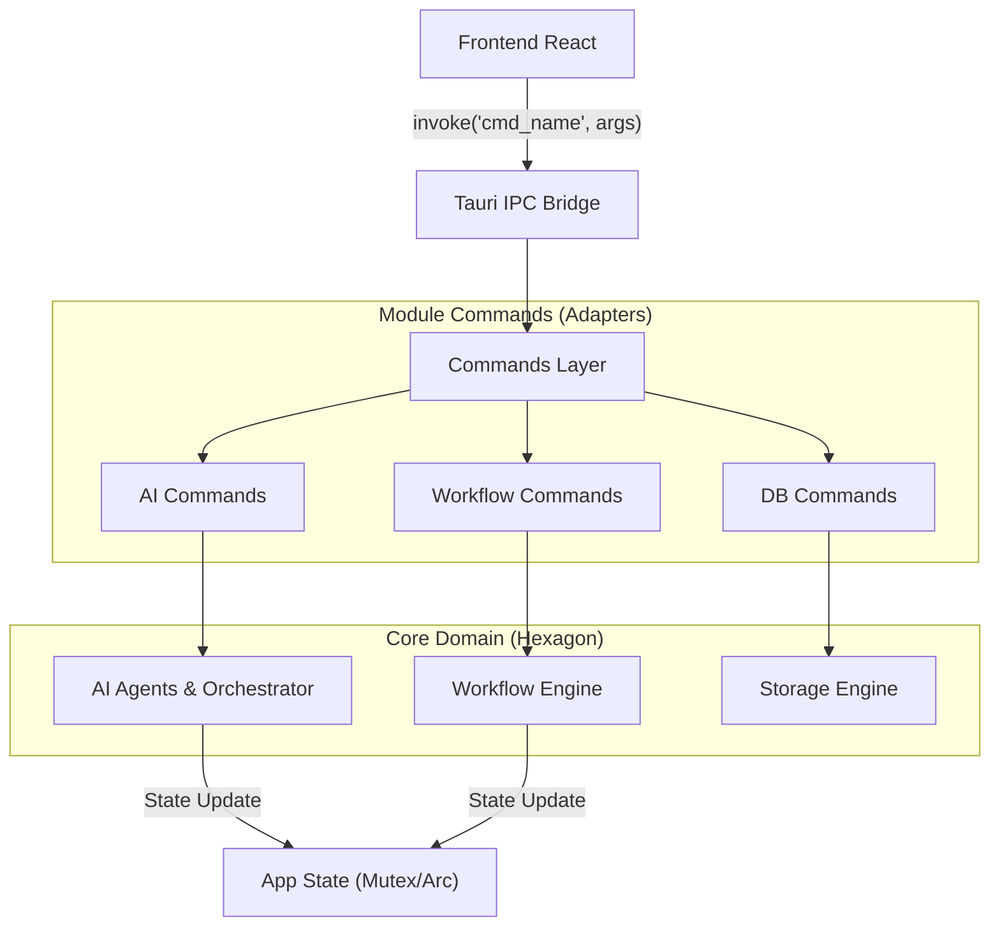

# 🎮 Commands Module (Interface Tauri)

Ce module constitue la **Couche d'Adaptation (API)** de l'architecture Hexagonale de RAISE.
Il expose l'ensemble des capacités fonctionnelles du backend Rust au frontend React/TypeScript via le pont IPC sécurisé de Tauri (`invoke`).

Il agit comme le **Contrôleur** unique, garantissant que chaque action utilisateur passe par un point d'entrée validé, audité et typé.

---

## 🏗️ Architecture & Flux de Données

Le module `commands` orchestre les interactions entre l'interface utilisateur et le cœur métier (Domain). Il ne contient **aucune logique métier complexe**, mais délègue immédiatement aux services appropriés (Agents IA, Moteurs, Stockage).



---

## 🧩 Catalogue des Domaines Fonctionnels

Le module est découpé par domaine de responsabilité pour assurer une séparation claire des préoccupations (SoC).

| Domaine                          | Fichier                    | Responsabilité & Intégration                                                                                                                                      |
| -------------------------------- | -------------------------- | ----------------------------------------------------------------------------------------------------------------------------------------------------------------- |
| **🧠 Intelligence Artificielle** | `ai_commands.rs`           | **Dispatcher Agentique**. Point d'entrée pour le système multi-agents. Gère l'état conversationnel (`AiState`) et route les prompts vers l'Orchestrateur partagé. |
| **⚙️ Workflow Engine**           | `workflow_commands.rs`     | **Pilotage de Processus**. Permet de démarrer, mettre en pause et reprendre des workflows. Intègre le feedback humain (RLHF) via `resume_workflow`.               |
| **💾 Données & NoCode**          | `json_db_commands.rs`      | **Persistance**. Interface CRUD pour le moteur JSON-DB. Expose aussi le moteur de règles pour tester des hypothèses (`evaluate_draft`).                           |
| **🔍 Traçabilité**               | `traceability_commands.rs` | **Assurance Qualité**. Outils d'analyse d'impact et d'audit de conformité (Trace Matrix, Compliance Check).                                                       |
| **⛓️ Blockchain**                | `blockchain_commands.rs`   | **Sécurité Décentralisée**. Gestion des transactions Hyperledger Fabric et de la connectivité Mesh VPN (Innernet).                                                |
| **🏭 Génération Code**           | `codegen_commands.rs`      | **Transpilation**. Transforme les modèles d'architecture (LA/PA) en code source exécutable (Rust, Python).                                                        |
| **🧬 Optimisation**              | `genetics_commands.rs`     | **Exploration**. Lance les algorithmes génétiques pour l'optimisation architecturale (compromis Coût/Perf).                                                       |
| **🧩 Cognitif**                  | `cognitive_commands.rs`    | **Extensibilité**. Charge et exécute des plugins d'analyse tiers au format WebAssembly (.wasm).                                                                   |
| **🏗️ Modèle Projet**             | `model_commands.rs`        | **Gestion de l'État**. Chargement et sauvegarde atomique du `ProjectModel` complet en mémoire.                                                                    |
| **🛠️ Utilitaires**               | `utils_commands.rs`        | **Système**. Informations de diagnostic, versioning et configuration de l'environnement.                                                                          |

---

## 🔐 Gestion de l'État et Sécurité

### Injection de Dépendances (State Management)

Les commandes utilisent le système d'injection de Tauri (`State<T>`) pour accéder aux ressources partagées de manière thread-safe.

- **`AiState`** : Mutex protégeant l'accès à l'Orchestrateur IA (partagé entre Chat et Workflow).
- **`WorkflowStore`** : Stocke les instances de processus en cours d'exécution.
- **`StorageEngine`** : Accès direct à la couche de persistance JSON.

### Sécurité des Entrées

Toutes les commandes sont typées statiquement via `serde`.

- **Validation** : Les arguments JSON du frontend sont automatiquement désérialisés en structs Rust. Si le format est invalide, la commande est rejetée avant même d'être exécutée.
- **Erreurs** : Les erreurs sont renvoyées sous forme de `Result<T, String>` pour être gérées proprement par le frontend (promesse rejetée).

---

## 🚀 Guide du Développeur : Ajouter une Commande

Pour exposer une nouvelle fonctionnalité au frontend :

1. **Définir la fonction** dans le fichier approprié (ex: `workflow_commands.rs`) :

```rust
#[tauri::command]
pub async fn my_new_action(
    state: State<'_, MyState>, // Injection de dépendance
    param_1: String            // Argument du frontend
) -> Result<String, String> {  // Retour standardisé
    // Logique métier...
    Ok("Succès".into())
}

```

2. **Enregistrer la commande** dans `src-tauri/src/lib.rs` (ou `main.rs`) :

```rust
.invoke_handler(tauri::generate_handler![
    // ... existantes
    workflow_commands::my_new_action, // Ajout ici
])

```

3. **Appeler depuis React** :

```typescript
import { invoke } from '@tauri-apps/api/core';
const result = await invoke('my_new_action', { param1: 'test' });
```

```

```
