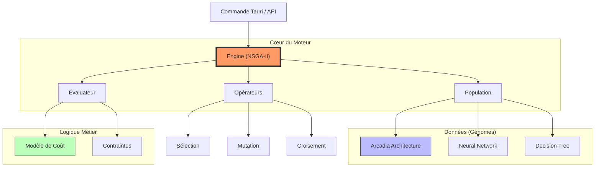

# 🧬 Moteur Génétique Raise (Raise Genetics Engine)

Ce module implémente un moteur d'Algorithme Génétique (AG) de qualité industrielle, conçu pour résoudre des problèmes d'optimisation complexes, multi-objectifs et sous contraintes.

Il est le cœur de l'intelligence d'optimisation de Raise, capable de traiter aussi bien de l'allocation d'architecture système (Arcadia) que de l'apprentissage automatique (Neuroévolution, Arbres de décision).

## 🚀 Fonctionnalités Clés

- **Multi-Objectifs (NSGA-II)** : Implémentation native du _Non-dominated Sorting Genetic Algorithm II_. Il ne cherche pas _une_ solution unique, mais un **Front de Pareto** de compromis optimaux (ex: Performance vs Coût).
- **Massivement Parallèle** : Utilise [Rayon](https://github.com/rayon-rs/rayon) pour paralléliser l'évaluation des individus sur tous les cœurs CPU disponibles.
- **Architecture Modulaire** : Conception basée sur des Traits (`Genome`, `Evaluator`, `SelectionStrategy`) permettant d'étendre le moteur sans modifier son cœur.
- **Contraintes "Hard" & "Soft"** : Gestion fine des solutions invalides via un mécanisme de pénalité et de priorité à la validité (Constraint Dominance).
- **État de l'Art** : Sélection par Tournoi, Crowding Distance pour la diversité, Opérateurs de mutation/croisement spécialisés.

## 🏛️ Architecture du Module

Le module est organisé en sous-systèmes spécialisés :



### Structure des Dossiers

- **[`engine.rs`](https://www.google.com/search?q=./engine.rs)** : Le chef d'orchestre. Contient la boucle d'évolution, le tri NSGA-II et la gestion du parallélisme.
- **[`types.rs`](https://www.google.com/search?q=./types.rs)** : Structures de données fondamentales (`Individual`, `Population`, `Fitness` multi-objectifs).
- **[`traits.rs`](https://www.google.com/search?q=./traits.rs)** : Les contrats que tout nouveau problème doit implémenter.
- **[`genomes/`](https://www.google.com/search?q=./genomes/README.md)** : Implémentations concrètes des structures de données évolutives (Vecteurs, Arbres, Graphes).
- **[`evaluators/`](https://www.google.com/search?q=./evaluators/README.md)** : Fonctions de fitness et règles métier spécifiques au domaine (ex: Règles Arcadia).
- **[`operators/`](https://www.google.com/search?q=./operators/README.md)** : La boîte à outils génétique (Mutation Gaussienne, Croisement Uniforme, Sélection Tournoi, etc.).
- **[`commands.rs`](https://www.google.com/search?q=./commands.rs)** : Interface publique exposée au Frontend via Tauri.

## 🛠️ Exemple d'Utilisation (Rust)

Voici comment instancier et lancer une optimisation manuellement :

```rust
use crate::genetics::engine::{GeneticEngine, GeneticConfig};
use crate::genetics::operators::selection::TournamentSelection;
// Importez vos implémentations spécifiques
use crate::genetics::genomes::arcadia_arch::SystemAllocationGenome;
use crate::genetics::evaluators::architecture::{ArchitectureEvaluator, ArchitectureCostModel};

fn run_optimization() {
    // 1. Configuration
    let config = GeneticConfig {
        population_size: 200,
        max_generations: 100,
        mutation_rate: 0.05,
        crossover_rate: 0.9,
        elitism_count: 5,
        ..Default::default()
    };

    // 2. Initialisation des composants
    let model = ArchitectureCostModel::new(/* ... données ... */);
    let evaluator = ArchitectureEvaluator::new(model);
    let selection = TournamentSelection::new(3);

    // 3. Création du Moteur
    let engine = GeneticEngine::new(evaluator, selection, config);

    // 4. Initialisation de la Population
    let mut population = Population::new();
    // ... remplir la population ...

    // 5. Lancement
    let result = engine.run(population, |pop| {
        println!("Génération {} terminée. Meilleur rang: 0", pop.generation);
    });
}

```

## 📊 Performance

Le moteur est optimisé pour la vitesse :

- **Zero-Cost Abstractions** : L'utilisation intensive des génériques permet au compilateur Rust d'inliner la plupart des appels de fonctions.
- **Cache Friendly** : Les génomes critiques (`SystemAllocationGenome`) utilisent des vecteurs d'entiers (`Vec<usize>`) compacts en mémoire.
- **Data Parallelism** : L'évaluation (souvent l'étape la plus lente) échelle linéairement avec le nombre de cœurs CPU.

---

_Développé pour le projet Raise - 2024_
