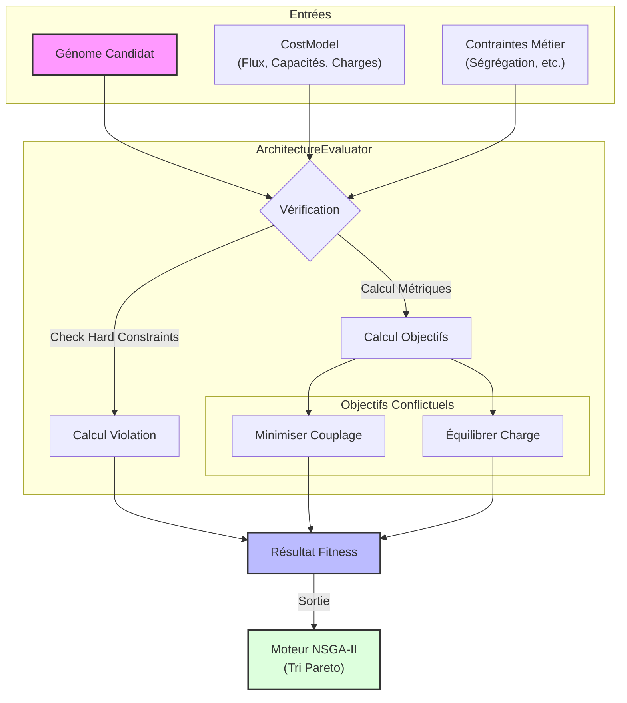

# Module Évaluateurs (Genetics Evaluators)

Ce module contient la logique "métier" utilisée par le moteur génétique pour juger la qualité des solutions candidates (Génomes).

Contrairement au moteur (`engine.rs`) qui est générique, les évaluateurs connaissent les règles spécifiques du domaine (ex: Architecture Système Arcadia, Règles de déploiement, etc.).

## 📊 Flux d'Évaluation

Le schéma ci-dessous illustre comment une solution candidate est transformée en score de performance :



## 🎯 Architecture Multi-Objectifs

Le moteur utilise une approche **Multi-Objectifs (NSGA-II)**. Au lieu de retourner un simple score unique, un évaluateur retourne :

1. **Un vecteur d'objectifs** (`Vec<f32>`) : Chaque valeur représente un critère à **MAXIMISER**.

- _Exemple :_ `[-coût, performance]` pour minimiser le coût et maximiser la performance.

2. **Un score de violation** (`f32`) : Représente le non-respect des contraintes strictes ("Hard Constraints").

- `0.0` = Solution valide.
- `> 0.0` = Solution invalide (pénalisée prioritairement dans le tri de Pareto).

## 🏗️ ArchitectureEvaluator (Arcadia)

L'évaluateur principal pour l'optimisation d'architecture système (`architecture.rs`). Il optimise l'allocation des **Fonctions** sur des **Composants**.

### Objectifs Calculés

Il calcule le front de Pareto basé sur deux objectifs conflictuels :

1. **Minimisation du Couplage (Coupling Efficiency)** :

- Pénalise les échanges de données entre fonctions situées sur des composants différents.
- _But :_ Réduire la latence, la complexité du câblage et la bande passante réseau.

2. **Équilibrage de Charge (Load Balancing)** :

- Cherche à minimiser la variance de la charge (CPU/RAM) entre les composants.
- _But :_ Éviter les goulots d'étranglement sur un seul composant (points chauds).

### Modèle de Coût (`ArchitectureCostModel`)

Pour des raisons de performance critique (évalué des milliers de fois par seconde), les données du modèle (flux, charges, capacités) sont stockées dans des structures aplaties (Matrices et Vecteurs `Vec<f32>`) indexées par des entiers (`usize`), évitant les coûteuses `HashMap` et allocations dynamiques durant l'évolution.

## 🛡️ Système de Contraintes

Le système utilise un trait flexible `SystemConstraint` (`constraints.rs`) pour injecter des règles métier dynamiques.

### Contraintes Disponibles

| Contrainte                | Description                                                                                    | Type      |
| ------------------------- | ---------------------------------------------------------------------------------------------- | --------- |
| **CapacityConstraint**    | Vérifie que la charge totale sur un composant ne dépasse pas sa capacité maximale.             | Hard      |
| **SegregationConstraint** | Interdit à deux fonctions spécifiques d'être sur le même composant (ex: Redondance, Sécurité). | Hard      |
| **ColocationConstraint**  | Force deux fonctions à être sur le même composant (ex: Latence ultra-faible requise).          | Hard/Soft |
| **ForbiddenPlacement**    | Interdit à une fonction d'être sur un composant spécifique (Blacklist).                        | Hard      |

### Exemple d'utilisation

```rust
use crate::genetics::evaluators::architecture::{ArchitectureEvaluator, ArchitectureCostModel};
use crate::genetics::evaluators::constraints::SegregationConstraint;

// 1. Initialisation du modèle statique (Données Arcadia)
let model = ArchitectureCostModel::new(
    num_functions,
    num_components,
    &flows,       // Flux de données (Src, Dst, Vol)
    &loads,       // Charge CPU par fonction
    &capacities   // Capacité CPU par composant
);

// 2. Création de l'évaluateur
let mut evaluator = ArchitectureEvaluator::new(model);

// 3. Injection dynamique de règles métier
evaluator.add_constraint(SegregationConstraint {
    func_a_idx: 0, // ID Fonction Critique A
    func_b_idx: 1, // ID Fonction Critique B (Redondance)
    penalty: 1000.0,
});

```

## 🚀 Performance & Benchmarks

- **Complexité** : O(N²) pour le calcul du couplage (où N est le nombre de fonctions).
- **Parallélisme** : L'évaluation est "Embarrassingly Parallel" et est distribuée sur tous les cœurs CPU via `rayon` dans le moteur principal.
- **Recommandation** : Pour des modèles > 1000 fonctions, préférez le filtrage des flux négligeables dans le `ArchitectureCostModel` pour maintenir la matrice creuse et rapide à parcourir.

```

```
