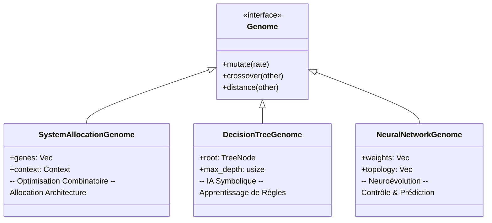

# Module Génomes (Genetics Genomes)

Ce module fournit les implémentations concrètes des structures de données évolutives (les "Individus"). Chaque type de génome est conçu pour un problème d'optimisation spécifique.

Tous les génomes implémentent le trait `Genome` (`src-tauri/src/genetics/traits.rs`), garantissant qu'ils peuvent être manipulés par le moteur générique (`GeneticEngine`) via les opérations standards (Mutation, Crossover).

## 🧬 Vue d'ensemble



---

## 1. Arcadia Architecture (`SystemAllocationGenome`)

Conçu pour l'optimisation combinatoire, spécifiquement l'allocation de fonctions logiques sur des composants physiques.

- **Structure** : Vecteur d'entiers (`Vec<usize>`).
- `genes[i] = c` signifie que la fonction `i` est allouée au composant `c`.

- **Performance** : Utilise des indices directs pour une évaluation ultra-rapide (O(1) lookup).
- **Contexte** : Embarque une référence aux IDs réels (Strings) pour reconstruire la solution métier lisible.
- **Opérateurs** :
- _Mutation_ : Réassignation uniforme (déplace une fonction vers un autre composant).
- _Crossover_ : Croisement Uniforme (mélange les allocations des deux parents).

**Usage :** Optimisation d'architecture système (Couplage, Charge, Latence).

---

## 2. Arbre de Décision (`DecisionTreeGenome`)

Conçu pour l'IA Explicable (XAI) et l'apprentissage de règles. L'évolution construit la structure de l'arbre.

- **Structure** : Enum récursif (`TreeNode`).
- `Internal` : Teste une caractéristique (`feature_index > threshold`).
- `Leaf` : Donne une valeur de sortie ou une classe.

- **Opérateurs** :
- _Mutation_ :
- Paramétrique : Change le seuil ou la feature testée.
- Structurelle : Remplace une feuille par un sous-arbre (Croissance) ou l'inverse (Élagage).

- _Crossover_ : Échange de sous-arbres (Subtree Exchange). C'est le principe fondamental de la Programmation Génétique (GP).

**Usage :** Classification, régression symbolique, découverte de règles métier lisibles par l'humain.

---

## 3. Réseau de Neurones (`NeuralNetworkGenome`)

Conçu pour la Neuroévolution (optimisation des poids d'un réseau de neurones sans rétropropagation de gradient).

- **Structure** : Vecteur plat de flottants (`Vec<f32>`).
- Contient tous les poids et biais concaténés.
- La topologie (couches) est fixée à l'initialisation (Fixed Topology Neuroevolution).

- **Opérateurs** :
- _Mutation_ : Gaussienne (ajoute un léger bruit aléatoire aux poids).
- _Crossover_ : Uniforme ou SBX (Simulated Binary Crossover) pour mélanger les "connaissances" des parents.

**Usage :** Apprentissage par renforcement (Reinforcement Learning), contrôle de systèmes dynamiques, approximation de fonctions complexes "boîte noire".

---

## 🛠️ Extension

Pour ajouter un nouveau type de génome (ex: _Problème du Voyageur de Commerce_), il suffit de :

1. Créer une struct qui contient vos données.
2. Implémenter le trait `Genome`.
3. Définir comment `mutate` modifie vos données et comment `crossover` mélange deux instances.

```

```
