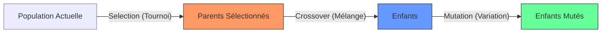

# Module Opérateurs (Genetics Operators)

Ce module implémente les mécanismes fondamentaux de l'Algorithme Génétique. Ce sont les fonctions qui manipulent directement les génomes pour simuler l'évolution naturelle.

Les opérateurs sont stateless (sans état) et conçus pour être composables.

## 🔄 Vue d'ensemble

Le cycle de reproduction repose sur trois étapes clés gérées par ce module :



---

## 1. Sélection (`selection.rs`)

La sélection détermine quels individus survivent et se reproduisent.

### Stratégie : Tournoi (Tournament Selection)

Nous utilisons exclusivement la sélection par tournoi car elle est :

1. **Robuste** : Fonctionne sans normalisation des scores de fitness.
2. **Parallélisable** : Pas besoin de connaitre la somme globale des fitness.
3. **Compatible NSGA-II** : La comparaison entre deux individus intègre la logique Pareto.

**Logique du Duel NSGA-II :**
Lorsqu'on compare deux individus A et B dans un tournoi :

1. Si **Rang(A) < Rang(B)** : A gagne (A est sur un meilleur front de Pareto).
2. Si **Rang(A) == Rang(B)** : On compare la **Crowding Distance**. Celui qui a la plus grande distance gagne (il est dans une zone moins peuplée de l'espace des solutions, favorisant la diversité).

---

## 2. Croisement (`crossover.rs`)

Le croisement (ou recombinaison) mélange les gènes de deux parents pour créer un enfant.

| Opérateur                  | Description                                                                                            | Cas d'usage idéal                                                             |
| -------------------------- | ------------------------------------------------------------------------------------------------------ | ----------------------------------------------------------------------------- |
| **Uniform Crossover**      | Chaque gène est choisi aléatoirement chez le Parent 1 ou 2 (50/50).                                    | Problèmes sans forte dépendance topologique voisine (ex: Allocation Arcadia). |
| **Single Point**           | Coupe les génomes en un point P. L'enfant prend le début de P1 et la fin de P2.                        | Préservation de séquences ou blocs logiques.                                  |
| **SBX (Simulated Binary)** | Simule le comportement binaire sur des flottants. Crée des enfants proches des parents mais distincts. | Poids de Réseaux de Neurones, paramètres continus.                            |

**Illustration du Croisement Uniforme :**

```text
Parent A: [1, 1, 1, 1]
Parent B: [2, 2, 2, 2]
            ⬇️
Enfant:   [1, 2, 1, 2] (Mélange aléatoire)

```

---

## 3. Mutation (`mutation.rs`)

La mutation introduit des variations aléatoires pour maintenir la diversité génétique et éviter les minimums locaux.

| Opérateur           | Description                                                      | Cas d'usage idéal                                                        |
| ------------------- | ---------------------------------------------------------------- | ------------------------------------------------------------------------ |
| **Uniform / Reset** | Remplace un gène par une toute nouvelle valeur aléatoire valide. | Allocation (déplacer une fonction sur un autre composant).               |
| **Swap**            | Échange la position de deux gènes existants.                     | Problèmes d'ordonnancement ou de permutation (TSP).                      |
| **Gaussian**        | Ajoute un bruit gaussien (loi normale) à une valeur flottante.   | Ajustement fin (Fine-tuning) de paramètres physiques ou poids neuronaux. |

---

## 🛠️ Guide d'Implémentation

Pour ajouter un nouvel opérateur, il suffit d'ajouter une fonction publique dans le fichier correspondant.

**Exemple : Ajouter une mutation "Inversion" (renverser une séquence)**

Dans `mutation.rs` :

```rust
/// Renverse l'ordre des gènes entre deux points aléatoires
pub fn inversion_mutation<T>(genes: &mut [T], rate: f32, rng: &mut dyn RngCore) {
    if rng.random::<f32>() < rate {
        let len = genes.len();
        if len < 2 { return; }

        let start = rng.random_range(0..len);
        let end = rng.random_range(0..len);

        if start < end {
            genes[start..end].reverse();
        }
    }
}

```
