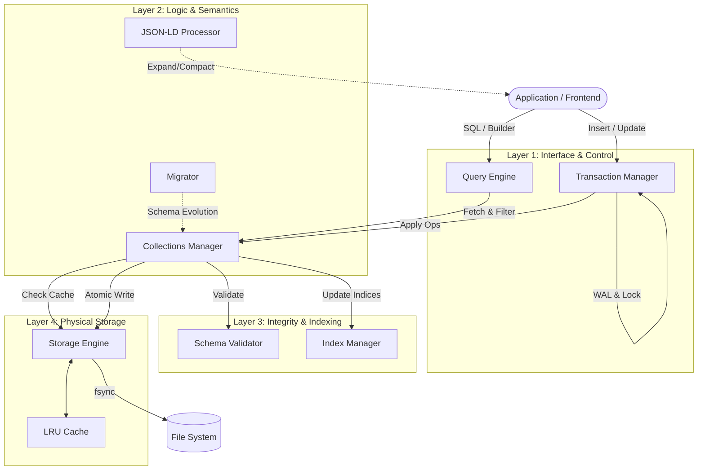

# 🗄️ JSON-DB (Embedded NoSQL Engine)

**JSON-DB** est un moteur de base de données orienté document, écrit en Rust, conçu spécifiquement pour être embarqué dans des applications locales (comme Tauri).

Il combine la flexibilité du **NoSQL** (documents JSON), la rigueur des **Transactions ACID**, et la puissance du **Web Sémantique** (JSON-LD).

---

## 🏛️ Architecture Globale

Le système est construit en couches (Layers), allant de l'abstraction sémantique de haut niveau jusqu'au stockage physique sur disque.



---

## 📦 Modules & Responsabilités

### 1. Stockage & I/O

- **[Storage](https://www.google.com/search?q=storage/README.md)** : Gère la persistance physique. Chaque document est un fichier `.json`. Assure l'atomicité des écritures (renommage atomique) et maintient un cache LRU en mémoire pour la performance.

### 2. Intégrité & Transactions

- **[Transactions](https://www.google.com/search?q=transactions/README.md)** : Garantit les propriétés ACID. Utilise un **WAL (Write-Ahead Log)** pour la durabilité et un **LockManager** pour l'isolation et la gestion de la concurrence.
- **[Migrations](https://www.google.com/search?q=migrations/README.md)** : Système de versioning de la structure de la base. Permet d'appliquer des évolutions de schéma (ajout de champs, création de collections) de manière déterministe.

### 3. Logique & Recherche

- **[Collections](https://www.google.com/search?q=collections/README.md)** : Abstraction logique regroupant les documents. Coordonne les opérations CRUD entre le stockage, les index et les validateurs.
- **[Indexes](https://www.google.com/search?q=indexes/README.md)** : Accélère les recherches. Supporte les index **Hash** (O(1) pour égalité) et **BTree** (O(log n) pour tri/range), ainsi que le **FullText**.
- **[Query](https://www.google.com/search?q=query/README.md)** : Moteur d'interrogation puissant. Supporte une syntaxe **SQL** (`SELECT * FROM users WHERE age > 18`) et un **QueryBuilder** fluide. Inclut un optimiseur de requêtes.

### 4. Sémantique & Validation

- **[Schema](https://www.google.com/search?q=schema/README.md)** : Validation structurelle via **JSON Schema**. Supporte les références `$ref` internes et externes via un registre centralisé.
- **[JsonLD](https://www.google.com/search?q=jsonld/README.md)** : Couche sémantique. Transforme les objets JSON en graphes de connaissances liés, conformes à l'ontologie Arcadia, via des algorithmes d'Expansion et de Compaction.

---

## 🚀 Exemple Rapide

```rust
use crate::json_db::{
    storage::{JsonDbConfig, StorageEngine},
    transactions::{TransactionManager, TransactionRequest},
    query::sql::parse_sql,
};

// 1. Initialisation
let config = JsonDbConfig::new(PathBuf::from("./data"));
let tm = TransactionManager::new(&config, "workspace", "main_db");

// 2. Écriture Transactionnelle
let requests = vec![
    TransactionRequest::Insert {
        collection: "users".into(),
        id: None,
        document: json!({ "name": "Alice", "role": "admin" })
    }
];
tm.execute_smart(requests).await?;

// 3. Lecture SQL
let query = parse_sql("SELECT name FROM users WHERE role = 'admin'")?;
let result = query_engine.execute_query(query).await?;

```

## 🛡️ Garanties

1. **Crash-Safe** : Grâce au WAL et aux écritures atomiques, une coupure de courant ne corrompt pas la base.
2. **Thread-Safe** : Les structures internes utilisent `Arc<RwLock>` pour permettre un accès concurrent sécurisé (Single Writer / Multiple Readers).
3. **Interopérable** : Les données étant stockées en JSON standard sur le disque, elles restent lisibles et éditables par n'importe quel outil externe, facilitant le débogage et l'export.

```

```
