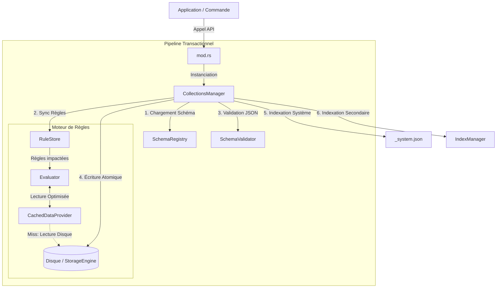

# 📦 Module Collections (JSON-DB)

Le module `collections` est la couche d'orchestration centrale de la base de données JSON-DB. Il encapsule la complexité de la gestion documentaire en assurant la liaison entre le stockage physique, la validation de schéma et l'intelligence métier.

C'est ce module qui garantit les propriétés ACID (Atomicité, Cohérence, Isolation, Durabilité) à l'échelle du fichier.

---

## 📂 Structure du Module

Le module est découpé en composants spécialisés pour séparer les responsabilités :

```text
src-tauri/src/json_db/collections/
├── mod.rs             # Façade Publique (API statique simplifiée)
├── manager.rs         # Orchestrateur (Logique transactionnelle & Règles)
├── data_provider.rs   # Cache de données (Optimisation des lectures pour le moteur de règles)
└── collection.rs      # I/O Bas Niveau (Wrapper CRUD sur le StorageEngine)

```

### Rôle des Fichiers

| Fichier                | Responsabilité  | Description                                                                                                                                                    |
| ---------------------- | --------------- | -------------------------------------------------------------------------------------------------------------------------------------------------------------- |
| **`mod.rs`**           | **Interface**   | Point d'entrée unique pour les consommateurs (Commandes Tauri). Masque l'instanciation complexe du Manager.                                                    |
| **`manager.rs`**       | **Logique**     | Gère le cycle de vie d'une requête : chargement du contexte, synchronisation des règles, validation JSON Schema, et maintien de l'index système.               |
| **`data_provider.rs`** | **Performance** | Fournit une couche d'abstraction pour l'accès aux données (`DataProvider`) avec **Mémoïsation**. Garantit qu'un document n'est lu qu'une fois par transaction. |
| **`collection.rs`**    | **Physique**    | Fonctions utilitaires pures pour l'interaction avec le `StorageEngine` (chemins, verrous, sérialisation).                                                      |

---

## 🏗️ Architecture & Pipeline Transactionnel

Lorsqu'une modification est demandée (ex: `insert_with_schema`), le système déclenche un pipeline strict. L'objectif est de garantir que **aucune donnée invalide ou incohérente** ne soit jamais écrite sur le disque.



---

## ⚡ Mécanismes Clés & Optimisations

### 1. Intégration du Rules Engine (GenRules)

Le `CollectionsManager` intercepte chaque écriture pour exécuter les règles métier définies dans le schéma (`x_rules`).

- **Calculs Dérivés** : Calcul automatique de totaux, de dates d'échéance, etc.
- **Enrichissement** : Injection de données provenant d'autres collections (Lookup).
- **Validation Métier** : Rejet de la transaction si une règle logique échoue.

### 2. Cache Transactionnel (`CachedDataProvider`)

Pour éviter l'explosion des I/O lors de calculs complexes (ex: insérer 100 lignes qui lisent toutes le même taux de TVA), nous utilisons un cache temporaire.

- **Scope** : La durée de vie de la fonction `apply_business_rules`.
- **Fonctionnement** : Utilise un `RefCell<HashMap>` pour stocker les documents lus.
- **Gain** : Transforme une complexité O(N) lectures disques en O(1).

### 3. Architecture "Zero-Copy"

L'ensemble du pipeline est optimisé pour minimiser les allocations mémoire.

- Utilisation intensive de `Cow` (Copy-On-Write) dans l'évaluateur.
- Les données ne sont clonées que lorsqu'elles sont modifiées par une règle.

### 4. Indexation Système (`_system.json`)

Chaque opération d'écriture met à jour automatiquement l'index central de la base de données. Cela permet de :

- Lister le contenu d'une collection sans parcourir le système de fichiers.
- Associer métadonnées et schémas aux collections.

---

## 🛠️ Utilisation de l'API (Façade)

L'API publique est exposée via `mod.rs`. Elle est conçue pour être "Stateless" du point de vue de l'appelant (l'état est géré en interne).

### Insertion avec Règles et Schéma

C'est la méthode recommandée pour toutes les données métier.

```rust
use crate::json_db::collections;

// 1. Donnée brute (partielle)
let draft = json!({
    "client_id": "c_55",
    "items": [
        { "ref": "A", "price": 10 },
        { "ref": "B", "price": 20 }
    ]
    // "total" n'est pas fourni, il sera calculé
});

// 2. Insertion
let result = collections::insert_with_schema(
    &config,
    "my_space",
    "my_db",
    "invoices/invoice.schema.json", // Le schéma porte les règles
    draft
)?;

// 3. Résultat : Complet et Validé
// result contient { "id": "...", "total": 30, ... }

```

### Lectures et Listes

```rust
// Récupérer un document par ID
let doc = collections::get(&config, "space", "db", "users", "u_123")?;

// Lister tous les documents d'une collection
let all_users = collections::list_all(&config, "space", "db", "users")?;

```

---

## 🚨 Gestion des Erreurs

Le module utilise `Result` pour la propagation des erreurs. Les erreurs courantes incluent :

- **Validation Error** : Le document ne respecte pas le schéma JSON.
- **Rule Error** : Une règle métier a échoué ou une dépendance est introuvable.
- **I/O Error** : Problème d'accès disque (permissions, espace).
- **Lock Error** : Conflit d'accès concurrent (géré par le StorageEngine).

```

```
