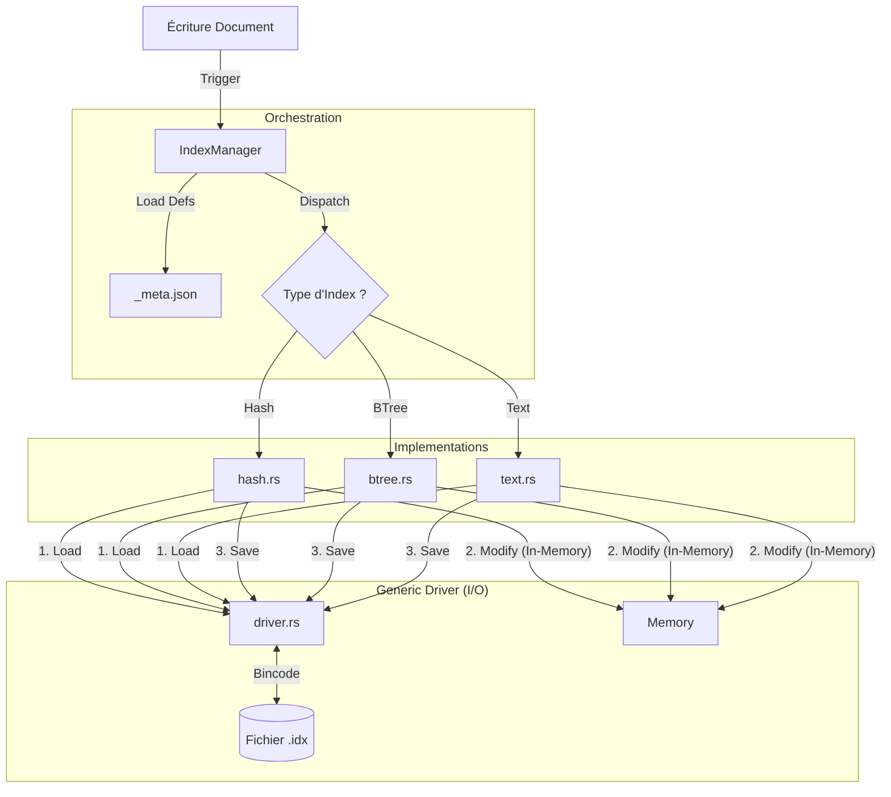

# 🗂️ JSON-DB Indexing System

Le module **Indexes** fournit un moteur d'indexation performant et extensible pour les collections JSON. Il permet d'accélérer les recherches, d'imposer des contraintes d'unicité et d'offrir des capacités de recherche textuelle.

Il est conçu pour être **atomique** et **résilient**, s'intégrant directement dans le cycle de vie des écritures de la base de données.

---

## 🏗️ Architecture

Le système repose sur une séparation stricte entre l'orchestration (`IndexManager`), la couche de persistance (`Generic Driver`) et les algorithmes spécifiques (`Hash`, `BTree`, `Text`).



### Composants Clés

| Fichier          | Rôle              | Description                                                                                                                                                                                 |
| ---------------- | ----------------- | ------------------------------------------------------------------------------------------------------------------------------------------------------------------------------------------- |
| **`manager.rs`** | **Orchestrateur** | Gère le cycle de vie (Create, Drop, Update). Maintient la liste des index dans `_meta.json` et déclenche le **Backfill** (réindexation) à la création.                                      |
| **`driver.rs`**  | **I/O Driver**    | Couche d'abstraction générique. Gère la sérialisation binaire (**Bincode**), la lecture/écriture atomique et la logique de mise à jour (Suppression ancienne valeur -> Insertion nouvelle). |
| **`paths.rs`**   | **Utilitaire**    | Centralise la logique des chemins fichiers (`_indexes/name.type.idx`).                                                                                                                      |

---

## 🚀 Types d'Index Supportés

| Type       | Variantine         | Structure Mémoire           | Usage & Performance                                                                                       |
| ---------- | ------------------ | --------------------------- | --------------------------------------------------------------------------------------------------------- |
| **Hash**   | `IndexType::Hash`  | `HashMap<String, Vec<ID>>`  | **Recherche Exacte** (`=`). Complexité O(1). Idéal pour les IDs, emails, statuts.                         |
| **B-Tree** | `IndexType::BTree` | `BTreeMap<String, Vec<ID>>` | **Recherche par Plage** (`<`, `>`, `<=`, `>=`). Complexité O(log n). Idéal pour les dates, nombres, prix. |
| **Text**   | `IndexType::Text`  | `HashMap<Token, Vec<ID>>`   | **Recherche Plein Texte**. Index inversé simple. Tokenisation (alphanumérique + lowercase).               |

### Contraintes d'Unicité

Tous les types d'index supportent l'option `unique: true`.
Le driver générique vérifie cette contrainte avant toute insertion. Si une clé existe déjà pour un ID différent, une erreur `Index unique constraint violation` est levée, ce qui **annule la transaction d'écriture**.

---

## 💾 Stockage Physique

Les index sont stockés séparément des données JSON pour ne pas impacter les performances de lecture des documents bruts.

- **Emplacement** : `{db_root}/{collection}/_indexes/`
- **Nommage** : `{field_name}.{type}.idx` (ex: `email.hash.idx`, `created_at.btree.idx`)
- **Format** : Binaire (**Bincode**). Ce format est compact et très rapide à désérialiser (Zero-Copy compatible).

### Structure du Fichier (.idx)

Le fichier contient une liste sérialisée de `IndexRecord` :

```rust
struct IndexRecord {
    key: String,       // Valeur indexée (sérialisée en String pour uniformité)
    document_id: String // ID du document cible
}

```

---

## 🔄 Cycle de Vie

### 1. Création (`create_index`)

L'appel est synchrone et peut être coûteux pour les grandes collections.

1. Mise à jour de `_meta.json` pour déclarer l'index.
2. **Backfill** : Le manager parcourt tous les fichiers `.json` existants de la collection.
3. Pour chaque document, il extrait la valeur du champ cible et peuple l'index.

### 2. Mise à jour Continue (`index_document`)

Appelée automatiquement par `CollectionsManager` lors d'un `insert` ou `update`.

1. Charge tous les index définis pour la collection.
2. Compare l'ancienne valeur du document (si update) avec la nouvelle.
3. Met à jour l'index uniquement si la valeur a changé.

### 3. Suppression (`drop_index`)

1. Retire la définition de `_meta.json`.
2. Supprime physiquement le fichier `.idx` pour libérer de l'espace.

---

## 🛠️ Exemple d'Intégration

```rust
use crate::json_db::indexes::IndexManager;

// Initialisation
let mut idx_mgr = IndexManager::new(storage_engine, "main", "db");

// 1. Déclarer un index unique sur l'email (déclenche l'indexation initiale)
idx_mgr.create_index("users", "email", "hash")?;

// 2. Indexer un document lors d'une insertion (appelé par CollectionsManager)
let doc = json!({ "id": "u1", "email": "test@example.com", "age": 25 });
idx_mgr.index_document("users", &doc)?;

// 3. Rechercher (Pseudo-code, voir module Query)
// L'index 'email.hash.idx' sera chargé et consulté en O(1)

```

## ⚠️ Limitations Actuelles

1. **Mémoire** : Les index sont chargés intégralement en RAM lors de l'utilisation. Pour des millions d'entrées, une pagination disque (B+Tree on-disk) sera nécessaire.
2. **Tokenizer** : L'index textuel est basique. Il ne gère pas encore les stop-words, le stemming ou les recherches phonétiques.
3. **Champs Imbriqués** : Les index supportent les champs imbriqués via JSON Pointer (ex: `/address/city`), mais ne supportent pas encore l'indexation de tableaux de valeurs (ex: tags).

```

```

```

```
