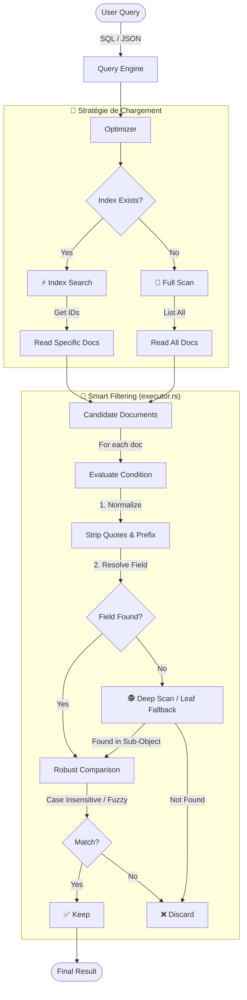

# 🗂️ Système d'Indexation & Query Engine

Ce module gère l'indexation des collections JSON et l'exécution des requêtes. Il est conçu pour offrir des performances élevées (O(1) ou O(log N)) tout en restant extrêmement permissif face aux structures de données variables (JSON) et aux entrées SQL.

## 📊 Flux d'Exécution (Query Pipeline)

Le diagramme ci-dessous illustre comment le moteur traite une requête, de la sélection de la stratégie (Index vs Scan) jusqu'à la résolution intelligente des champs.



---

## 🏗️ Architecture

Le système est découpé en plusieurs couches :

1. **`IndexManager`** : Point d'entrée principal. Il gère le cycle de vie des index (création, suppression, reconstruction) et coordonne les écritures.
2. **`QueryEngine`** : Cerveau de la lecture. Il orchestre l'optimiseur, le fournisseur d'index et le filtrage en mémoire.
3. **Drivers** : Implémentations spécifiques des algorithmes de stockage (`btree`, `hash`, `text`).

---

## ⚙️ Types d'Index Supportés

| Type        | Algorithme          | Cas d'usage idéal                                   | Complexité   |
| ----------- | ------------------- | --------------------------------------------------- | ------------ |
| **`hash`**  | `HashMap` persistée | IDs, Emails, UUIDs, Codes uniques (Égalité stricte) | **O(1)**     |
| **`btree`** | `BTreeMap`          | Nombres, Dates, Tris, Plages (`>`, `<`, `BETWEEN`)  | **O(log N)** |
| **`text`**  | Inverted Index      | Recherche de mots-clés dans du texte                | **Variable** |

### Définition (`_meta.json`)

Les définitions d'index sont stockées dans le fichier `_meta.json` à la racine de la collection.

```json
{
  "indexes": [
    {
      "name": "email_idx",
      "field_path": "email",
      "index_type": "hash",
      "unique": true
    }
  ]
}
```

---

## 🔍 Capacités Avancées du Query Engine

Le moteur de requête (`executor.rs`) a été durci pour traiter les cas limites souvent rencontrés avec des données JSON hétérogènes (ex: ActivityPub) ou des requêtes SQL générées.

### 1. Smart Field Resolution (Résolution Intelligente)

Le moteur trouve le champ ciblé même si le chemin fourni est imparfait :

- **Suppression de Préfixe** : `users.age` → trouve `age` (gestion des alias SQL `table.column`).
- **Insensibilité à la Casse** : `displayName` → trouve `displayname` ou `DisplayName`.
- **Leaf Fallback** : Si le chemin complet `data.attributes.name` échoue, le moteur tente de trouver `name` (la feuille) n'importe où.

### 2. Deep Scan (Recherche en Profondeur)

Si un champ n'est pas trouvé à la racine du document, le moteur scanne automatiquement les sous-objets immédiats (ex: `data`, `object`, `actor`).

- _Exemple :_ `SELECT * WHERE name = 'Alice'` trouvera la valeur dans `{ "id": 1, "object": { "name": "Alice" } }`.

### 3. Opérateurs Étendus & Tolérants

- **`LIKE` sur Tableaux** : `tags LIKE 'rust'` retourne `true` si le tableau `tags` contient l'élément "rust".
- **`LIKE` "Fuzzy"** : Si le motif ne contient pas de `%` (ex: `LIKE 'Alice'`), il se comporte comme un `CONTAINS` (partiel).
- **Nettoyage Automatique** : Les guillemets parasites envoyés par les parseurs SQL (ex: `"'valeur'"`) sont nettoyés récursivement avant comparaison.

---

## 🛠️ Utilisation (Rust)

### Création d'un index

```rust
use raise::json_db::indexes::{IndexManager, IndexType};

// Créer un index unique sur le champ "email"
manager.create_index(
    "users",
    "email_idx",
    "email",
    IndexType::Hash,
    true // unique
).expect("Impossible de créer l'index");

```

### Exécution d'une requête

Le `QueryEngine` sélectionne automatiquement le meilleur index disponible.

```rust
use raise::json_db::query::{Query, Condition, QueryEngine};

let engine = QueryEngine::new(&manager);

// Cette requête utilisera l'index "email_idx" si disponible (O(1))
// Sinon, elle basculera en Full Scan (O(N))
let query = Query::new("users")
    .filter(Condition::eq("email", json!("alice@example.com")));

let result = engine.execute_query(query).await?;

```

```

```
