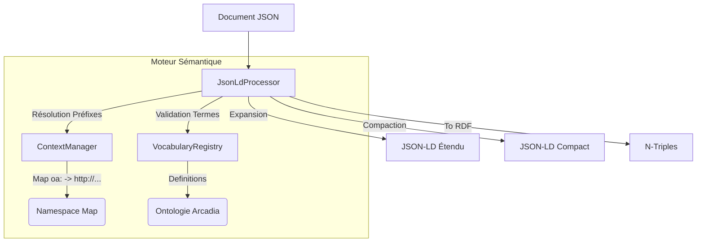

# 🕸️ Module JSON-LD (Semantic Engine)

Ce module implémente la couche d'abstraction **Sémantique** de RAISE. Il permet de traiter les documents JSON non seulement comme des structures de données, mais comme des graphes de connaissances liés (Linked Data), conformes à l'ontologie Arcadia.

Il assure l'interopérabilité sémantique et la validation des concepts métiers.

---

## 🏗️ Architecture

Le module est conçu autour de trois piliers qui séparent le traitement, le contexte et la définition du vocabulaire.



### Composants Clés

| Composant                | Fichier         | Rôle                                                                                                                                       |
| ------------------------ | --------------- | ------------------------------------------------------------------------------------------------------------------------------------------ |
| **`JsonLdProcessor`**    | `processor.rs`  | Le moteur principal. Implémente les algorithmes d'Expansion, de Compaction et de conversion RDF.                                           |
| **`ContextManager`**     | `context.rs`    | Gère la résolution des IRIs. Maintient la correspondance entre les préfixes courts (`oa:`) et les URIs complètes.                          |
| **`VocabularyRegistry`** | `vocabulary.rs` | Le "Dictionnaire" de l'application. Contient les définitions statiques (hardcodées) de toutes les classes et propriétés valides d'Arcadia. |

---

## 🧠 Ontologie Arcadia & Namespaces

RAISE définit ses propres espaces de noms pour mapper les concepts de la méthode Arcadia. Ces définitions sont centralisées dans `vocabulary.rs`.

| Couche           | Préfixe | URI de Base (`https://raise.io/ontology/...`) | Concepts Clés                                |
| ---------------- | ------- | --------------------------------------------- | -------------------------------------------- |
| **Opérationnel** | `oa:`   | `.../arcadia/oa#`                             | `OperationalActivity`, `Actor`, `Capability` |
| **Système**      | `sa:`   | `.../arcadia/sa#`                             | `SystemFunction`, `SystemComponent`          |
| **Logique**      | `la:`   | `.../arcadia/la#`                             | `LogicalFunction`, `LogicalComponent`        |
| **Physique**     | `pa:`   | `.../arcadia/pa#`                             | `PhysicalNode`, `PhysicalLink`               |
| **EPBS**         | `epbs:` | `.../arcadia/epbs#`                           | `ConfigurationItem`                          |
| **Données**      | `data:` | `.../arcadia/data#`                           | `Class`, `ExchangeItem`, `DataType`          |

---

## 🚀 Fonctionnalités Clés

### 1. Expansion & Compaction (Normalisation)

Ces opérations sont fondamentales pour traiter les données indépendamment de leur formatage JSON spécifique.

- **Expansion** : Convertit toutes les clés en IRIs absolues.
- _Entrée_ : `{"@type": "oa:OperationalActivity"}`
- _Sortie_ : `{"@type": "https://raise.io/ontology/arcadia/oa#OperationalActivity"}`
- _Usage_ : Validation, typage fort, stockage RDF.

- **Compaction** : Réduit les IRIs en préfixes courts pour la lisibilité.
- _Usage_ : Stockage JSON-DB, API Frontend, Édition humaine.

### 2. Validation Sémantique

Vérifie le _sens_ des données plutôt que leur structure.

- **Vérification de Vocabulaire** : S'assure que le `@type` d'un document existe réellement dans l'ontologie Arcadia connue.
- **Champs Requis par IRI** : Permet de valider la présence d'un champ (ex: `oa:name`) peu importe le préfixe utilisé dans le document source (`name`, `oa:name`, `rdfs:label`...).

### 3. Export RDF (N-Triples)

Permet d'exporter les données de RAISE vers des outils du Web Sémantique tiers (Protégé, GraphDB) ou des moteurs d'inférence.

---

## 🛠️ Exemple d'Utilisation

```rust
use crate::json_db::jsonld::{JsonLdProcessor, VocabularyRegistry};
use serde_json::json;

// 1. Initialisation
let processor = JsonLdProcessor::new();
let registry = VocabularyRegistry::new();

// 2. Document entrant (format compact)
let doc = json!({
    "@context": { "oa": "[https://raise.io/ontology/arcadia/oa#](https://raise.io/ontology/arcadia/oa#)" },
    "@id": "urn:uuid:1234",
    "@type": "oa:OperationalActivity",
    "oa:name": "Analyser le besoin"
});

// 3. Expansion (pour traitement normalisé)
let expanded = processor.expand(&doc);
let type_iri = processor.get_type(&expanded).unwrap();

// 4. Validation sémantique
if registry.has_class(&type_iri) {
    println!("✅ Classe Arcadia valide : {}", type_iri);
} else {
    println!("⚠️ Classe inconnue !");
}

// 5. Export RDF
let ntriples = processor.to_ntriples(&doc).unwrap();
// <urn:uuid:1234> <.../type> <.../OperationalActivity> .

```

---

## 📂 Structure des Fichiers

L'architecture est simplifiée, les tests unitaires sont désormais colocalisés avec le code source.

```text
src-tauri/src/json_db/jsonld/
├── mod.rs          // Point d'entrée et exports publics
├── context.rs      // Logique de résolution des contextes (@context)
├── processor.rs    // Algorithmes JSON-LD (Expand, Compact, RDF)
└── vocabulary.rs   // Registre statique de l'ontologie Arcadia (OA, SA, LA...)

```

## ⚠️ Notes Techniques

- **Registre en Mémoire** : Pour des raisons de performance et de stabilité (embedded), l'ontologie n'est pas chargée dynamiquement depuis le web ou des fichiers `.owl`, mais compilée statiquement dans `vocabulary.rs`.
- **Validation Légère** : Ce module n'est pas un validateur SHACL complet. Il se concentre sur la cohérence des identifiants et des types au sein de l'écosystème RAISE.

```

```
