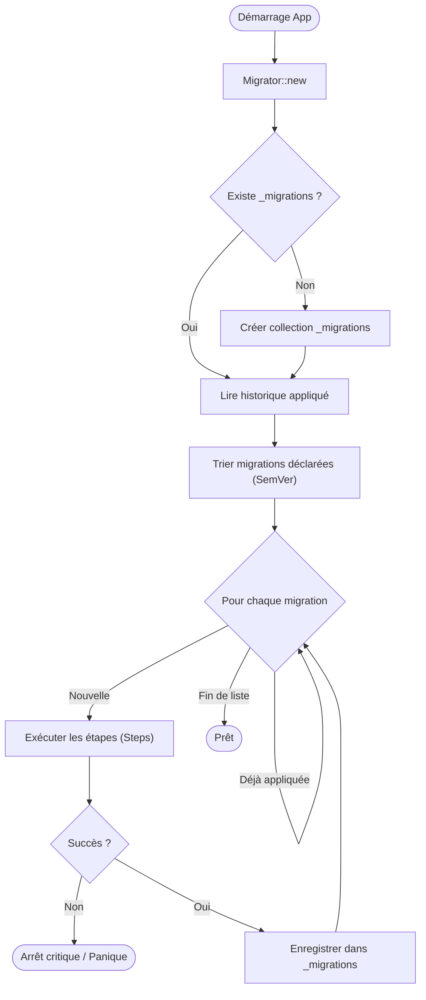

# 🔄 Module Migrations (JSON-DB)

Ce module fournit un système robuste de **gestion de versions de schéma** pour la base de données JSON (NoSQL) de RAISE.

Bien que JSON-DB soit "Schemaless" (sans schéma rigide) par nature, l'application a besoin de garanties sur la structure des données pour fonctionner correctement. Ce module permet de faire évoluer la structure des données existantes (ajout de champs, renommage, indexation) de manière ordonnée et traçable.

---

## 🏗️ Architecture

Le module est composé de trois fichiers principaux :

1.  **`mod.rs`** : Définit les structures de données (`Migration`, `MigrationStep`) qui décrivent une évolution de la base.
2.  **`version.rs`** : Gère le parsing et la comparaison des versions selon le **Semantic Versioning** (ex: `1.0.0` < `1.1.0`).
3.  **`migrator.rs`** : Le moteur d'exécution. Il compare les migrations déclarées dans le code avec l'historique de la base, applique les changements et met à jour le registre.

### Cycle de Vie d'une Migration

Le processus est conçu pour être **idempotent** (sûr à relancer plusieurs fois) et **atomique** par étape.



---

## 🚀 Fonctionnalités

### Opérations Supportées (`MigrationStep`)

Le système supporte les opérations atomiques suivantes :

| Opération              | Description                                                                       | Impact Performance     |
| ---------------------- | --------------------------------------------------------------------------------- | ---------------------- |
| **`CreateCollection`** | Crée une nouvelle collection et son fichier `_meta.json` (avec schéma optionnel). | 🟢 Faible              |
| **`DropCollection`**   | Supprime une collection entière.                                                  | 🟢 Faible              |
| **`CreateIndex`**      | Ajoute un index (ex: BTree) sur un champ spécifique.                              | 🟡 Moyen               |
| **`DropIndex`**        | Supprime un index existant.                                                       | 🟢 Faible              |
| **`AddField`**         | Ajoute un champ avec une valeur par défaut à **tous** les documents.              | 🔴 Fort (Scan complet) |
| **`RemoveField`**      | Supprime un champ de **tous** les documents.                                      | 🔴 Fort (Scan complet) |
| **`RenameField`**      | Renomme une clé dans **tous** les documents (ex: `cost` -> `price`).              | 🔴 Fort (Scan complet) |

### Gestion de l'État (`_migrations`)

Le module utilise une collection système privée nommée **`_migrations`** pour stocker l'historique. Chaque document enregistré contient :

- `id` : Identifiant unique de la migration (ex: `m_init_users`).
- `version` : Version sémantique (ex: `1.0.0`).
- `appliedAt` : Date et heure d'exécution (ISO 8601).

---

## 🛠️ Exemple d'Utilisation

Voici comment déclarer et exécuter des migrations au démarrage de l'application (dans `main.rs` ou un module d'initialisation) :

```rust
use crate::json_db::migrations::{Migration, MigrationStep, Migrator};


pub fn init_database_migrations(storage: &StorageEngine, space: &str, db: &str) -> RaiseResult<()> {
    let migrator = Migrator::new(storage, space, db);

    let migrations = vec![
        // V1 : Initialisation
        Migration {
            id: "m_init_users".to_string(),
            version: "1.0.0".to_string(),
            description: "Création table utilisateurs".to_string(),
            up: vec![
                MigrationStep::CreateCollection {
                    name: "users".to_string(),
                    schema: json!(null) // Pas de schéma strict pour commencer
                }
            ],
            down: vec![], // Rollback non implémenté pour l'instant
            applied_at: None,
        },
        // V2 : Évolution du schéma
        Migration {
            id: "m_add_active_flag".to_string(),
            version: "1.1.0".to_string(),
            description: "Ajout flag actif par défaut".to_string(),
            up: vec![
                MigrationStep::AddField {
                    collection: "users".to_string(),
                    field: "is_active".to_string(),
                    default: Some(json!(true))
                }
            ],
            down: vec![],
            applied_at: None,
        }
    ];

    // Exécution automatique au démarrage
    migrator.run_migrations(migrations)?;
    Ok(())
}

```

---

## ✅ Tests et Validation

Ce module est couvert par des tests unitaires et d'intégration validant :

- Le parsing des versions (`1.2.3`).
- L'ordre d'application des migrations.
- La modification réelle des fichiers JSON sur le disque (Renommage, Ajout).
- L'idempotence (ne pas ré-appliquer une migration déjà faite).

Pour lancer les tests spécifiques à ce module :

```bash
cargo test json_db::migrations

```

---

## ⚠️ Notes Techniques

1. **Transformations Lourdes** : Les opérations `AddField`, `RemoveField` et `RenameField` impliquent l'ouverture, la modification et la réécriture de **chaque fichier JSON** de la collection cible. À utiliser avec parcimonie sur les très grosses collections (privilégier les migrations paresseuses si possible, bien que non supportées nativement ici).
2. **Schémas** : Lors d'une migration, si un schéma JSON (`$schema`) est actif sur la collection, la mise à jour des documents tentera de les valider. Si la migration rend les documents temporairement invalides vis-à-vis du schéma, assurez-vous de mettre à jour le schéma **avant** ou dans la même migration.

```

```
