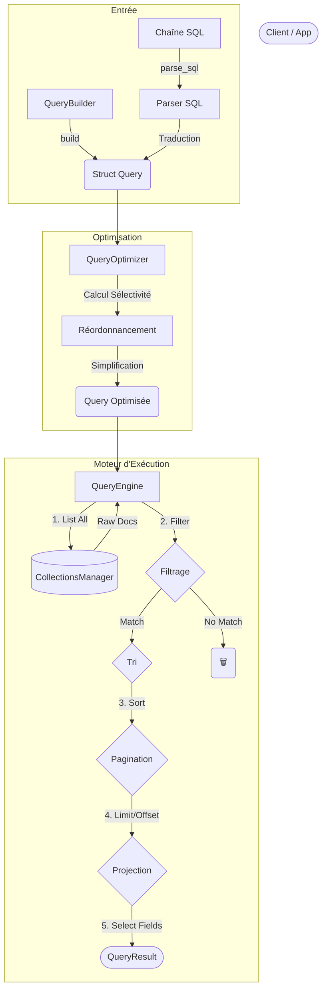

# 🔍 Module Query (JSON-DB)

Ce module implémente le moteur de requêtes de RAISE. Il offre une abstraction puissante pour interroger les collections JSON via une syntaxe **SQL standard** ou un **QueryBuilder** fluide, tout en gérant l'optimisation et la projection des données.

---

## 🏗️ Architecture & Pipeline

Le traitement d'une requête suit un pipeline strict en 4 étapes : Parsing, Optimisation, Chargement, Post-Traitement.



---

## 🚀 Fonctionnalités

### 1. Parsing SQL (`sql.rs`)

Le module utilise `sqlparser` pour supporter une syntaxe SQL familière :

- **Projections** : `SELECT name, address.city` (support des chemins imbriqués).
- **Filtres** : `WHERE age >= 18 AND (role = 'admin' OR status = 'active')`.
- **Tri** : `ORDER BY created_at DESC`.
- **Types** : Gestion transparente des types JSON (String, Number, Boolean, Null).

### 2. Optimiseur de Requêtes (`optimizer.rs`)

Avant l'exécution, l'`Optimizer` analyse la requête pour améliorer les performances :

- **Réordonnancement (Sélectivité)** : Les conditions sont triées par coût estimé. Une égalité simple (`=`) est vérifiée avant une expression régulière ou un `LIKE`. Cela permet d'éliminer les candidats non valides le plus tôt possible ("Fail Fast").
- **Simplification** : Déduplication des conditions redondantes.
- **Pagination** : Plafonnement automatique des limites excessives pour protéger la mémoire RAM.

### 3. Exécution (`executor.rs`)

Le moteur applique la logique sur les documents en mémoire :

- **Filtrage** : Évaluation récursive de l'arbre logique (`AND`/`OR`/`NOT`).
- **Comparaison** : Comparaison robuste des valeurs JSON (ex: `null` est toujours inférieur aux autres valeurs).
- **Projection** : Reconstitution d'objets JSON contenant uniquement les champs demandés (`SELECT`).

---

## 🛠️ Exemples d'Utilisation

### Option A : SQL (Recommandé pour l'UI/Console)

```rust
use crate::json_db::query::{sql::parse_sql, QueryEngine};

// 1. Définir la requête
let sql = "SELECT id, name FROM users WHERE role = 'admin' AND age > 25 ORDER BY name ASC";

// 2. Parser
let query = parse_sql(sql)?;

// 3. Exécuter
let engine = QueryEngine::new(&manager);
let result = engine.execute_query(query).await?;

println!("Trouvé {} admins", result.total_count);

```

### Option B : QueryBuilder (Recommandé pour le Code Rust)

```rust
use crate::json_db::query::parser::QueryBuilder;

// Construction fluide et typée
let query = QueryBuilder::new("users")
    .where_eq("status", json!("active"))
    .select(vec!["email".to_string()])
    .unwrap()
    .build();

let result = engine.execute_query(query).await?;

```

---

## 📂 Structure des Fichiers

| Fichier            | Rôle                                                                            |
| ------------------ | ------------------------------------------------------------------------------- |
| **`mod.rs`**       | Définitions des structures de données (`Query`, `Condition`, `Operator`).       |
| **`sql.rs`**       | Traducteur de l'AST `sqlparser` vers notre structure `Query` interne.           |
| **`parser.rs`**    | Utilitaires pour le parsing JSON et implémentation du `QueryBuilder`.           |
| **`optimizer.rs`** | Logique d'heuristique pour réorganiser les filtres.                             |
| **`executor.rs`**  | Moteur principal : boucle sur les données, applique les filtres et projections. |

---

## ⚠️ Limitations Actuelles

1. **Full Scan (Performance)** : Actuellement, le moteur charge **tous** les documents de la collection en mémoire (`manager.list_all`) avant d'appliquer les filtres. Il n'exploite pas encore les index (`json_db/indexes`) pour accélérer la lecture initiale. C'est la prochaine optimisation majeure prévue.
2. **Jointures** : Pas de support pour `JOIN`. Le modèle NoSQL privilégie la dénormalisation ou les requêtes applicatives multiples.
3. **Agrégations** : Les fonctions `COUNT()`, `SUM()`, `GROUP BY` ne sont pas encore supportées.

```

```
