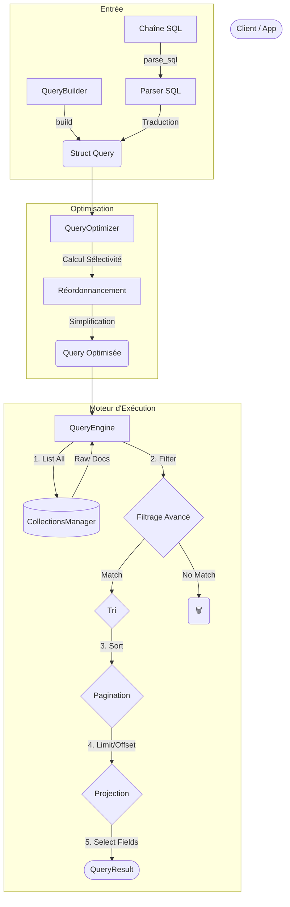

# 🔍 Module Query (JSON-DB)

Ce module implémente le moteur de requêtes de RAISE. Il offre une abstraction puissante pour interroger les collections JSON via une syntaxe **SQL standard** ou un **QueryBuilder** fluide, tout en gérant l'optimisation et la projection des données.

---

## 🏗️ Architecture & Pipeline

Le traitement d'une requête suit un pipeline strict en 4 étapes : Parsing, Optimisation, Chargement, Post-Traitement.



---

## 🚀 Fonctionnalités

### 1. Parsing SQL (`sql.rs`)

Le module utilise `sqlparser` pour supporter une syntaxe SQL familière, étendue pour le NoSQL :

- **Projections** : `SELECT name, address.city` (support des chemins imbriqués).
- **Filtres** : `WHERE age >= 18 AND role IN ('admin', 'editor')`.
- **Tri** : `ORDER BY created_at DESC`.
- **Pattern Matching** : `WHERE name LIKE 'A%'` (Commence par A).

### 2. Optimiseur de Requêtes (`optimizer.rs`)

Avant l'exécution, l'`Optimizer` analyse la requête pour améliorer les performances en réordonnant les conditions selon leur coût estimé (Sélectivité) :

- **Réordonnancement (Sélectivité)** : Les conditions "légères" (ex: `status = 'active'`) sont vérifiées avant les opérations coûteuses (ex: `bio CONTAINS 'dev'`).
- **Simplification** : Déduplication des conditions redondantes.
- **Pagination** : Plafonnement automatique des limites excessives.

### 3. Exécution (`executor.rs`)

Le moteur applique la logique sur les documents en mémoire avec un support étendu des opérateurs :

- **Comparaison** : `Eq` (`=`), `Ne` (`!=`), `Gt` (`>`), `Lt` (`<`).
- **Collections** : `In` (présence dans une liste), `Contains` (tableau contient valeur).
- **Texte** : `StartsWith`, `EndsWith`, `Like`, `Matches` (Regex).
- **Projection** : Reconstitution d'objets JSON contenant uniquement les champs demandés (`SELECT`).

---

## 🛠️ Exemples d'Utilisation

### Option A : SQL (Recommandé pour l'UI/Console)

```rust
use crate::json_db::query::{sql::parse_sql, QueryEngine};

// 1. Définir la requête (Supporte LIKE et IN)
let sql = "SELECT id, name FROM users WHERE role IN ('admin', 'editor') AND name LIKE 'S%' ORDER BY name ASC";

// 2. Parser
let query = parse_sql(sql)?;

// 3. Exécuter
let engine = QueryEngine::new(&manager);
let result = engine.execute_query(query).await?;

println!("Trouvé {} utilisateurs", result.total_count);

```

### Option B : QueryBuilder (Recommandé pour le Code Rust)

```rust
use crate::json_db::query::{parser::QueryBuilder, Condition};

// Construction fluide et typée avec les nouveaux helpers
let query = QueryBuilder::new("products")
    .where_cond(Condition::starts_with("sku", json!("PROD-")))
    .where_cond(Condition::r#in("category", json!(["electronics", "books"])))
    .sort("price", SortOrder::Asc)
    .limit(10)
    .build();

let result = engine.execute_query(query).await?;

```

---

## 📂 Structure des Fichiers

| Fichier            | Rôle                                                                              |
| ------------------ | --------------------------------------------------------------------------------- |
| **`mod.rs`**       | Définitions des structures (`Query`, `Condition`) et des Helpers (`gt`, `in`...). |
| **`sql.rs`**       | Traducteur de l'AST `sqlparser` vers notre structure `Query` interne.             |
| **`parser.rs`**    | Utilitaires pour le parsing JSON et implémentation du `QueryBuilder`.             |
| **`optimizer.rs`** | Logique d'heuristique pour réorganiser les filtres (Sélectivité).                 |
| **`executor.rs`**  | Moteur principal : itération, filtrage (tous opérateurs), tri et pagination.      |

---

## ⚠️ Limitations Actuelles

1. **Full Scan (Performance)** : Le moteur charge actuellement tous les documents (`manager.list_all`) avant de filtrer. L'intégration prochaine avec les index (`json_db/indexes`) permettra de ne charger que les IDs pertinents.
2. **Jointures** : Pas de support pour `JOIN`. Le modèle NoSQL privilégie la dénormalisation.
3. **Agrégations** : Les fonctions `COUNT()`, `SUM()` ne sont pas encore supportées (sauf count total).

```

```
