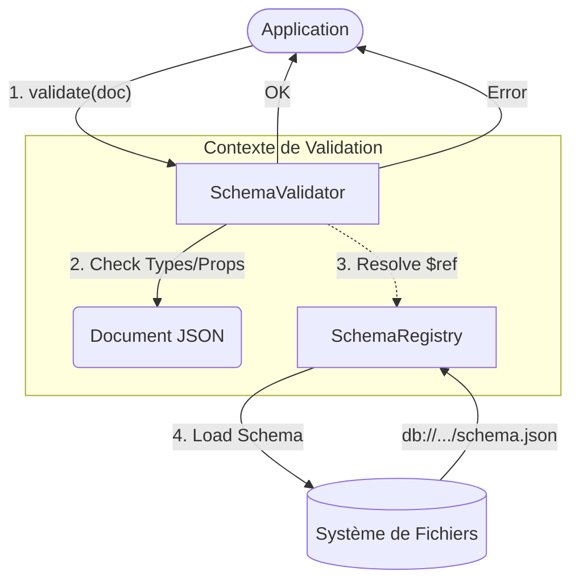

# 🛡️ Module Schema (Validation Structurelle)

Ce module implémente un moteur de validation JSON Schema "léger" et intégré, spécifiquement conçu pour l'architecture de RAISE. Il ne dépend pas de validateurs externes lourds et gère nativement la résolution de références internes (`$ref`) via un registre en mémoire.

---

## 🏗️ Architecture & Flux

Le système repose sur la séparation entre le stockage des définitions (Registry) et la logique de vérification (Validator).



### Composants Clés

| Composant             | Fichier        | Rôle                                                                                                                                                                |
| --------------------- | -------------- | ------------------------------------------------------------------------------------------------------------------------------------------------------------------- |
| **`SchemaRegistry`**  | `registry.rs`  | Charge et indexe tous les schémas disponibles dans la base (`.../schemas/v1/`). Il attribue à chaque fichier une URI unique de type `db://space/db/schemas/v1/...`. |
| **`SchemaValidator`** | `validator.rs` | Effectue la validation récursive d'un document JSON par rapport à un schéma racine. Il gère la logique des mots-clés (`required`, `patternProperties`, etc.).       |

---

## 🚀 Fonctionnalités Implémentées

### 1. Registre de Schémas (`registry.rs`)

Le registre est l'autorité centrale des types.

- **Scan Automatique** : Au démarrage, il parcourt récursivement le dossier `schemas/v1` de la base de données.
- **Résolution d'URI** : Il normalise les chemins relatifs pour permettre des références inter-fichiers stables (`db://...`).

### 2. Validation (`validator.rs`)

Le validateur implémente une sous-partie stricte de JSON Schema Draft 2020-12 :

- **Types Primitifs** : `string`, `number`, `integer`, `boolean`, `array`, `object`, `null`.
- **Objets** :
- `required` : Vérifie la présence des champs obligatoires.
- `properties` : Valide récursivement les sous-objets définis.
- `patternProperties` : Valide les clés dynamiques via Regex (ex: `^x_` pour les extensions).
- `additionalProperties` : Si `false`, rejette toute clé non définie (sauf `$schema` qui est toléré).

- **Références (`$ref`)** :
- Interne : `"#/$defs/myType"` (Pointeurs JSON).
- Externe : `"../common/base.json"` (Résolution via le registre).

---

## 🛠️ Exemple d'Utilisation

```rust
use crate::json_db::schema::{SchemaRegistry, SchemaValidator};


// 1. Initialisation (Scan du disque)
let registry = SchemaRegistry::from_db(&config, "my_space", "my_db")?;

// 2. Compilation d'un validateur pour un type donné
// Le chemin relatif est automatiquement converti en URI absolue
let root_uri = registry.uri("actors/operational_actor.json");
let validator = SchemaValidator::compile_with_registry(&root_uri, &registry)?;

// 3. Validation d'une instance
let doc = json!({
    "id": "123",
    "name": "Opérateur Radar",
    "x_custom_field": "Extension valide" // Si patternProperties: "^x_"
});

match validator.validate(&doc) {
    Ok(_) => println!("✅ Document valide"),
    Err(e) => eprintln!("❌ Erreur de validation : {}", e),
}

```

---

## 📂 Structure des Fichiers

```text
src-tauri/src/json_db/schema/
├── mod.rs          // Exports et définition de l'enum ValidationError
├── registry.rs     // Chargement, indexation et résolution des URIs
└── validator.rs    // Moteur de validation récursif (logique pure)

```

## ⚠️ Limitations

- **Mots-clés manquants** : Des fonctionnalités avancées comme `oneOf`, `anyOf`, `allOf`, `if/then/else` ou les contraintes numériques (`minimum`, `maxLength`) ne sont pas encore implémentées.
- **Performance** : Le registre charge tous les schémas en mémoire (RAM) au démarrage. Pour des bases contenant des milliers de types, une stratégie de _Lazy Loading_ (chargement à la demande) sera nécessaire.

```

```
