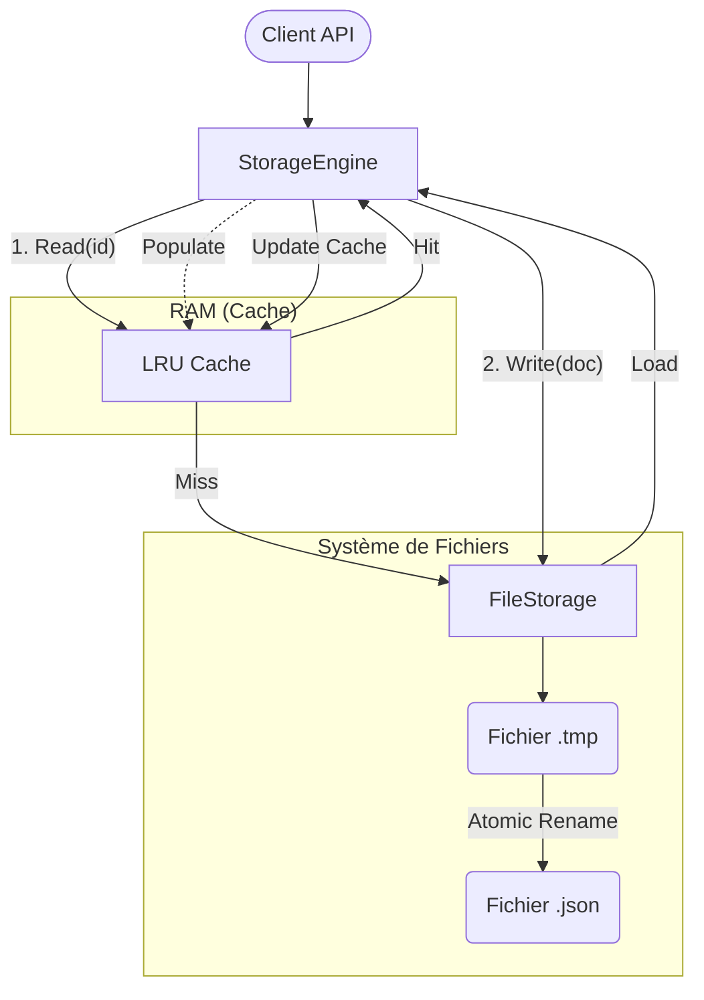

# 💾 Module Storage (JSON-DB)

Ce module implémente la couche physique de stockage de données pour RAISE. Il est responsable de la persistance sur le disque, de la gestion du cache en mémoire et de la sécurité des transactions de bas niveau.

C'est la fondation sur laquelle reposent les modules `collections`, `indexes` et `migrations`.

---

## 🏗️ Architecture & Flux I/O

Le moteur utilise une stratégie hybride **Disque + Cache** pour optimiser les performances tout en garantissant la durabilité.



### Composants Clés

| Composant           | Fichier           | Rôle                                                                                              |
| ------------------- | ----------------- | ------------------------------------------------------------------------------------------------- |
| **`StorageEngine`** | `mod.rs`          | Façade principale. Coordonne les appels entre le cache et le disque.                              |
| **`file_storage`**  | `file_storage.rs` | Opérations bas niveau : lecture/écriture fichiers, gestion des dossiers, déploiement des schémas. |
| **`cache`**         | `cache.rs`        | Cache mémoire LRU (Least Recently Used) thread-safe pour éviter les I/O répétitifs.               |
| **`JsonDbConfig`**  | `mod.rs`          | Configuration centrale des chemins (Racine, Espaces, Bases).                                      |

---

## 🚀 Fonctionnalités Clés

### 1. Organisation Hiérarchique

Le stockage structure les données physiquement pour isoler les contextes (Multi-tenant ready).

```text
data_root/
├── space_A/
│   ├── db_prod/
│   │   ├── collections/
│   │   │   └── users/
│   │   │       ├── u_123.json
│   │   │       └── u_456.json
│   │   └── _indexes/
│   └── _system/
│       └── schemas/v1/ (Schémas partagés)

```

### 2. Écritures Atomiques (Crash-Safe)

Pour éviter la corruption de données en cas de panne (coupure de courant, crash process), aucune écriture n'est directe.

1. Le contenu est écrit dans un fichier temporaire `filename.tmp.uuid`.
2. Le fichier est synchronisé sur le disque (`fsync`).
3. Le fichier est renommé vers `filename.json`. Cette opération est atomique sur les systèmes de fichiers modernes (POSIX/NTFS).

### 3. Cache Intelligent

Le `StorageEngine` maintient un cache des documents les plus utilisés.

- **Write-Through** : Toute écriture met à jour simultanément le disque et le cache.
- **LRU** : Si la capacité est atteinte (ex: 1000 docs), les documents les moins récemment utilisés sont éjectés.
- **TTL** : Une durée de vie peut être configurée pour forcer le rafraîchissement des données.

### 4. Déploiement Automatique des Schémas

Le module intègre les schémas JSON par défaut (`src-tauri/schemas/v1`) directement dans le binaire compilé.
Lors de l'initialisation (`create_db`), il extrait automatiquement ces fichiers sur le disque si nécessaire, garantissant que l'application démarre toujours avec une structure valide.

---

## 🛠️ Exemple d'Utilisation

```rust
use crate::json_db::storage::{JsonDbConfig, StorageEngine};
use serde_json::json;
use std::path::PathBuf;

fn main() -> anyhow::Result<()> {
    // 1. Configuration
    let config = JsonDbConfig::new(PathBuf::from("./data"));
    let storage = StorageEngine::new(config);

    // 2. Initialisation (crée les dossiers et déploie les schémas)
    crate::json_db::storage::file_storage::create_db(&storage.config, "my_space", "my_db")?;

    // 3. Écriture Sécurisée
    let doc = json!({ "id": "user_1", "name": "Alice" });
    storage.write_document("my_space", "my_db", "users", "user_1", &doc)?;

    // 4. Lecture (Cache Hit probable)
    if let Some(read_doc) = storage.read_document("my_space", "my_db", "users", "user_1")? {
        println!("Document lu : {:?}", read_doc);
    }

    Ok(())
}

```

---

## ⚠️ Notes Techniques

- **Verrouillage** : Ce module n'implémente pas de verrouillage inter-processus (`flock`). Il est conçu pour être utilisé par une instance unique de l'application (Single Writer).
- **Performance** : Le stockage "un fichier par document" est excellent pour la fiabilité et le débogage, mais peut atteindre des limites de performance (inodes) sur des collections contenant des millions de petits documents.

```

```

```

```
