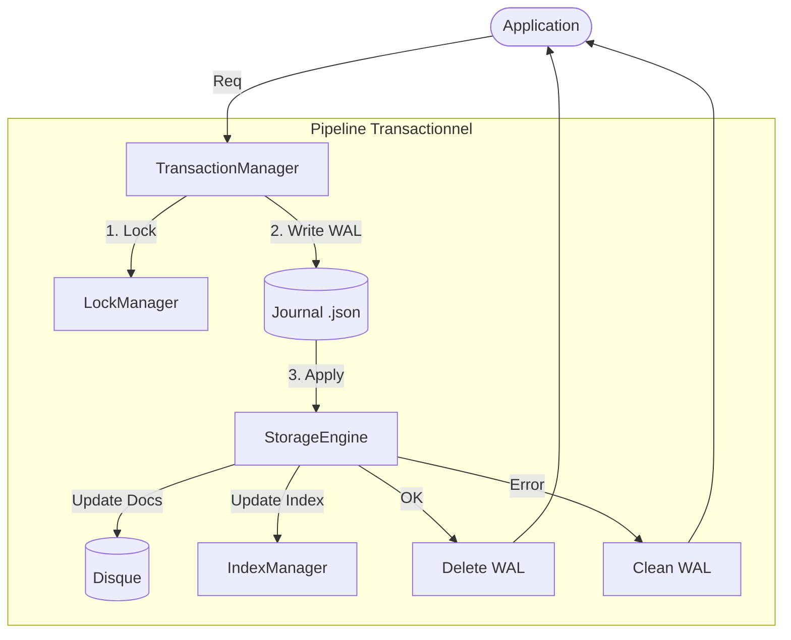

# 🔄 Module Transactions (JSON-DB)

Ce module implémente le gestionnaire de transactions ACID (Atomicité, Cohérence, Isolation, Durabilité) de RAISE. Il garantit que toutes les écritures dans la base de données sont sûres, même en cas de crash ou d'accès concurrent.

---

## 🏗️ Architecture & Flux Transactionnel

Le gestionnaire coordonne les verrous, la journalisation (WAL) et l'application des changements.



### Composants Clés

| Composant                      | Fichier           | Rôle                                                                                                                                                                                                                               |
| ------------------------------ | ----------------- | ---------------------------------------------------------------------------------------------------------------------------------------------------------------------------------------------------------------------------------- |
| **`TransactionManager`**       | `manager.rs`      | Chef d'orchestre. Exécute les transactions, gère les erreurs et assure la cohérence.                                                                                                                                               |
| **`WAL` (Write-Ahead Log)**    | `wal.rs`          | Le journal des transactions. Avant toute modification physique des données, l'intention est sérialisée sur disque dans le dossier `/wal`. En cas de crash, ce journal permet de rejouer ou d'annuler les transactions incomplètes. |
| **`LockManager`**              | `lock_manager.rs` | Gère la concurrence. Il fournit des verrous d'écriture (`RwLock`) granulaires au niveau de la Collection (`space/db/collection`), empêchant deux transactions de modifier la même table simultanément.                             |
| **Structure des Transactions** | `mod.rs`          | Définit les types de requêtes (`TransactionRequest`) et les opérations atomiques internes (`Operation`).                                                                                                                           |

---

## 🚀 Fonctionnalités Clés

### 1. Atomicité et Durabilité (WAL)

Le principe fondamental est : **Write Ahead Log**.

- **Étape 1** : La transaction complète est écrite dans un fichier JSON `{tx_id}.json` dans le dossier `wal/`.
- **Étape 2** : Les modifications sont appliquées aux fichiers de données (physique) et aux index (mémoire/disque).
- **Étape 3 (Commit)** : Si tout s'est bien passé, le fichier WAL est supprimé.
- **Rollback** : Si une erreur survient pendant l'étape 2, le système s'arrête et nettoie le WAL (dans cette implémentation simple, le rollback consiste à annuler le WAL, une récupération future nettoierait l'état).

### 2. Isolation (Locking)

Le `LockManager` assure une isolation séquentielle pour les écritures sur une même collection.

- Avant d'exécuter une transaction, le Manager identifie toutes les collections impactées.
- Il acquiert les verrous dans un ordre déterministe (tri alphabétique des noms de collection) pour éviter les **Deadlocks**.

### 3. API Intelligente (`execute_smart`)

Le `TransactionManager` offre une méthode `execute_smart` qui simplifie la vie du développeur:

- **Auto-ID** : Génère automatiquement les UUIDs si manquants.
- **Résolution de Handle** : Permet de cibler un document par son `handle` (ex: `user-alice`) au lieu de son ID, en effectuant une recherche préalable transparente.
- **Import de Fichiers** : Supporte l'opération `InsertFrom` pour charger des données depuis un fichier externe (dataset).

### 4. Cohérence (Validation & Indexation)

Lors de l'application d'une transaction, le Manager ne se contente pas d'écrire le fichier :

- Il valide le document contre son schéma JSON (`SchemaValidator`).
- Il met à jour l'index système (`_system.json`).
- Il met à jour les index secondaires (`IndexManager`).

---

## 🛠️ Utilisation

### Haut Niveau (Recommandé)

```rust
use crate::json_db::transactions::{TransactionManager, TransactionRequest};

let tm = TransactionManager::new(&config, "my_space", "my_db");

let requests = vec![
    TransactionRequest::Insert {
        collection: "users".to_string(),
        id: None, // Auto-généré
        document: json!({ "name": "Alice", "age": 30 }),
    },
    TransactionRequest::Update {
        collection: "configs".to_string(),
        id: None,
        handle: Some("app-theme".to_string()), // Recherche par handle
        document: json!({ "dark_mode": true }),
    }
];

tm.execute_smart(requests).await?;

```

### Bas Niveau (Interne)

```rust
tm.execute(|tx| {
    tx.add_insert("users", "user_1", json!({...}));
    Ok(())
})?;

```

## 📂 Structure des Fichiers

```text
src-tauri/src/json_db/transactions/
├── mod.rs          // Définitions (Request, Operation, Transaction)
├── manager.rs      // Logique principale (Execute, Commit, Rollback)
├── wal.rs          // Gestion physique du journal (Write/Delete files)
├── lock_manager.rs // Gestion des verrous (RwLock)

```

## ⚠️ Limitations Actuelles

- **Rollback Partiel** : Actuellement, si une transaction échoue au milieu de l'étape 2 (après avoir écrit 1 fichier sur 3), les fichiers déjà écrits restent sur le disque. Une vraie procédure de "Recovery" au démarrage (qui scannerait le WAL pour annuler les changements partiels) serait la prochaine étape d'amélioration.
- **Verrouillage** : Les verrous sont uniquement en mémoire (RAM). Ils ne fonctionnent que pour une instance unique de l'application. Si deux processus accèdent à la même DB, il n'y a pas de protection (pas de verrous fichiers `flock`).

```

```
