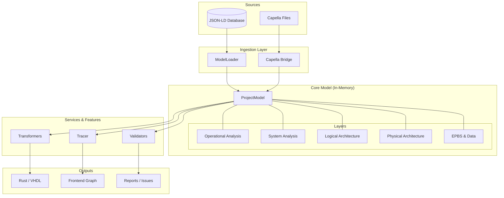

# Model Engine (`src/model_engine`)

Le **Model Engine** est le cœur métier de l'application RAISE. Il encapsule toute la logique d'Ingénierie Système basée sur la méthodologie **Arcadia**.

Il agit comme une couche d'abstraction entre les données brutes (JSON-LD, Fichiers Capella) et les fonctionnalités utilisateur (Visualisation, IA, Génération de code).

## 🌍 Vue d'Ensemble Architecturelle

Le moteur orchestre le cycle de vie d'un modèle système, du chargement à la génération d'artefacts.



## 📂 Organisation des Modules

| Module              | Description                                                                                                                                                                           |
| ------------------- | ------------------------------------------------------------------------------------------------------------------------------------------------------------------------------------- |
| **`arcadia/`**      | **Définitions Sémantiques**. Contient les types forts (Structs) pour chaque élément (ex: `LogicalComponent`, `SystemFunction`) et les règles de classification (`Layer`, `Category`). |
| **`capella/`**      | **Interopérabilité**. Parsers XML spécialisés pour lire les projets `.capella` (sémantique) et `.aird` (diagrammes) d'Eclipse Capella.                                                |
| **`transformers/`** | **Génération**. Moteur de transformation Model-to-Text (Génération de code Rust/VHDL) et Text-to-Model (Interprétation des réponses IA).                                              |
| **`validators/`**   | **Qualité**. Moteur de règles vérifiant la cohérence technique (liens brisés, orphelins) et la conformité méthodologique.                                                             |
| **`loader.rs`**     | **Hydratation**. Charge les données depuis la base JSON-LD et reconstruit les liens d'objets en mémoire.                                                                              |
| **`types.rs`**      | **Structures Unifiées**. Définit le `ProjectModel` global et l'`ArcadiaElement` générique utilisé comme pivot.                                                                        |
| **`traceability/`** | **Navigation**. Gère l'indexation inverse des liens (ex: trouver "qui alloue cette fonction ?") via le `Tracer`.                                                                      |

## 🔑 Concepts Clés

### 1. Le Double Modèle (Generic vs Typed)

Le moteur gère deux représentations des données :

- **Le Modèle Générique (`ArcadiaElement`)** :
- Utilisé par le `Loader` et l'IA.
- Flexible : C'est un "sac de propriétés" (`HashMap`).
- Permet de manipuler des données incomplètes ou en cours de création.

- **Le Modèle Typé (via `arcadia/*`)** :
- Utilisé par les `Validators` et `Transformers`.
- Strict : Un `LogicalComponent` est une struct Rust précise.
- Garantit la sûreté du typage pour la génération de code.

### 2. La Gestion des Liens

Dans la base de données, les liens sont directionnels (ex: `Component --allocatedFunctions--> Function`).
Le **`Tracer`** construit dynamiquement l'index inverse au chargement, permettant des requêtes bidirectionnelles instantanées (ex: `Function --isAllocatedTo--> Component`).

## 🚀 Guide d'Utilisation Rapide

### Chargement d'un projet

```rust
use crate::model_engine::loader::ModelLoader;
// Supposons que 'storage' est injecté par Tauri
let loader = ModelLoader::new(&storage, "my_space", "my_project");
let model = loader.load_full_model()?;

println!("Projet chargé : {} éléments", model.meta.element_count);

```

### Validation

```rust
use crate::model_engine::validators::{ConsistencyChecker, ComplianceValidator};

let validator = ComplianceValidator::new();
let issues = validator.validate(&model);

if !issues.is_empty() {
    println!("Attention, {} problèmes détectés !", issues.len());
}

```

### Transformation (Génération de Code)

```rust
use crate::model_engine::transformers::{get_transformer, TransformationDomain};

let generator = get_transformer(TransformationDomain::Software);
let input = serde_json::to_value(&model)?;
let output = generator.transform(&input)?;

println!("Code généré : {}", output["code"]);

```

## ⚠️ Conventions de Développement

1. **Immutabilité par défaut** : Le `ProjectModel` chargé est généralement traité en lecture seule par les services de transformation et de validation.
2. **Séparation des préoccupation** :

- Si ça concerne la _structure_ de la donnée -> `arcadia/`
- Si ça concerne la _vérification_ -> `validators/`
- Si ça concerne la _production_ -> `transformers/`

3. **Gestion des Erreurs** : Utilisation systématique de `anyhow::Result` pour la propagation des erreurs contextuelles.

```

```
