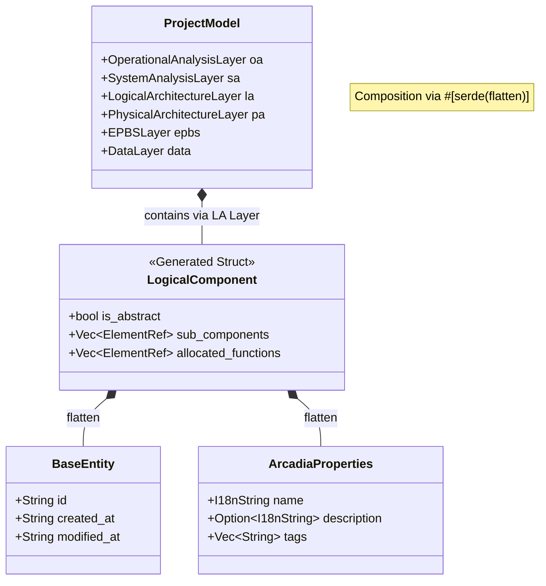

# Arcadia Semantic Model (`src/model_engine/arcadia`)

Ce module définit le **Méta-modèle Arcadia** en Rust. Il fournit des structures de données fortement typées pour représenter les éléments d'ingénierie système (Capella) avec une rigueur sémantique.

Contrairement au modèle générique (JSON "sac de nœuds"), ce module garantit que chaque élément (ex: `LogicalComponent`, `Class`) possède exactement les champs définis par la méthodologie Arcadia.

## 📊 Architecture des Données

Le diagramme ci-dessous illustre comment les structures Rust sont générées. La macro `arcadia_element!` combine les données techniques (`BaseEntity`) et les propriétés métier (`ArcadiaProperties`) avec les champs spécifiques à chaque type.



## 📂 Structure du Module

```text
src/model_engine/arcadia/
├── mod.rs                  # Point d'entrée et re-exports
├── common.rs               # Types primitifs (BaseEntity, I18nString, ElementRef)
├── element_kind.rs         # Enums de classification (Layer, ElementCategory)
├── metamodel.rs            # La MACRO `arcadia_element!` et les propriétés communes
│
├── operational_analysis.rs # Couche OA (Utilisateurs, Activités...)
├── system_analysis.rs      # Couche SA (Système, Fonctions, Acteurs...)
├── logical_architecture.rs # Couche LA (Composants logiques, Interfaces...)
├── physical_architecture.rs# Couche PA (Nœuds, Hardware, Comportement...)
├── epbs.rs                 # Couche EPBS (Configuration Items)
└── data.rs                 # Couche Data (Classes, Types, ExchangeItems)

```

## 🛠️ Concepts Clés

### 1. Composition via Macro (`arcadia_element!`)

Pour éviter la répétition de code, tous les éléments sont générés via la macro `arcadia_element!`. Cette macro injecte automatiquement deux socles communs à chaque structure :

1. **`base` (`BaseEntity`)** : Identifiant technique (UUID), dates de création/modif.
2. **`props` (`ArcadiaProperties`)** : Nom, Description, Résumé, Tags.

**Exemple de définition :**

```rust
// Dans logical_architecture.rs
arcadia_element!(LogicalComponent {
    // Champs spécifiques à cet élément uniquement
    #[serde(rename = "isAbstract", default)]
    is_abstract: bool,

    #[serde(rename = "allocatedFunctions", default)]
    allocated_functions: Vec<ElementRef>
});

```

### 2. Typage Fort

Les champs ne sont pas des `HashMap` génériques. Si un `SystemComponent` doit avoir des `allocatedFunctions`, le compilateur Rust garantit que ce champ existe et est un `Vec<String>`.

### 3. Internationalisation (`I18nString`)

Le champ `name` et `description` supportent nativement le multilingue via l'enum `I18nString` (soit une `String` simple, soit une `Map<Lang, String>`).

## 📚 Couches Supportées

### Operational Analysis (OA)

Focalisé sur le besoin utilisateur et les activités opérationnelles.

- `OperationalActor`, `OperationalActivity`, `OperationalCapability`, `OperationalEntity`, `OperationalExchange`.

### System Analysis (SA)

Vue boîte noire du système.

- `SystemComponent` (Le Système), `SystemFunction`, `SystemActor`, `SystemCapability`, `FunctionalExchange`.

### Logical Architecture (LA)

Vue boîte blanche abstraite (indépendante de la technologie).

- `LogicalComponent`, `LogicalFunction`, `LogicalActor`, `LogicalInterface`.

### Physical Architecture (PA)

Vue concrète (Hardware, Software, Déploiement).

- `PhysicalComponent` (Node/Behavior), `PhysicalFunction`, `PhysicalLink` (Câbles/Bus).

### EPBS (End Product Breakdown Structure)

Découpage industriel.

- `ConfigurationItem` (CI).

### Data Analysis (Transverse)

Définition des données échangées.

- `Class` (UML-like), `DataType` (Enum, Boolean, Numeric), `ExchangeItem`.

## 🚀 Utilisation

### Instanciation Manuelle

```rust
use crate::model_engine::arcadia::logical_architecture::LogicalComponent;
use crate::model_engine::arcadia::common::{BaseEntity, ElementRef};
use crate::model_engine::arcadia::metamodel::ArcadiaProperties;

let comp = LogicalComponent {
    base: BaseEntity {
        id: "uuid-123".to_string(),
        created_at: chrono::Utc::now().to_rfc3339(),
        modified_at: chrono::Utc::now().to_rfc3339(),
    },
    props: ArcadiaProperties {
        name: I18nString::String("Contrôleur de Vol".into()),
        description: Some(I18nString::String("Gère la stabilité".into())),
        ..Default::default()
    },
    is_abstract: false,
    sub_components: vec![],
    allocated_functions: vec!["func-abc".to_string()],
    // ... autres champs obligatoires initialisés à vide
    realized_system_components: vec![],
    provided_interfaces: vec![],
    required_interfaces: vec![],
};

```

### Classification Sémantique

Le trait `ArcadiaSemantics` permet d'interroger la nature d'un élément générique :

```rust
use crate::model_engine::arcadia::{ArcadiaSemantics, Layer, ElementCategory};

// Sur un ArcadiaElement générique
if element.get_layer() == Layer::LogicalArchitecture {
    println!("C'est du Logique !");
}

if element.is_behavioral() {
    println!("C'est une fonction ou un échange (comportement)");
}

```

## ⚠️ Conventions

- **IDs** : Toujours des UUID v4 sous forme de String.
- **Refs** : Les relations (ex: `allocatedTo`) stockent uniquement l'ID cible (`ElementRef`). La résolution se fait via le `Tracer` ou le `ModelLoader`.

```

```
