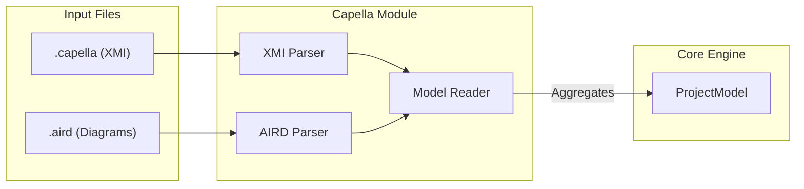

# Capella Model Bridge (`src/model_engine/capella`)

Ce module assure l'interopérabilité avec l'outil **Eclipse Capella**. Il est responsable du parsing bas niveau des fichiers XML (XMI) pour extraire la sémantique (le modèle) et la représentation graphique (les diagrammes).

## 🎯 Objectifs

1.  **Parsing Haute Performance** : Utilisation de `quick-xml` pour lire des fichiers `.capella` de plusieurs centaines de Mo sans charger tout le DOM en mémoire.
2.  **Extraction Sémantique** : Conversion des types XMI verbeux (ex: `org.polarsys.capella.core.data.la:LogicalComponent`) en structures `ArcadiaElement` normalisées.
3.  **Extraction Visuelle** : Analyse des fichiers `.aird` pour récupérer les coordonnées (x, y, w, h) des éléments sur les diagrammes.

## 📂 Structure du Module

```text
src/model_engine/capella/
├── mod.rs                  # Point d'entrée
├── xmi_parser.rs           # Parser de flux XML pour le fichier sémantique (.capella)
├── diagram_generator.rs    # Extraction des layouts depuis le fichier de vue (.aird)
├── model_reader.rs         # Façade haut-niveau (Orchestre XMI + Metadata)
└── model_writer.rs         # Export (Actuellement JSON/RAISE format, pas de réécriture XMI)
```

## 🔄 Flux de Données

Le diagramme ci-dessous illustre le processus de chargement d'un projet Capella externe vers le moteur interne RAISE.



## 🛠️ Composants Détaillés

### 1. XMI Parser (`xmi_parser.rs`)

Il parcourt le fichier `.capella` événement par événement (SAX-like parsing).

- **Détection des couches** : Identifie automatiquement si un élément appartient à OA, SA, LA ou PA.
- **Mapping** : Convertit les attributs XML (`id`, `name`, `xsi:type`) en champs `ArcadiaElement`.
- **Dispatch** : Range l'élément dans le bon vecteur du `ProjectModel` (ex: `model.la.components`).

### 2. Diagram Generator (`diagram_generator.rs`)

Analyse le fichier `.aird` (format GMF/Sirius).

- Repère les balises `<children>` associées à un élément sémantique via `element="#UUID"`.
- Extrait les contraintes de mise en page : `<layoutConstraint x="..." y="..." width="..." height="...">`.
- _Note : Ce parser est tolérant aux fautes car la structure Sirius est extrêmement complexe et variable._

### 3. Model Reader (`model_reader.rs`)

C'est la façade publique utilisée par le reste de l'application.

- Initialise le `ProjectModel`.
- Appelle le parser XMI.
- (Optionnel) Appelle le parser de diagrammes pour enrichir les propriétés.
- Calcule les métadonnées (nombre d'éléments, date de chargement).

## 🚀 Utilisation

### Chargement d'un fichier Capella

```rust
use crate::model_engine::capella::CapellaReader;
use std::path::Path;

fn load_demo() {
    let path = Path::new("/path/to/project.capella");

    match CapellaReader::read_model(path) {
        Ok(model) => {
            println!("Projet chargé : {}", model.meta.name);
            println!("Nombre de composants logiques : {}", model.la.components.len());
        },
        Err(e) => eprintln!("Erreur de chargement : {}", e),
    }
}

```

### Parsing des diagrammes (Avancé)

```rust
use crate::model_engine::capella::diagram_generator::AirdParser;

let layout_map = AirdParser::extract_layout(Path::new("model.aird"))?;
if let Some(layout) = layout_map.get("UUID-1234") {
    println!("L'élément est en ({}, {})", layout.x, layout.y);
}

```

## ⚠️ Limitations Actuelles

1. **Lecture Seule (Read-Only) sur le format natif** :

- Nous lisons les fichiers `.capella` et `.aird`.
- Nous **n'écrivons pas** dans ces fichiers pour éviter de corrompre les projets Eclipse (la structure XMI est trop fragile sans EMF).
- L'export se fait au format JSON natif de RAISE via `model_writer.rs`.

2. **Liens Complexes** :

- Le parser extrait les liens simples (ex: `allocatedTo="#UUID"`).
- Les liens complexes (ex: ports, interfaces, délégations) nécessitent l'utilisation du `Tracer` après le chargement pour être pleinement résolus.

```

```

```

```
