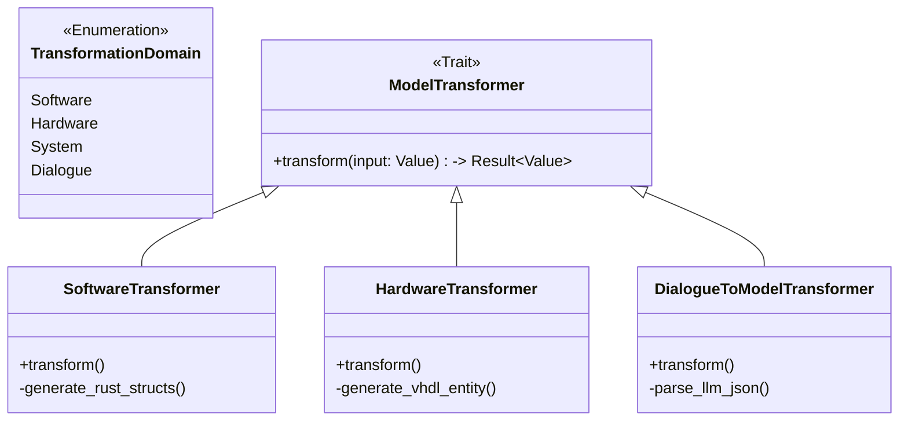

# Model Transformers (`src/model_engine/transformers`)

Ce module gère la **génération d'artefacts** à partir du modèle système (`ProjectModel`) ou la transformation de données externes (ex: Dialogue IA) vers le modèle.

C'est le moteur de "production" de l'application RAISE : il permet de passer de l'architecture abstraite (Arcadia) à du code concret (Rust, VHDL) ou des rapports.

## 🎯 Objectifs

1.  **Code Generation (Model-to-Text)** : Générer des squelettes de code (Structs, Classes, Entity VHDL) basés sur les Composants et Interfaces définis dans le modèle.
2.  **Model Transformation (Text-to-Model)** : Convertir des sorties textuelles d'IA (LLM) en objets JSON valides pour insertion dans la base de données (via `DialogueToModel`).
3.  **Abstraction Factory** : Fournir une interface unique pour invoquer différents types de générateurs sans coupler le code métier aux implémentations spécifiques.

## 📊 Architecture

Le système utilise un **Pattern Factory**. Le client demande un transformateur pour un domaine spécifique (`TransformationDomain`), et le moteur retourne l'implémentation correspondante traitant le `ProjectModel`.



## 📂 Structure du Module

```text
src/model_engine/transformers/
├── mod.rs                  # Factory (get_transformer) et définitions des Traits
├── software.rs             # Génération de code logiciel (Rust/C++)
├── hardware.rs             # Génération de code matériel (VHDL/Verilog)
├── system.rs               # Transformation vers des rapports système
└── dialogue_to_model.rs    # Parsing et validation des réponses JSON de l'IA

```

## 🛠️ Le Trait `ModelTransformer`

Tous les transformateurs implémentent ce trait générique :

```rust
pub trait ModelTransformer {
    /// Transforme une entrée (souvent le ProjectModel ou une String)
    /// en une sortie (Code, JSON, Rapport).
    fn transform(&self, input: &serde_json::Value) -> anyhow::Result<serde_json::Value>;
}

```

## 🚀 Utilisation

### 1. Génération de Code (Software)

Transforme les composants de l'architecture logique (LA) ou physique (PA) en structures de code.

```rust
use crate::model_engine::transformers::{get_transformer, TransformationDomain};
use serde_json::json;

fn generate_code(model: &ProjectModel) {
    // 1. Récupérer le transformateur Logiciel
    let transformer = get_transformer(TransformationDomain::Software);

    // 2. Préparer l'input (le modèle complet serialisé)
    let input = serde_json::to_value(model).unwrap();

    // 3. Exécuter la transformation
    let result = transformer.transform(&input).expect("Erreur de génération");

    println!("Code généré : {}", result["code"]);
}

```

### 2. Dialogue vers Modèle (AI Feature)

Utilisé par l'assistant pour convertir une suggestion textuelle en un élément insérable en base.

```rust
use crate::model_engine::transformers::TransformationDomain;

fn ai_response_to_model(llm_response: &str) {
    let transformer = get_transformer(TransformationDomain::Dialogue);

    // L'input est la réponse brute de l'IA
    let input = json!({ "raw_text": llm_response });

    // L'output est un ArcadiaElement valide (nettoyé et typé)
    let element = transformer.transform(&input).unwrap();

    // On peut maintenant l'insérer via le ModelLoader
}

```

## ⚠️ Règles d'Implémentation

1. **Idempotence** : Les transformateurs doivent (autant que possible) produire le même résultat pour le même modèle d'entrée.
2. **Séparation Logiciel/Matériel** :

- Les composants tagués `Software` ou `Node` génèrent du code impératif/OO.
- Les composants tagués `Hardware` ou `FPGA` génèrent du code de description matérielle (HDL).

3. **Traçabilité** : Le code généré doit idéalement inclure en commentaire l'ID de l'élément modèle source pour permettre le "Round-Trip Engineering".

```

```
