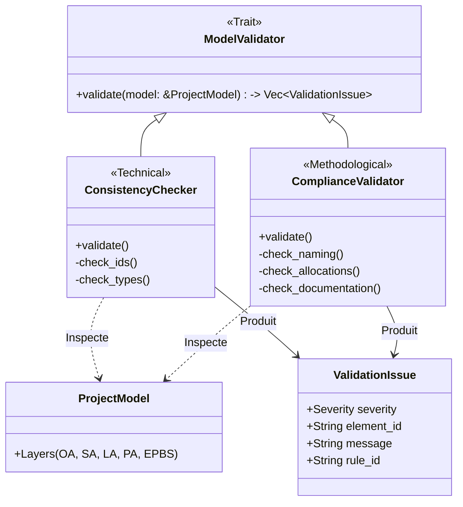

# Model Validators (`src/model_engine/validators`)

Ce module est le **Garde-fou** de l'application RAISE. Il est responsable de la vérification de la qualité, de l'intégrité et de la conformité du modèle système (`ProjectModel`).

Il est conçu pour fonctionner en temps réel ou à la demande, fournissant un retour immédiat à l'utilisateur sur l'état de santé de son architecture.

## 🎯 Objectifs

Le module répond à trois besoins distincts :

1.  **Cohérence Technique (Consistency)** : Le modèle est-il valide informatiquement ?
    - Pas d'IDs dupliqués ou manquants.
    - Pas de liens pointant vers le vide (Broken Links).
    - Types d'éléments (URIs) corrects.
2.  **Conformité Méthodologique (Compliance)** : Le modèle respecte-t-il Arcadia ?
    - Conventions de nommage (PascalCase, etc.).
    - Règles d'allocation (ex: un Composant doit avoir des Fonctions).
    - Qualité documentaire (Descriptions présentes).
3.  **Extensibilité** : Permettre d'ajouter facilement de nouvelles règles métier sans toucher au cœur du moteur.

## 📊 Flux de Validation

Le diagramme ci-dessous illustre l'architecture du module. Le `ValidationService` (ou l'appelant) orchestre différents validateurs qui implémentent tous le même Trait `ModelValidator`.



## 📂 Structure du Module

```text
src/model_engine/validators/
├── mod.rs                  # Définitions des Traits (ModelValidator) et Structures (ValidationIssue, Severity)
├── consistency_checker.rs  # Validateur technique (Intégrité des données)
└── compliance_validator.rs # Validateur métier (Qualité et Méthodologie)

```

## 🛠️ Structures de Données

### `Severity`

Indique la gravité du problème pour l'interface utilisateur.

- `Error` (Rouge) : Problème critique (ID manquant, corruption). Bloque souvent la génération de code.
- `Warning` (Jaune) : Problème méthodologique (ex: Composant vide).
- `Info` (Bleu) : Suggestion d'amélioration (ex: Description manquante, faute de convention).

### `ValidationIssue`

L'objet retourné au Frontend.

```rust
pub struct ValidationIssue {
    pub severity: Severity,
    pub rule_id: String,      // Code unique (ex: "SYS_001") pour filtrage/ignorance
    pub element_id: String,   // ID de l'élément pour le surligner dans le graphe
    pub message: String,      // Description lisible par l'humain
}

```

## 🚀 Utilisation

### Lancer une validation complète

```rust
use crate::model_engine::validators::{ConsistencyChecker, ComplianceValidator, ModelValidator};

fn run_audit(model: &ProjectModel) {
    let mut issues = Vec::new();

    // 1. Instancier les validateurs
    let technical_validator = ConsistencyChecker::new();
    let quality_validator = ComplianceValidator::new();

    // 2. Exécuter (Pattern Composite implicite)
    issues.extend(technical_validator.validate(model));
    issues.extend(quality_validator.validate(model));

    // 3. Traiter les résultats
    for issue in issues {
        println!("[{:?}] {} : {}", issue.severity, issue.rule_id, issue.message);
    }
}

```

## 📋 Catalogue des Règles

### Consistency Rules (`consistency_checker.rs`)

| Rule ID     | Sévérité  | Description                                       |
| ----------- | --------- | ------------------------------------------------- |
| **SYS_001** | `Error`   | Identifiant (UUID) manquant ou vide.              |
| **SYS_002** | `Warning` | Nom de l'élément vide ou par défaut ("Sans nom"). |
| **SYS_003** | `Error`   | Type URI (Kind) manquant.                         |

### Compliance Rules (`compliance_validator.rs`)

| Rule ID                  | Sévérité  | Description                                                                 |
| ------------------------ | --------- | --------------------------------------------------------------------------- |
| **RULE_NAMING**          | `Warning` | Élément nommé "Unnamed", "Copy of..." ou vide.                              |
| **NAMING_001**           | `Info`    | Non-respect de la casse (ex: Composant en minuscule au lieu de PascalCase). |
| **RULE_DOC_MISSING**     | `Info`    | Description manquante sur un élément structurel majeur.                     |
| **RULE_EMPTY_COMPONENT** | `Warning` | Composant Logique ou Physique sans aucune fonction allouée (coquille vide). |

## 🔄 Ajouter une nouvelle règle

Pour ajouter une règle, il suffit de modifier la méthode `validate` (ou `validate_element`) dans le fichier approprié.

**Exemple : Vérifier que les interfaces commencent par "I\_"**

Dans `compliance_validator.rs` :

```rust
if element.kind.contains("Interface") && !element.name.as_str().starts_with("I_") {
    issues.push(ValidationIssue {
        severity: Severity::Info,
        rule_id: "NAMING_INTERFACE".to_string(),
        element_id: element.id.clone(),
        message: "Les interfaces devraient commencer par 'I_'.".to_string(),
    });
}

```

```

```
