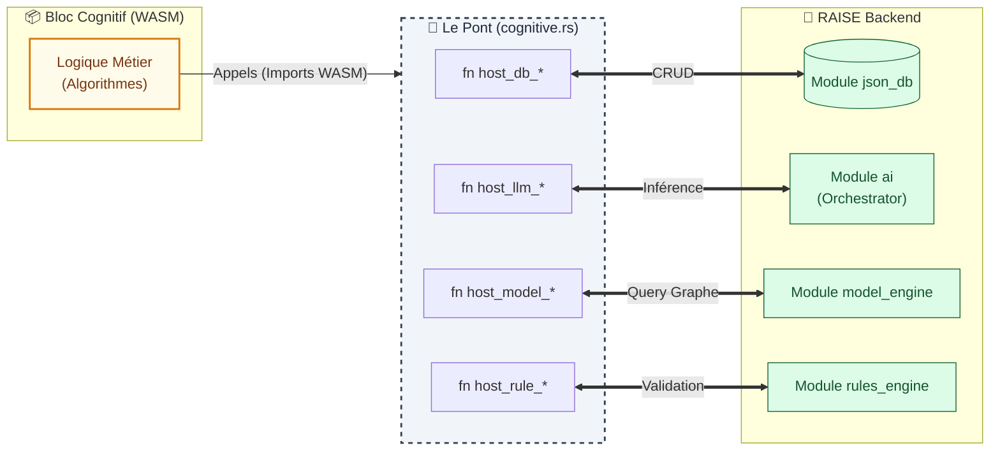

# Architecture : Le Pont Cognitif (Hub & Spoke)

> **Statut** : Spécification Technique  
> **Module** : `src-tauri/src/plugins`  
> **Objectif** : Connecter le Bloc Cognitif (WASM) à l'ensemble du Backend RAISE.

## 1. Vision : Le Plugin comme Chef d'Orchestre

Pour créer de la valeur, le Bloc Cognitif ne doit pas être isolé. Il agit comme un **Opérateur Omniscient** capable d'instrumenter les services de la plateforme.

Le module `plugins` devient le **Hub Central** qui importe les traits des autres modules pour les exposer au runtime WASM via une couche de médiation sécurisée.

---

## 2. Matrice d'Accès (Host Functions)

Le fichier `cognitive.rs` agit comme le panneau de contrôle, exposant les capacités suivantes au monde WASM :

| Module Backend        | Fonction Hôte (Import WASM)      | Usage du Bloc Cognitif                                                        |
| :-------------------- | :------------------------------- | :---------------------------------------------------------------------------- |
| **`json_db`**         | `host_db_read` / `host_db_write` | Lire le contexte sémantique (JSON-LD), Sauvegarder l'artefact produit.        |
| **`ai`**              | `host_llm_inference`             | Solliciter l'Hémisphère Droit (Intuition, Synthèse, Traduction).              |
| **`model_engine`**    | `host_model_query`               | Interroger le graphe Arcadia (ex: _"Trouve tous les acteurs connectés à X"_). |
| **`rules_engine`**    | `host_rule_validate`             | Vérifier la conformité d'un objet par rapport aux règles du projet.           |
| **`workflow_engine`** | `host_signal_event`              | (V2) Déclencher une alerte, une erreur critique ou une sous-tâche.            |

---

## 3. Diagramme d'Architecture (Hub & Spoke)

L'architecture repose sur un modèle en étoile où `cognitive.rs` (Le Pont) centralise les échanges.



---

## 4. Sécurité : Le Mandat comme Pare-Feu

L'accès technique n'implique pas l'autorisation métier. Chaque appel vers une fonction hôte est intercepté et validé par le **Mandat** injecté dans le contexte du plugin.

### Pseudo-Code de Médiation (`cognitive.rs`)

```rust
fn host_db_write(ctx: &mut PluginContext, collection: &str, data: Json) -> Result<i32> {
    // 1. Vérification du Mandat (Gouvernance)
    if !ctx.mandate.can_write_collection(collection) {
        tracing::warn!("⛔ Tentative d'écriture non autorisée par le mandat");
        return Ok(0); // Échec silencieux ou Code Erreur
    }

    // 2. Exécution Technique (Si autorisé)
    ctx.storage.insert(collection, data).await?;

    Ok(1) // Succès
}

```

---

## 5. Flux de Données Type

1. **Input** : Le Bloc reçoit un ID de contexte (ex: un UUID de composant).
2. **Enrichissement** : Il appelle `host_model_query` pour récupérer le voisinage de ce composant (Sémantique).
3. **Traitement** :

- Il analyse la structure (Logique WASM).
- Il demande une synthèse textuelle via `host_llm_inference` (Intuition IA).

4. **Vérification** : Il valide le résultat via `host_rule_validate`.
5. **Output** : Il sauvegarde le résultat certifié via `host_db_write`.

```

```

```

```
