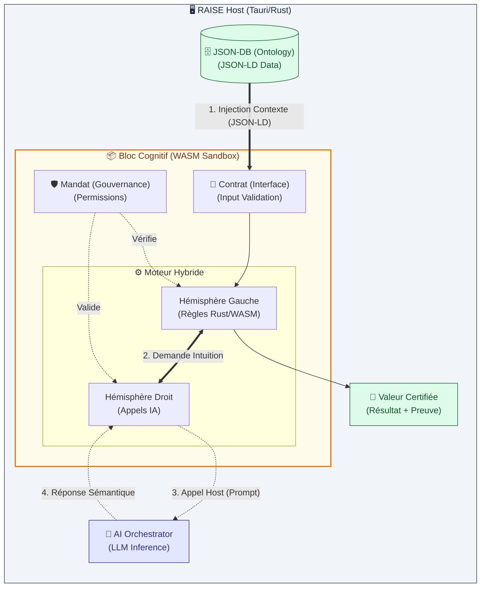

# Le Bloc Cognitif : Unité d'Œuvre de RAISE

> **Version** : 2.0 (Ontologique & Hybride)  
> **Statut** : Spécification Technique  
> **Contexte** : Module `src-tauri/src/plugins`

## 1. Vision : De la Prestation à l'Actif

Le **Bloc Cognitif** est la réponse de RAISE à l'obsolescence du modèle "Freelance". Il ne vend pas du temps de cerveau disponible, il vend une **expertise cristallisée**.

C'est un **Actif Numérique Autonome** qui encapsule un savoir-faire métier, capable de raisonner sur des modèles d'ingénierie complexes grâce à une compréhension ontologique de son environnement.

Contrairement à un simple script, il ne manipule pas juste des données brutes, il manipule du **Sens** (Sémantique).

---

## 2. Anatomie d'un Bloc Cognitif

Pour garantir la confiance, la robustesse et la valeur, un Bloc Cognitif est constitué de **4 couches indissociables** :

### A. Le Socle Ontologique (Le "Sens") 🧠

- **Fonction :** Ancrer l'expertise dans une méthode formelle (ex: Arcadia, SysML).
- **Technologie :** **JSON-LD** (Linked Data) fourni par `json-db`.
- **Apport :** Le bloc ne reçoit pas `{ "val": 42 }`, mais _"Ceci est la Température Max (Property) du Moteur (Component)"_.
- **Bénéfice :** Élimine les hallucinations et garantit l'interopérabilité sémantique.

### B. Le Contrat (L'Interface) 🤝

- **Fonction :** Définir formellement les entrées et les sorties.
- **Technologie :** Schémas JSON (Validation stricte à l'entrée du WASM).
- **Exemple :** _"J'accepte un Graphe Fonctionnel (Input) et je livre une Matrice de Risques (Output)."_

### C. Le Moteur (L'Exécution Hybride) ⚙️

C'est le cœur réactif du bloc, divisé en deux hémisphères :

1.  **Hémisphère Gauche (Déterministe - WASM/Rust) :**
    - Calculs mathématiques, traversée de graphes, validation de règles strictes.
    - Performance native, sandboxé, auditable à 100%.
2.  **Hémisphère Droit (Probabiliste - Host AI) :**
    - Appel à l'Orchestrateur IA de l'hôte pour l'intuition, la synthèse textuelle ou le pattern matching flou.
    - _"Analyse la sémantique de cette exigence pour voir si elle est ambiguë."_

### D. La Gouvernance (Le Mandat) 🛡️

- **Fonction :** Les lignes rouges éthiques et techniques.
- **Technologie :** `Mandate` (Vérifié par le `runtime.rs`).
- **Règle d'Or :** Le code ne peut jamais outrepasser son Mandat (ex: interdiction d'écrire en base, interdiction d'exfiltrer des données).

---

## 3. Flux de Valeur

La formule de création de valeur est la suivante :

> **Contexte Sémantique (JSON-LD) + Expertise (Bloc) = Valeur Certifiée (Preuve)**

1.  **Ingestion :** L'hôte injecte le contexte riche (Ontologie) dans la mémoire du Bloc.
2.  **Cognition :** Le Bloc traite l'information (Règles + IA).
3.  **Production :** Le Bloc génère un résultat ET une trace d'audit (Preuve de travail).

---

## 4. Architecture Technique (Mermaid)



---

## 5. Implications pour le Développement

Pour réaliser cette vision, le module `plugins` doit implémenter :

1. **Memory Mapping Bidirectionnel :** Capacité d'écrire des objets JSON-LD complexes directement dans la mémoire linéaire du WASM (`host_db_read` amélioré).
2. **Pont d'Inférence (`host_llm_inference`) :** Une nouvelle fonction importée permettant au WASM de solliciter le LLM de l'hôte.
3. **Structure de Sortie Standardisée :** Le plugin ne retourne pas un `i32`, mais un pointeur vers une structure `Result { data: JsonLd, proof: AuditLog }`.

```

```
