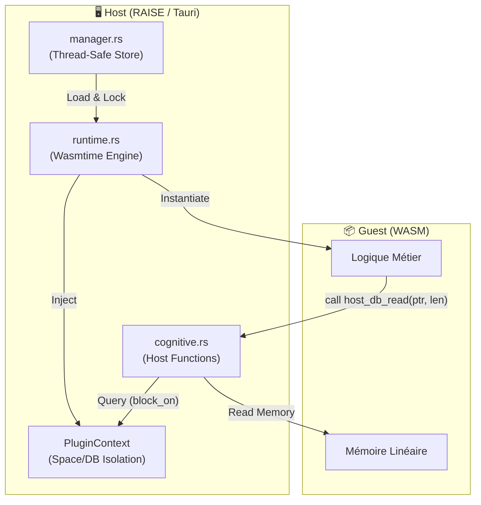

# 🧠 Module Plugins Cognitifs (`src-tauri/src/plugins`)

> **Architecture "Use-Case Factory" & Moteur WASM**

Ce module implémente le cœur de l'extensibilité de RAISE. Il permet de charger, sécuriser et exécuter des **"Blocs Cognitifs"** : des binaires WebAssembly (.wasm) capables d'interagir intelligemment avec les données de l'application via une API standardisée.

---

## 🏗️ Architecture Industrielle (Factory Pattern)

Le système gère toute la chaîne de production logicielle via une séparation stricte :

1.  **L'Usine (`src-wasm/`)** : Workspace Rust autonome contenant le code source des plugins.
2.  **La Chaîne de Montage (`build.sh`)** : Compilation en `wasm32-unknown-unknown`.
3.  **Le Magasin (`wasm-modules/`)** : Stockage des binaires finaux.

---

## 🌉 Architecture Runtime (Host / Guest)

Une fois chargé, le système repose sur une isolation stricte gérée par `wasmtime`.



### Flux de Données & Sécurité

1. **Chargement Thread-Safe** : `manager.rs` utilise un `Arc<Mutex<HashMap>>` pour gérer les accès concurrents aux plugins chargés.
2. **Contextualisation** : Chaque plugin est instancié avec un `PluginContext` spécifique.

- **Space / DB** : Le plugin est "prisonnier" d'un espace de données (ex: `test_space`). Il ne peut pas accéder aux données d'un autre tenant.
- **StorageEngine** : Une copie thread-safe du moteur de stockage est injectée.

---

## 📂 Structure du Module

| Fichier                      | Description Technique                                                                                                             |
| ---------------------------- | --------------------------------------------------------------------------------------------------------------------------------- |
| **`mod.rs`**                 | Exports des modules publics.                                                                                                      |
| **`manager.rs`**             | **Orchestrateur**. Charge les fichiers `.wasm`, les stocke en mémoire et expose `run_plugin` et `list_active_plugins`.            |
| **`runtime.rs`**             | **Moteur**. Configure `wasmtime::Store` et le `Linker`. Instancie le module et expose la fonction d'entrée `run`.                 |
| **`cognitive.rs`**           | **Pont**. Enregistre les "Host Functions" (`host_db_read`, `plugin_log`). Gère la conversion Asynchrone/Synchrone via `block_on`. |
| **`tests.rs`**               | **Validateurs**. Génère dynamiquement du bytecode WASM (opcodes bruts) pour tester le pont sans compilateur externe.              |
| **`filesystem_extended.rs`** | _Placeholder_. Réservé pour les futures implémentations d'accès fichiers (WASI).                                                  |

---

## 🔌 API du Pont Cognitif (Host Functions)

Le Guest (WASM) communique avec le Host (Rust) via des fonctions importées depuis le namespace `env`.

| Fonction Host      | Signature WASM                | Comportement Technique (`cognitive.rs`)               |
| ------------------ | ----------------------------- | ----------------------------------------------------- |
| **`host_db_read`** | `(ptr: i32, len: i32) -> i32` | 1. Lit la requête JSON depuis la mémoire du WASM.<br> |

<br>2. Exécute `CollectionsManager::get` de manière synchrone (via `block_on`).<br>

<br>3. Logue le résultat (stdout) et retourne `1` (succès). |
| **`plugin_log`** | `(ptr: i32, len: i32) -> i32` | Lit une string en mémoire et l'affiche dans la console hôte avec le préfixe `🤖 [PLUGIN LOG]`. |

### Note sur l'Asynchronisme

Le moteur `JsonDb` est asynchrone (`async/await`), mais WASM (dans sa version actuelle) est synchrone. Le fichier `cognitive.rs` utilise `futures::executor::block_on` pour attendre le résultat de la base de données avant de rendre la main au plugin.

---

## 🧪 Méthodologie de Test (Low-Level)

Le fichier `tests.rs` implémente une approche originale : la **Génération de Bytecode Dynamique**.
Plutôt que de dépendre d'un fichier `.wasm` externe compilé, le test construit manuellement le binaire octet par octet.

**Exemple de génération du "Spy Plugin" :**

```rust
// Extrait de src-tauri/src/plugins/tests.rs
wasm.extend_from_slice(&[
    0x41, 0x00, // i32.const 0 (ptr)
    0x41, 0x28, // i32.const 40 (len)
    0x10, 0x00, // call func 0 (host_db_read)
    0x0b,       // end
]);

```

Cela permet de tester le **Linker** et l'accès mémoire sans risque de désynchronisation avec un fichier source externe.

---

## 🔮 Roadmap & Limitations Actuelles

1. **Retour de Données** : Actuellement, `host_db_read` affiche le résultat mais ne l'écrit pas dans la mémoire du WASM (manque d'une fonction `malloc` exportée par le Guest).
2. **Système de Fichiers** : `filesystem_extended.rs` est vide. L'implémentation WASI est prévue pour la V2.
3. **Buffer de Sortie** : Le `PluginContext` contient un `wasi_out_buffer` préparé pour capturer la sortie standard, mais non encore utilisé activement.

```

```
