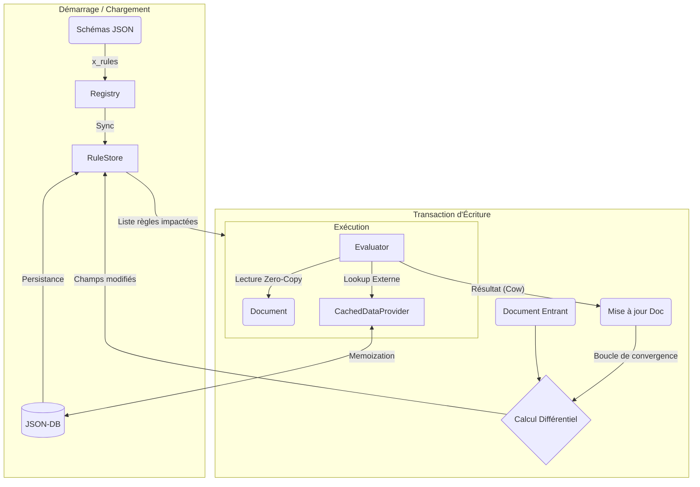

# 🧠 RAISE Rules Engine (GenRules)

Le **Rules Engine** est le cœur réactif de RAISE. Il s'agit d'un moteur de règles déclaratif chargé d'exécuter la logique métier (calculs, validations, enrichissement) directement au sein des transactions de la base de données, sans nécessiter de code Rust/TS spécifique.

Il est conçu pour être :

- **Performant** : Architecture "Zero-Copy" et Caching transactionnel.
- **Sûr** : Pas d'exécution de code arbitraire, analyse statique de profondeur.
- **Réactif** : Calcul différentiel basé sur les dépendances.

---

## 🏗️ Architecture et Flux de Données

Le moteur s'insère dans le pipeline d'écriture de `json_db`. Il intercepte les modifications de documents pour recalculer les champs dérivés avant la persistance finale.



### Composants Clés

| Composant                | Rôle                                                                                                                                              | Optimisations Clés                                                                                                                    |
| ------------------------ | ------------------------------------------------------------------------------------------------------------------------------------------------- | ------------------------------------------------------------------------------------------------------------------------------------- |
| **`RuleStore`**          | Gère l'indexation des règles. Maintient un index inversé (Champ -> Règles) en RAM et persiste les définitions dans la collection `_system_rules`. | **Idempotence** : N'écrit sur disque que si la règle a changé. Lookup en O(1).                                                        |
| **`Evaluator`**          | Exécute l'AST (Arbre Syntaxique) de la règle.                                                                                                     | **Zero-Copy** : Utilise `Cow<Value>` pour éviter de cloner les données lues. Gestion de **Scope** pour les boucles (`map`, `filter`). |
| **`Analyzer`**           | Analyse statique de la règle avant enregistrement.                                                                                                | Détection automatique des dépendances. **Validation de profondeur** pour éviter les Stack Overflows.                                  |
| **`CachedDataProvider`** | Interface d'accès aux données externes (`lookup`).                                                                                                | **Cache Transactionnel** : Un document externe n'est lu qu'une seule fois par transaction, même si 50 règles le demandent.            |

---

## 📂 Structure des Fichiers

Le module est organisé pour séparer la définition du langage (AST), l'analyse, l'exécution et le stockage.

```text
src-tauri/src/rules_engine/
├── mod.rs          // Point d'entrée et re-exports
├── ast.rs          // Définition de la grammaire (Enums Expr & Rule)
├── analyzer.rs     // Analyse statique (Dépendances, Profondeur, Scopes)
├── evaluator.rs    // Moteur d'exécution récursif (Logique métier)
└── store.rs        // Gestion de la persistance et de l'indexation (Lien avec json_db)

```

---

## 📚 Langage de Règles (Reference)

Les règles sont définies en JSON (format Lisp-like) dans la propriété `x_rules` des schémas.

### 1. Opérations sur les Listes & Collections (Nouveau 🚀)

Le moteur supporte la programmation fonctionnelle sur les tableaux.

| Fonction      | Description                                                         | Exemple                                                                                         |
| ------------- | ------------------------------------------------------------------- | ----------------------------------------------------------------------------------------------- |
| `map`         | Transforme chaque élément (`alias`) d'une liste via une expression. | `{"map": {"list": {"var": "items"}, "alias": "x", "expr": {"mul": [{"var": "x.price"}, 1.2]}}}` |
| `filter`      | Filtre les éléments selon une condition.                            | `{"filter": {"list": {"var": "users"}, "alias": "u", "expr": {"gte": [{"var": "u.age"}, 18]}}}` |
| `len`         | Taille d'une liste ou longueur d'une chaîne.                        | `{"len": {"var": "tags"}}`                                                                      |
| `contains`    | Vérifie la présence d'une valeur.                                   | `{"contains": {"list": {"var": "roles"}, "value": "admin"}}`                                    |
| `min` / `max` | Minimum / Maximum d'une liste numérique.                            | `{"max": {"var": "scores"}}`                                                                    |

### 2. Mathématiques

| Fonction                   | Description                             | Exemple                                                |
| -------------------------- | --------------------------------------- | ------------------------------------------------------ |
| `add`, `sub`, `mul`, `div` | Opérations arithmétiques (+, -, \*, /). | `{"add": [{"var": "ht"}, {"var": "tva"}]}`             |
| `round`                    | Arrondi à une précision donnée.         | `{"round": {"value": {"var": "val"}, "precision": 2}}` |
| `abs`                      | Valeur absolue.                         | `{"abs": {"var": "delta"}}`                            |

### 3. Chaînes de Caractères

| Fonction          | Description                                           | Exemple                                                               |
| ----------------- | ----------------------------------------------------- | --------------------------------------------------------------------- |
| `concat`          | Concaténation de chaînes/nombres ("Smart Stringify"). | `{"concat": ["REF-", {"var": "id"}]}`                                 |
| `upper` / `lower` | Conversion de casse.                                  | `{"upper": {"var": "name"}}`                                          |
| `trim`            | Supprime les espaces début/fin.                       | `{"trim": {"var": "input"}}`                                          |
| `replace`         | Remplacement de sous-chaîne.                          | `{"replace": {"value": "Hello", "pattern": "H", "replacement": "Y"}}` |
| `regex_match`     | Validation par Regex.                                 | `{"regex_match": {"value": "test@mail.com", "pattern": "^.+@.+$"}}`   |

### 4. Logique & Contrôle

- **Conditionnelle** : `{"if": { "condition": ..., "then_branch": ..., "else_branch": ... }}`
- **Booléens** : `and`, `or`, `not`
- **Comparaisons** : `eq` (=), `neq` (!=), `gt` (>), `lt` (<), `gte` (>=), `lte` (<=)

### 5. Dates

- `now` : Date actuelle (ISO 8601).
- `date_diff` : Différence en jours.
- `date_add` : Ajoute X jours à une date.

### 6. Accès aux Données

- `var` : Variable locale ou du document courant.
- `lookup` : Récupération d'une valeur dans une **autre collection**.

```json
{
  "lookup": {
    "collection": "users",
    "id": { "var": "owner_id" },
    "field": "settings.theme"
  }
}
```

---

## ⚡ Optimisations Techniques

### Zero-Copy (Evaluator)

L'évaluateur utilise le type `std::borrow::Cow` (Copy-On-Write). Si une règle lit une valeur sans la modifier (ex: `if name == "admin"`), aucune allocation mémoire n'est faite ; le moteur pointe directement vers la mémoire du document JSON original. L'allocation ne se produit que si une nouvelle valeur est créée (calcul).

### Cache Transactionnel (DataProvider)

Lors d'une insertion massive ou d'un calcul complexe impliquant de multiples `lookup` vers le même document de référence (ex: configuration globale, taux de TVA), le `CachedDataProvider` garantit que le fichier n'est lu et désérialisé qu'une seule fois par transaction.

### Sécurité (Analyzer)

- **Anti-StackOverflow** : L'analyseur rejette les règles dont l'imbrication dépasse une profondeur critique (par défaut 50-100 niveaux).
- **Scope Checking** : L'analyseur comprend la portée des variables (`map`, `filter`) pour ne pas confondre une variable locale temporaire avec une dépendance de base de données.

```

```
