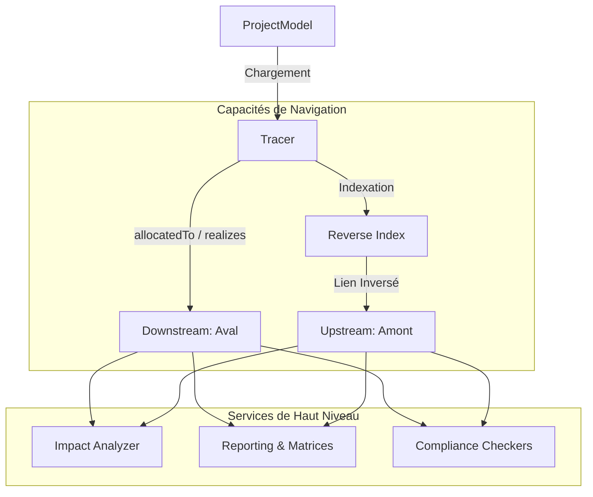

# Module de Traçabilité (Traceability Engine) 🧭

Ce module constitue le cœur analytique de **RAISE**. Il interprète les relations sémantiques entre les éléments du modèle Arcadia (Operational, System, Logical, Physical) pour garantir la cohérence système et la certification logicielle.

## 🏗️ Architecture du Moteur

Le moteur fonctionne sur un principe d'indexation dynamique. Contrairement à une base de données relationnelle classique, il reconstruit le graphe de dépendances en mémoire pour permettre des performances d'analyse instantanées.



## 🎯 Fonctions Clés

| Composant           | Description                                                                                                                                   |
| ------------------- | --------------------------------------------------------------------------------------------------------------------------------------------- |
| **Tracer**          | Navigue dans les liens (`allocatedTo`, `satisfiedBy`, `model_id`). Gère la résolution automatique des IDs en références d'objets.             |
| **Impact Analyzer** | Calcule la propagation des changements. Utilise une recherche en largeur (BFS) pour déterminer la distance d'impact et un score de criticité. |
| **Change Tracker**  | Détecte les deltas entre deux versions JSON. Indispensable pour l'auditabilité et le suivi des exigences.                                     |

---

## 🔍 Logique de Navigation

### 1. Navigation Bidirectionnelle (`Tracer`)

Le moteur supporte nativement la navigation dans les deux sens du cycle en V :

- **Downstream (Aval)** : Part de l'exigence vers l'implémentation (ex: "Quels composants réalisent cette fonction ?").
- **Upstream (Amont)** : Remonte de l'implémentation vers la justification (ex: "Quelle exigence justifie la présence de ce code ?").

### 2. Analyse d'Impact (`ImpactAnalyzer`)

L'analyse d'impact est **bidirectionnelle par défaut**. Si vous modifiez un composant central, le moteur identifie :

1. Les éléments qu'il contrôle (Aval).
2. Les éléments qui dépendent de lui (Amont).

### 3. Traçabilité de l'IA (Trustworthy AI)

Le moteur reconnaît désormais la propriété `model_id`. Cela permet de lier des **Preuves d'Assurance** (Quality Reports, Xai Frames) à des **Composants d'Architecture**, assurant ainsi la conformité au **EU AI Act**.

---

## 🚀 Exemples d'Utilisation

### Navigation et Audit IA

```rust
let tracer = Tracer::new(&project_model);

// Trouver les preuves d'assurance pour un modèle IA spécifique
let proofs = tracer.get_upstream_elements("ai_model_v1");
// proofs contient maintenant les QualityReport et XaiFrame liés.

```

### Analyse de Criticité

```rust
let analyzer = ImpactAnalyzer::new(Tracer::new(&project_model));
let report = analyzer.analyze("engine_control_unit", 3);

println!("Score de criticité : {}", report.criticality_score);
// Plus le score est élevé, plus le changement nécessite une validation rigoureuse.

```

---

## 📂 Organisation du Code

```text
traceability/
├── mod.rs              # Point d'entrée et re-exports
├── tracer.rs           # Moteur d'indexation et navigation
├── impact_analyzer.rs  # Calcul de propagation et criticité
├── change_tracker.rs   # Algorithme de Diff JSON
├── compliance/         # Sous-module des règles métier (DO-178C, AI Act...)
└── reporting/          # Génération de Matrices et Rapports d'Audit

```

## ✅ Validation Technique

Le module Core maintient une couverture de tests stricte sur :

- La résolution des liens simples et multiples (arrays).
- La détection des cycles dans le graphe.
- La précision du calcul de distance d'impact.

```bash
# Pour valider le moteur complet
cargo test traceability -- --nocapture

```

---
