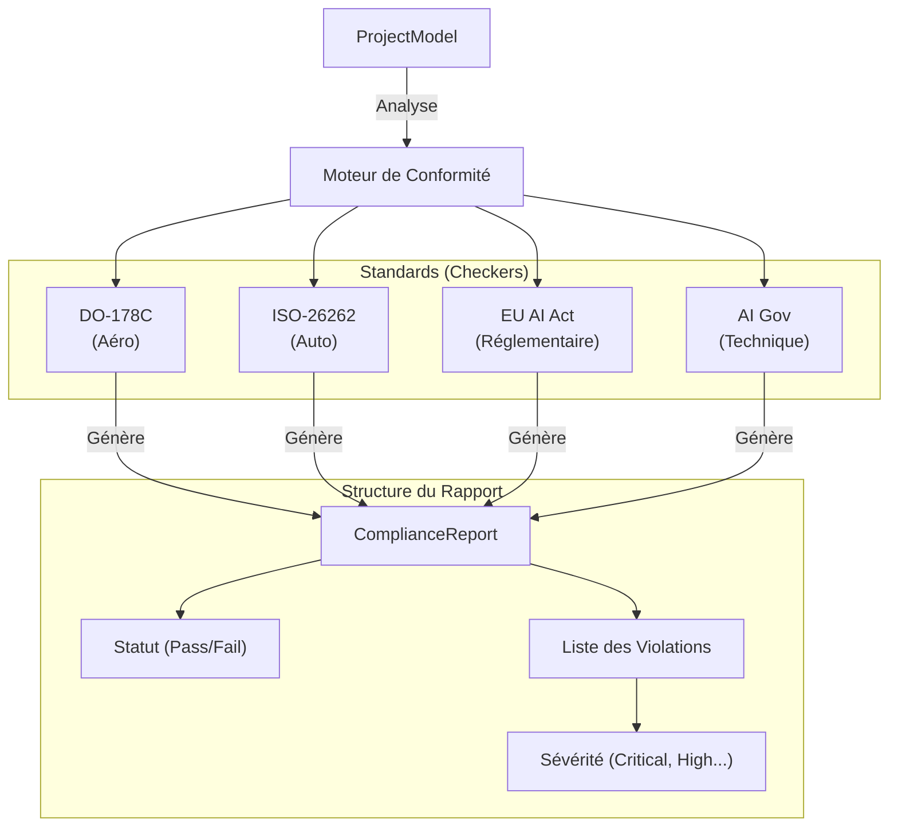

# Module de Conformité (Compliance) 🛡️

Ce module constitue le "moteur de jugement" du système RAISE. Il est responsable de la **vérification statique et structurelle** des modèles d'architecture Arcadia. Son rôle est de transformer des règles normatives complexes (DO-178C, ISO-26262, AI Act) en algorithmes de vérification automatisés s'appuyant sur le graphe de traçabilité.

## 🏗️ Architecture du Moteur

Le module utilise une architecture par "Checkers" interchangeables. Chaque standard est encapsulé dans une structure implémentant le trait `ComplianceChecker`.



## 📋 Standards et Règles Implémentés

Le module couvre actuellement quatre domaines critiques :

### 1. Aéronautique : DO-178C

_Fichier : `do_178c.rs_`
Ce vérificateur s'assure que le logiciel est entièrement justifié par des besoins système.

- **Règle TRACE-01 (Couverture) :** Toute "Fonction Système" (SA) doit être allouée à au moins un "Composant Logique" (LA).
- **Objectif :** Éliminer le "Dead Code" et garantir que chaque fonction implémentée répond à une exigence certifiable.

### 2. Automobile : ISO-26262

_Fichier : `iso_26262.rs_`
Gère la sécurité fonctionnelle via les niveaux d'intégrité ASIL (Automotive Safety Integrity Level).

- **Règle ASIL-D :** Si un composant est marqué comme critique (`safety_critical: true`), il doit impérativement posséder un attribut `asil` défini.
- **Objectif :** Garantir que les composants à haut risque (freinage, direction) disposent des mécanismes de sécurité appropriés.

### 3. Réglementation IA : EU AI Act

_Fichier : `eu_ai_act.rs_`
Se concentre sur la transparence et la classification des systèmes d'Intelligence Artificielle.

- **Règle RISK-01 :** Tout composant identifié comme `AI_Model` doit posséder une classification de risque (`risk_level`).
- **Objectif :** Assurer la conformité avec la législation européenne sur les systèmes à haut risque.

### 4. Gouvernance Technique : AI Governance

_Fichier : `ai_governance.rs_`C'est le lien entre la traçabilité et le module`AI Assurance`.

- **Règle GOV-CHECK :** Vérifie que chaque modèle IA est lié à un **Quality Report** (statut "Pass") et à une **XAI Frame** (explicabilité).
- **Objectif :** Empêcher l'utilisation de modèles "boîtes noires" ou non validés techniquement.

---

## 🔄 Fonctionnement des Vérifications

Le module n'analyse pas seulement les propriétés isolées, il utilise le `Tracer` pour explorer les relations :

1. **Analyse Amont (Upstream) :** Remonter depuis un composant pour trouver sa source (Exigence/Fonction).
2. **Analyse Aval (Downstream) :** Descendre depuis une exigence pour vérifier son implémentation.

---

## 🛠️ Guide d'Extension

Pour ajouter une nouvelle norme (ex: _IEC-62304_ pour le médical) :

1. **Créer le fichier** : `src/traceability/compliance/iec_62304.rs`.
2. **Implémenter `ComplianceChecker**` :

```rust
impl ComplianceChecker for Iec62304Checker {
    fn name(&self) -> &str { "IEC-62304" }
    fn check(&self, model: &ProjectModel) -> ComplianceReport {
        // Utiliser le Tracer pour vérifier les liens...
    }
}

```

3. **Enregistrer** : Ajouter `pub mod iec_62304;` dans `mod.rs`.

---

## 🚀 Tests et Validation

Chaque fichier de conformité contient sa propre suite de tests unitaires pour valider les heuristiques de détection.

```bash
# Lancer tous les tests du module de conformité
cargo test traceability::compliance -- --nocapture

```

---
