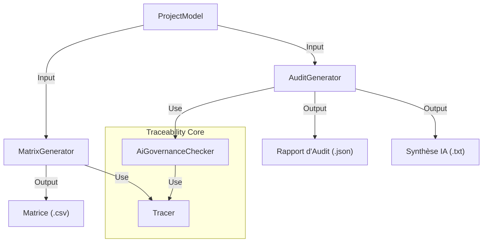

# Module Reporting — Génération de Preuves & Tableaux de Bord

Ce module est la "Tour de Contrôle" de la traçabilité. Il transforme les données brutes du graphe (liens) et les résultats de conformité en artefacts exploitables pour :

1.  **L'Ingénieur** : Visualisation de la couverture (Matrices).
2.  **L'Auditeur** : Rapports de conformité (DO-178C, EU AI Act).
3.  **L'Assistant IA** : Synthèses textuelles pour le RAG (Retrieval Augmented Generation).

---

## 🏗️ Flux de Données

Le reporting agrège les données venant du moteur `traceability` et du module `ai/assurance`.



---

## 📊 1. Matrice de Traçabilité (`trace_matrix.rs`)

Génère des vues croisées pour vérifier la couverture des exigences ou des fonctions.

### Fonctionnalité : SA ➔ LA

Vérifie comment les **Fonctions Système (SA)** sont réalisées par les **Composants Logiques (LA)**.

- **Statut Calculé** :
- `Covered` : La fonction est allouée à au moins un composant.
- `Uncovered` : La fonction est orpheline (Dette technique).

- **Gestion des Noms** : Supporte les types de noms complexes (`NameType::String`, `NameType::I18n`).

**Exemple de sortie (CSV) :**

```csv
Source ID,Source Name,Coverage Status,Target IDs
func_sa_01,"Calculer Trajectoire",Covered,"comp_la_nav_01; comp_la_nav_02"
func_sa_02,"Afficher Alerte",Uncovered,""

```

---

## 🛡️ 2. Rapport d'Audit (`audit_report.rs`)

C'est l'artefact le plus critique. Il combine deux types d'analyses :

### A. Conformité Normative (Static)

Exécute les checkers classiques sur l'ensemble du modèle :

- **DO-178C** : Sécurité logicielle (Aéronautique).
- **ISO-26262** : Sécurité fonctionnelle (Automobile).
- **EU AI Act** : Transparence et gestion des risques (Réglementaire).

### B. Gouvernance IA (Deep Scan) [NOUVEAU]

Utilise le `Tracer` pour auditer spécifiquement les composants marqués comme `nature: "AI_Model"`.
Il vérifie la présence des preuves générées par le module `ai/assurance` :

- ✅ **QualityReport** : Le modèle a-t-il passé ses tests de performance/biais ?
- ✅ **XaiFrame** : Le modèle est-il explicable ?

**Structure du Rapport (JSON) :**

```json
{
  "project_name": "RAISE Pilot",
  "date": "2025-10-12T10:00:00Z",
  "model_stats": {
    "total_elements": 150,
    "total_functions": 45
  },
  "compliance_results": [
    {
      "standard": "DO-178C",
      "passed": true,
      "violations": []
    },
    {
      "standard": "RAISE AI Governance",
      "passed": false,
      "violations": [
        {
          "rule_id": "AI-GOV-CHECK",
          "severity": "Critical",
          "description": "Composant IA 'Vision Module' non conforme : Missing valid Quality Report"
        }
      ]
    }
  ]
}
```

---

## 🤖 3. Synthèse pour l'IA

Le module expose une fonction `generate_ai_summary` qui transforme le rapport JSON en texte narratif. Cela permet à l'Assistant RAISE de répondre à des questions comme :

> _"Est-ce que le projet est prêt pour la certification ?"_

**Exemple de résumé généré :**

> "Le projet 'RAISE Pilot' contient 150 éléments.
>
> - DO-178C : ✅ CONFORME.
> - RAISE AI Governance : ❌ NON-CONFORME.
>   ⚠️ Violation Critique : Le composant 'Vision Module' n'a pas de rapport de qualité validé."

---

## 💻 Utilisation Technique

```rust
use crate::traceability::reporting::{MatrixGenerator, AuditGenerator, ReportExporter};

// 1. Générer la matrice
let matrix = MatrixGenerator::generate_sa_to_la(&model);

// 2. Générer l'audit complet
let audit = AuditGenerator::generate(&model);

// 3. Exporter sur le disque
ReportExporter::export_matrix_csv(&matrix, Path::new("trace.csv"))?;
ReportExporter::export_audit_json(&audit, Path::new("audit.json"))?;

// 4. Obtenir le résumé pour le Chatbot
let summary = ReportExporter::generate_ai_summary(&audit);

```

## ✅ Tests

```bash
# Lancer les tests du module de reporting uniquement
cargo test traceability::reporting -- --nocapture

```

```

```
