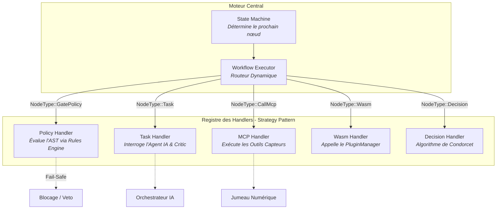
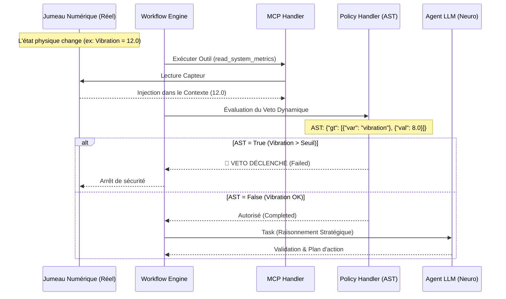

# 🧠 Workflow Engine (Neuro-Symbolic & Sovereign)

Ce module implémente le cœur d'exécution **Neuro-Symbolique** du projet RAISE.
Il dépasse le simple moteur de script pour devenir une architecture de **Gouvernance par le Code**, mariant :

1. **La Rigueur Constitutionnelle** : Mandats signés cryptographiquement, lignes rouges inviolables (Vetos dynamiques via AST), compilation déterministe.
2. **L'Intelligence Générative** : Agents IA contextuels, raisonnement dynamique, auto-critique (Reward Model).
3. **L'Ancrage dans le Réel (Grounding)** : Capacité d'agir physiquement sur le système via des outils déterministes (MCP).
4. **Le Consensus Algorithmique** : Résolution de conflits par vote pondéré (Méthode de Condorcet).
5. **L'Extensibilité à Chaud** : Exécution de plugins cognitifs WebAssembly (WASM) via un Hub sécurisé.

---

## 🏛️ Architecture : Cerveau, Mains et Loi

Le système repose sur une séparation stricte des pouvoirs. L'utilisateur (Législateur) ne code pas le workflow ; il définit un **Mandat**. Le système le compile ensuite en une structure exécutable qui orchestre Agents (Probabilistes), Outils (Déterministes) et Plugins (WASM).

L'architecture est hautement modulaire, reposant sur le **Design Pattern Strategy** pour garantir le principe d'Ouverture/Fermeture (Open/Closed Principle).

| Composant | Fichier/Dossier | Rôle & Responsabilité |
| :--- | :--- | :--- |
| **Mandate** | `mandate.rs` | **La Constitution**. Structure JSON signée définissant la stratégie, les poids politiques et les vetos (AST). |
| **Compiler** | `compiler.rs` | **Le Traducteur**. Transforme le Mandat en un Graphe orienté (DAG) avec injection de nœuds de contrôle et d'outils. |
| **Scheduler** | `scheduler.rs` | **Le Directeur**. Gère le cycle de vie des instances, la persistance et l'horloge d'exécution globale. |
| **State Machine** | `state_machine.rs`| **Le Navigateur (Zéro-Copie)**. Évalue asynchronement les transitions et les conditions du graphe. |
| **Executor** | `executor.rs` | **Le Routeur Principal**. Reçoit les instructions et les délègue au bon *Handler* spécialisé. |
| **Handlers** | `handlers/` | **Les Ouvriers Spécialisés**. Implémentent la logique métier unique de chaque type de nœud (`Task`, `Mcp`, `Wasm`, `Decision`, `Policy`). |
| **Tools (MCP)** | `tools/` | **Les Mains**. Modules Rust natifs pour interagir avec le matériel (Jumeau Numérique). |
| **Critic** | `critic.rs` | **Le Juge Interne**. Évalue la qualité des réponses de l'IA (Reward Model). |

---

## ⚙️ Le Routage Dynamique (Pattern Strategy)

Afin de garantir une scalabilité et une robustesse maximales, l'Exécuteur ne contient aucune logique métier codée en dur. Il délègue l'exécution à un registre de `Handlers` spécialisés partageant un contexte commun (`HandlerContext`).



## 🛡️ Vetos et Sécurité (Fail-Safe & AST)

Les règles de sécurité (Vetos) ne sont plus codées en dur. Elles reposent sur des **Abstract Syntax Trees (AST)** définis dans le Mandat.
Le `GatePolicyHandler` utilise le `rules_engine` pour évaluer ces arbres mathématiques de manière stricte.

> **Principe de Fail-Safe :** Si un AST est manquant, malformé, ou illisible par le moteur, le système bloque immédiatement l'exécution du workflow par mesure de précaution. On ne laisse jamais passer une règle non évaluable.

---

## ♊ La Notion de Jumeau Numérique (Digital Twin)

Le **Jumeau Numérique** est le pont sémantique entre la réalité physique et le raisonnement de l'IA. Dans RAISE, il sert d'**ancrage (grounding)** pour empêcher les hallucinations et garantir la sécurité.

### Flux de Données Neuro-Symbolique



---

## 🧩 Modèle de Données (Nœuds)

Le typage strict de Rust garantit qu'un nœud correspond toujours à une stratégie d'exécution valide :

| Type | Description | Comportement Handler |
| --- | --- | --- |
| **`Task`** | Agent Cognitif | Exécute une instruction IA, génère une trace XAI, validée par le **Critique**. |
| **`CallMcp`** | Action Système | Appelle un **Outil Rust** injecté (Lecture de capteur, API métier). |
| **`Decision`** | Vote Algorithmique | Applique la méthode de **Condorcet** pondérée par la stratégie du Mandat. |
| **`GatePolicy`** | Veto Dynamique | Parse et évalue un **AST** via le moteur de règles. Comportement **Fail-Safe**. |
| **`Wasm`** | Plugin Cognitif | Délègue l'exécution à un module WebAssembly isolé via le **PluginManager**. |
| **`GateHitl`** | Human-In-The-Loop | Met le workflow en pause (Paused) dans l'attente d'une validation humaine. |
| **`End`** | Terminaison | Marque officiellement le Workflow comme complété. |

---

## 💻 Commandes Tauri Exposées (Prochaines Étapes)

L'API permet de piloter la gouvernance, l'exécution et le feedback :

* **`submit_mandate(mandate: Mandate)`** : Compile une politique signée en workflow technique.
* **`start_workflow(id)`** : Lance l'exécution asynchrone d'une instance.
* **`resume_workflow(id, node_id, approved)`** : Feedback humain (RLHF) pour débloquer un nœud `GateHitl`.
* **`get_workflow_state(id)`** : Récupère l'état temps-réel de la State Machine et le contexte partagé.

```

 