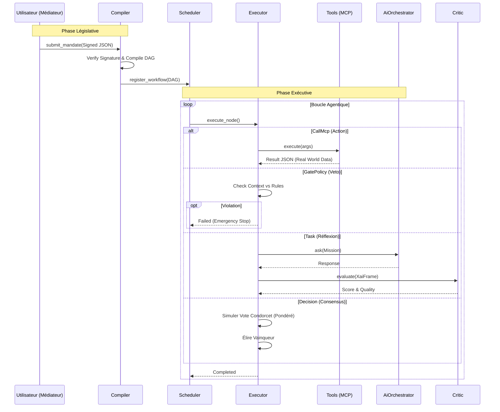

# 🧠 Workflow Engine (Neuro-Symbolic & Sovereign)

Ce module implémente le cœur d'exécution **Neuro-Symbolique** de RAISE.
Il dépasse le simple moteur de script pour devenir une architecture de **Gouvernance par le Code**, mariant :

1. **La Rigueur Constitutionnelle** : Mandats signés cryptographiquement, lignes rouges inviolables (Vetos), compilation déterministe.
2. **L'Intelligence Générative** : Agents IA contextuels, raisonnement dynamique, auto-critique.
3. **L'Ancrage dans le Réel (Grounding)** : Capacité d'agir physiquement sur le système via des outils déterministes (MCP).
4. **Le Consensus Algorithmique** : Résolution de conflits par vote pondéré (Méthode de Condorcet).

---

## 🏛️ Architecture : Cerveau, Mains et Loi

Le système repose sur une séparation stricte des pouvoirs. L'utilisateur (Législateur) ne code pas le workflow ; il définit un **Mandat**. Le système le compile ensuite en une structure exécutable qui orchestre Agents (Probabilistes) et Outils (Déterministes).

| Composant         | Fichier            | Rôle & Responsabilité                                                                                             |
| ----------------- | ------------------ | ----------------------------------------------------------------------------------------------------------------- |
| **Mandate**       | `mandate.rs`       | **La Constitution**. Structure JSON signée (Ed25519) définissant la stratégie, les poids politiques et les vetos. |
| **Compiler**      | `compiler.rs`      | **Le Traducteur**. Transforme le Mandat (Politique) en un Graphe orienté (Technique) exécutable.                  |
| **Scheduler**     | `scheduler.rs`     | **Le Chef d'Orchestre**. Gère le cycle de vie, la persistance et l'injection des ressources.                      |
| **Executor**      | `executor.rs`      | **L'Interface Agentique**. Exécute les tâches, appelle les outils (MCP), consulte l'IA et applique les votes.     |
| **Tools (MCP)**   | `tools/`           | **Les Mains**. Modules Rust natifs pour interagir avec le matériel, le système de fichiers ou les API.            |
| **Critic**        | `critic.rs`        | **Le Juge Interne**. Évalue la qualité des réponses de l'IA (Reward Model) avant validation.                      |
| **State Machine** | `state_machine.rs` | **Le Navigateur**. Gère la topologie du graphe (DAG) et les transitions d'états.                                  |

---

## 📜 Le Protocole de Mandat

Le moteur ne lance pas un script arbitraire. Il exécute un **Contrat de Gouvernance**.

### 1. Structure du Mandat

Le `Mandate` contient :

- **Méta-données** : Auteur, Version, Signature Cryptographique.
- **Gouvernance** : Poids des agents virtuels (ex: `Sécurité: 3.0`, `Finance: 1.0`).
- **Hard Logic (Vetos)** : Règles bloquantes (ex: `VIBRATION_MAX` -> `EMERGENCY_SHUTDOWN`).
- **Observabilité** : Fréquence de reporting et métriques obligatoires.

### 2. Compilation

Le `WorkflowCompiler` injecte ces règles dans le graphe :

1. Les **Vetos** deviennent des nœuds `GatePolicy` placés en amont.
2. Les **Poids** sont injectés dans les nœuds `Decision` (Condorcet).
3. La **Stratégie** conditionne le prompt des nœuds `Task`.

---

## 🛠️ Écosystème d'Outils (Native MCP)

Pour éviter les hallucinations lors d'actions critiques, Raise sépare nettement la **Réflexion** de l'**Action**.

- **Agents (`src/ai/agents`)** : "Bavards" et créatifs. Ils génèrent du texte, du code ou des plans.
- **Outils (`src/workflow_engine/tools`)** : "Muets" et robustes. Ils exécutent des fonctions Rust natives.

Cette architecture implémente une version native du **Model Context Protocol (MCP)**.
Les outils sont exposés au moteur via le trait `AgentTool` et exécutés via le nœud `CallMcp`.

> **Exemple de Flux Sécurisé :**
>
> 1. Un nœud `CallMcp` appelle l'outil `read_system_metrics` (Lecture physique).
> 2. Le résultat JSON est stocké dans le contexte.
> 3. Un nœud `GatePolicy` lit ce contexte et applique un Veto si la valeur dépasse le seuil mandaté.

---

## 🔄 Flux d'Exécution Global

---

## 🧩 Modèle de Données (Nœuds)

| Type             | Description       | Comportement                                                             |
| ---------------- | ----------------- | ------------------------------------------------------------------------ |
| **`Task`**       | Agent Cognitif    | Exécute une instruction, génère une trace XAI, soumise au **Critique**.  |
| **`CallMcp`**    | Action Système    | Appelle un **Outil Rust** (Lecture capteur, Fichier, API). Déterministe. |
| **`Decision`**   | Vote Condorcet    | Applique les **Poids du Mandat** pour arbitrer entre plusieurs options.  |
| **`GatePolicy`** | Veto              | Vérifie une règle stricte sur les données du contexte. **Bloquant**.     |
| **`GateHitl`**   | Human-In-The-Loop | Pause le workflow pour une signature humaine explicite.                  |
| **`Parallel`**   | Fork              | Lance plusieurs branches simultanément.                                  |

---

## 💻 Commandes Tauri Exposées

L'API permet désormais de piloter la gouvernance, l'exécution et le feedback.

- **`submit_mandate(mandate: Mandate)`** : Compile une politique signée en workflow technique.
- **`start_workflow(id)`** : Lance l'exécution d'une instance.
- **`resume_workflow(id, node_id, approved)`** : Feedback humain (RLHF) pour débloquer un `GateHitl`.
- **`get_workflow_state(id)`** : Récupère l'état temps-réel, les logs, et les valeurs des variables de contexte.
