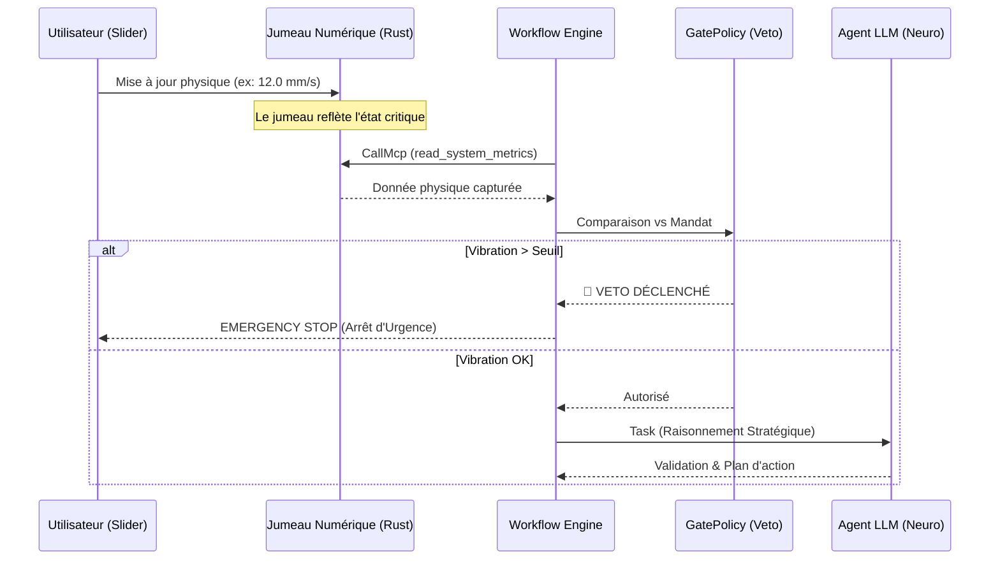
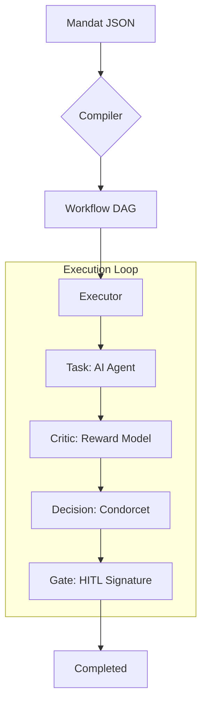

# 🧠 Workflow Engine (Neuro-Symbolic & Sovereign)

Ce module implémente le cœur d'exécution **Neuro-Symbolique** de RAISE.
Il dépasse le simple moteur de script pour devenir une architecture de **Gouvernance par le Code**, mariant :

1. **La Rigueur Constitutionnelle** : Mandats signés cryptographiquement, lignes rouges inviolables (Vetos), compilation déterministe.
2. **L'Intelligence Générative** : Agents IA contextuels, raisonnement dynamique, auto-critique.
3. **L'Ancrage dans le Réel (Grounding)** : Capacité d'agir physiquement sur le système via des outils déterministes (MCP).
4. **Le Consensus Algorithmique** : Résolution de conflits par vote pondéré (Méthode de Condorcet).

---

## 🏛️ Architecture : Cerveau, Mains et Loi

Le système repose sur une séparation stricte des pouvoirs. L'utilisateur (Législateur) ne code pas le workflow ; il définit un **Mandat**. Le système le compile ensuite en une structure exécutable qui orchestre Agents (Probabilistes) et Outils (Déterministes).

| Composant         | Fichier            | Rôle & Responsabilité                                                                                                    |
| ----------------- | ------------------ | ------------------------------------------------------------------------------------------------------------------------ |
| **Mandate**       | `mandate.rs`       | **La Constitution**. Structure JSON signée (Ed25519) définissant la stratégie, les poids politiques et les vetos.        |
| **Compiler**      | `compiler.rs`      | **Le Traducteur**. Transforme le Mandat (Politique) en un Graphe orienté (Technique) via injection de nœuds de contrôle. |
| **Scheduler**     | `scheduler.rs`     | **Le Chef d'Orchestre**. Gère le cycle de vie des instances, la persistance et l'injection des ressources.               |
| **Executor**      | `executor.rs`      | **L'Interface Agentique**. Exécute les tâches, appelle les outils (MCP) et consulte l'IA.                                |
| **Tools (MCP)**   | `tools/`           | **Les Mains**. Modules Rust natifs pour interagir avec le matériel (Jumeau Numérique).                                   |
| **Critic**        | `critic.rs`        | **Le Juge Interne**. Évalue la qualité des réponses de l'IA (Reward Model).                                              |
| **State Machine** | `state_machine.rs` | **Le Navigateur**. Gère la topologie du graphe (DAG) et les transitions d'états.                                         |

---

## ♊ La Notion de Jumeau Numérique (Digital Twin)

Le **Jumeau Numérique** est le pont sémantique entre la réalité physique et le raisonnement de l'IA. Dans RAISE, il sert d'**ancrage (grounding)** pour empêcher les hallucinations et garantir la sécurité.

### 1. Définition et Rôle

Le Jumeau Numérique est une réplique virtuelle dynamique du système :

- **Observation sans risque** : Permettre à l'IA d'analyser l'état du système (vibrations, température) sans interférer avec les processus.
- **Ancrage du Raisonnement** : L'IA ne "devine" pas l'état ; elle consulte le Jumeau pour fonder ses décisions.
- **Boucle de Sécurité (Veto)** : Le moteur compare les données du Jumeau aux seuils du Mandat avant d'autoriser l'action.

### 2. Flux de Données Neuro-Symbolique

---

## 📜 Le Protocole de Mandat

Le moteur ne lance pas un script arbitraire. Il exécute un **Contrat de Gouvernance**.

### 1. Compilation & Injection

Le `WorkflowCompiler` garantit la sécurité par construction :

1. **Vetos** : Ils sont transformés en nœuds `GatePolicy` bloquants.
2. **Fraîcheur des données** : Le compilateur injecte automatiquement des nœuds de lecture (`CallMcp`) **juste avant** les vetos pour forcer la mise à jour du Jumeau Numérique.
3. **Poids** : Les poids politiques sont injectés dans les nœuds `Decision` pour l'arbitrage Condorcet.

### 2. Cycle de vie d'une exécution

---

## 🧩 Modèle de Données (Nœuds)

| Type             | Description       | Comportement                                                                      |
| ---------------- | ----------------- | --------------------------------------------------------------------------------- |
| **`Task`**       | Agent Cognitif    | Exécute une instruction, génère une trace XAI, soumise au **Critique**.           |
| **`CallMcp`**    | Action Système    | Appelle un **Outil Rust** (Lecture Jumeau Numérique, Fichier, API). Déterministe. |
| **`Decision`**   | Vote Condorcet    | Applique les **Poids du Mandat** pour arbitrer entre plusieurs options.           |
| **`GatePolicy`** | Veto              | Vérifie une règle stricte sur les données du contexte. **Bloquant**.              |
| **`GateHitl`**   | Human-In-The-Loop | Pause le workflow pour une signature humaine explicite (RLHF).                    |
| **`Parallel`**   | Fork              | Lance plusieurs branches simultanément.                                           |

---

## 💻 Commandes Tauri Exposées

L'API permet de piloter la gouvernance, l'exécution et le feedback :

- **`submit_mandate(mandate: Mandate)`** : Compile une politique signée en workflow technique.
- **`start_workflow(id)`** : Lance l'exécution d'une instance.
- **`resume_workflow(id, node_id, approved)`** : Feedback humain (RLHF) pour débloquer un `GateHitl`.
- **`get_workflow_state(id)`** : Récupère l'état temps-réel, les logs et le contexte du Jumeau Numérique.

---

_Ce module garantit qu'aucune intelligence probabiliste ne peut outrepasser les limites physiques dictées par le Jumeau Numérique et encadrées par le Mandat._
