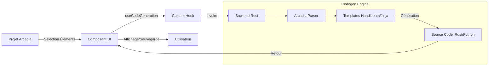

# ⚛️ Frontend Architecture (RAISE)

Ce dossier contient le code source de l'interface utilisateur de **RAISE**.
L'application est une Single Page Application (SPA) robuste construite avec **React 18**, **TypeScript** et **Vite**, conçue pour piloter un backend Rust performant via l'API **Tauri v2**.

## 🏛️ Principes de Conception

L'interface de RAISE n'est pas un simple tableau de bord, c'est une **Console de Gouvernance** qui repose sur quatre piliers :

1.  **Souveraineté Locale** : L'UI communique prioritairement avec des processus locaux (LLM locaux, DB locale).
2.  **Visualisation Spatiale** : Une vue 3D immersive permet de naviguer dans la topologie complexe des systèmes (Nœuds & Flux).
3.  **Transparence XAI** : Chaque décision de l'IA est accompagnée d'une trace d'explicabilité visuelle.
4.  **Réactivité Temps Réel** : Utilisation intensive du pont Rust-TS pour refléter l'état du **Jumeau Numérique**.

---

## 🛠️ Stack Technique

| Technologie           | Usage            | Justification                                                       |
| :-------------------- | :--------------- | :------------------------------------------------------------------ |
| **React 18**          | UI Framework     | Composants fonctionnels et Hooks pour une UI réactive.              |
| **React Three Fiber** | Moteur 3D        | Rendu 3D déclaratif basé sur Three.js pour la visualisation graphe. |
| **TypeScript**        | Langage          | Typage strict pour garantir la cohérence avec les structures Rust.  |
| **Vite**              | Build Tool       | Démarrage instantané et HMR ultra-rapide.                           |
| **Zustand**           | State Management | Gestion d'état global minimaliste pour éviter le "Prop Drilling".   |
| **Tailwind CSS**      | Styling          | Styles utilitaires pour une mise en page rapide et flexible.        |
| **Tauri API**         | Bridge Backend   | Communication asynchrone (`invoke`, `listen`) avec le noyau Rust.   |
| **Playwright**        | Tests E2E        | Validation automatique des scénarios utilisateurs critiques.        |

---

## 📂 Organisation du Code

L'architecture suit une séparation stricte des responsabilités adaptée au Frontend :

```text
src/
├── assets/             # Images, icônes et polices statiques
├── components/         # Bibliothèque de composants UI
│   ├── layout/         # Structure (Header, Sidebar, MainLayout)
│   ├── shared/         # Composants atomiques réutilisables
│   ├── spatial/        # Moteur de visualisation 3D (Scène, Nodes)
│   ├── governance/     # Console de Mandat et Jumeau Numérique
│   └── ai-chat/        # Interface conversationnelle
│
├── hooks/              # Custom Hooks (Logique réutilisable)
│   ├── useGovernance   # Pilotage des workflows et promulgation
│   ├── useDigitalTwin  # Synchronisation temps réel avec les capteurs
│   └── ...
│
├── services/           # Couche de service (API Rust & Logique pure)
│   ├── spatial-service # Gestion de la topologie et des données graphe
│   ├── json-db/        # Wrappers pour la base de données JSON
│   ├── tauri-commands  # Centralisation des identifiants de commandes
│   └── ...
│
├── store/              # Gestion d'état global (Zustand)
│   ├── ui-store.ts     # État de l'interface (Vue 3D/2D, Thèmes)
│   ├── model-store.ts  # État du projet courant
│   └── ...
│
├── styles/             # Fichiers CSS globaux et variables de thème
├── types/              # Définitions TypeScript partagées
├── utils/              # Fonctions utilitaires (Parsers, Formatters)
│
├── App.tsx             # Routeur principal et Orchestration
└── main.tsx            # Point d'entrée (Mount React DOM)

tests/                  # Stratégie de tests
├── unit/               # Tests unitaires (Vitest)
└── e2e/                # Tests de bout en bout (Playwright)

```

---

## 🧠 Gestion d'État (Zustand)

L'application utilise **Zustand** pour partager l'état entre les pages sans complexité.

- **`useUiStore`** : Gère l'état de l'interface (Mode Vue 3D/2D, Sidebar, Thèmes, Sélection d'objets).
- **`useModelStore`** : Cœur de l'application contenant l'objet `ProjectModel` complet (Arbre Arcadia).
- **`useSettingsStore`** : Persiste les configurations utilisateur.
- **`useAiStore`** : Stocke l'historique de la conversation avec l'assistant.

---

## 🌌 Visualisation Spatiale (Hybrid View)

RAISE intègre un mode de vue hybride innovant :

- **Mode 2D** : Interface classique pour la gestion et l'édition de formulaires.
- **Mode 3D** : Une scène spatiale interactve (WebGL) qui affiche la topologie du système sous forme de graphe de force.

Le `MainLayout` gère la superposition des deux couches, permettant de basculer instantanément ou de superposer les informations via le `Header`.

---

## 🧬 Flux de Génération de Code

Le système de génération transforme les modèles d'architecture en code source via une communication structurée avec le backend.



---

## 🚀 Commandes de Développement

```bash
# Installer les dépendances JS
npm install

# Lancer le serveur de dev (Backend Rust + Vite)
npm run tauri dev

# Lancer les Tests Unitaires (Vitest)
npm run test

# Lancer les Tests End-to-End (Playwright)
npx playwright test

# Linter le code TypeScript
npm run lint

# Construire l'exécutable final
npm run tauri build

```

---

_Ce module garantit une interface réactive où chaque interaction est ancrée dans la réalité physique du Jumeau Numérique et visualisable spatialement._

```

```
