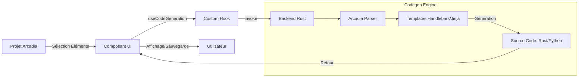
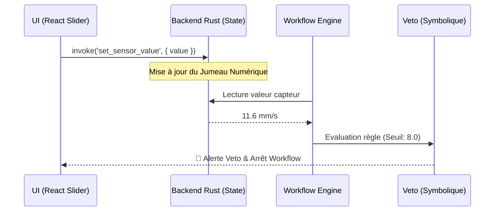

# ⚛️ Frontend Architecture (RAISE)

Ce dossier contient le code source de l'interface utilisateur de **RAISE**.
L'application est une Single Page Application (SPA) robuste construite avec **React 18**, **TypeScript** et **Vite**, conçue pour piloter un backend Rust performant via l'API **Tauri v2**.

## 🏛️ Principes de Conception

L'interface de RAISE n'est pas un simple tableau de bord, c'est une **Console de Gouvernance** qui repose sur trois piliers :

1.  **Souveraineté Locale** : L'UI communique prioritairement avec des processus locaux (LLM locaux, DB locale).
2.  **Transparence XAI** : Chaque décision de l'IA est accompagnée d'une trace d'explicabilité visuelle.
3.  **Réactivité Temps Réel** : Utilisation intensive du pont Rust-TS pour refléter l'état du **Jumeau Numérique**.

---

## 🛠️ Stack Technique

| Technologie     | Usage            | Justification                                                      |
| :-------------- | :--------------- | :----------------------------------------------------------------- |
| **React 18**    | UI Framework     | Composants fonctionnels et Hooks pour une UI réactive.             |
| **TypeScript**  | Langage          | Typage strict pour garantir la cohérence avec les structures Rust. |
| **Vite**        | Build Tool       | Démarrage instantané et HMR ultra-rapide.                          |
| **Zustand**     | State Management | Gestion d'état global minimaliste pour éviter le "Prop Drilling".  |
| **CSS Modules** | Styling          | Styles scopés localement avec support natif des variables CSS.     |
| **Tauri API**   | Bridge Backend   | Communication asynchrone (`invoke`, `listen`) avec le noyau Rust.  |

---

## 📂 Organisation du Code

L'architecture suit une séparation stricte des responsabilités adaptée au Frontend :

```text
src/
├── assets/             # Images, icônes et polices statiques
├── components/         # Bibliothèque de composants UI
│   ├── layout/         # Structure (Header, Sidebar)
│   ├── shared/         # Composants atomiques réutilisables
│   ├── governance/     # Console de Mandat et Jumeau Numérique
│   └── ai-chat/        # Interface conversationnelle
│
├── hooks/              # Custom Hooks (Logique réutilisable)
│   ├── useGovernance   # Pilotage des workflows et promulgation
│   ├── useDigitalTwin  # Synchronisation temps réel avec les capteurs
│   └── ...
│
├── services/           # Couche de service (API Rust & Logique pure)
│   ├── json-db/        # Wrappers pour la base de données JSON
│   ├── tauri-commands  # Centralisation des identifiants de commandes
│   └── ...
│
├── store/              # Gestion d'état global (Zustand)
│   ├── model-store.ts  # État du projet courant
│   ├── settings-store.ts # Configuration app (IA, DB path)
│   └── ...
│
├── styles/             # Fichiers CSS globaux et variables de thème
├── types/              # Définitions TypeScript partagées
├── utils/              # Fonctions utilitaires (Parsers, Formatters)
│
├── App.tsx             # Routeur principal et Orchestration
└── main.tsx            # Point d'entrée (Mount React DOM)
```

---

## 🧠 Gestion d'État (Zustand)

L'application utilise **Zustand** pour partager l'état entre les pages sans complexité.

- **`useModelStore`** : Cœur de l'application contenant l'objet `ProjectModel` complet (Arbre Arcadia).
- **`useSettingsStore`** : Persiste les configurations utilisateur comme le choix du backend IA ou les chemins de base de données.
- **`useUiStore`** : Gère l'état de l'interface pure (Sidebar, thèmes).
- **`useAiStore`** : Stocke l'historique de la conversation avec l'assistant.

---

## 🧬 Flux de Génération de Code

Le système de génération transforme les modèles d'architecture en code source via une communication structurée avec le backend.



---

## ♊ Le Jumeau Numérique dans l'UI

L'interface implémente une visualisation dynamique du **Digital Twin**. Elle permet de manipuler des simulateurs physiques (sliders) qui impactent directement le contexte décisionnel de l'IA.



---

## 🔌 Services & Hooks (Lien Frontend-Backend)

### 1. Custom Hooks (`src/hooks/`)

| Hook                 | Rôle                                                      | Commande Tauri associée             |
| -------------------- | --------------------------------------------------------- | ----------------------------------- |
| **`useGovernance`**  | Gère la soumission des Mandats et le suivi des Workflows. | `workflow_submit`, `workflow_start` |
| **`useDigitalTwin`** | Écoute les événements système et met à jour les jauges.   | `set_sensor_value`                  |
| **`useRulesEngine`** | Gère la mise à jour des champs calculés (GenRules).       | `jsondb_evaluate_draft`             |
| **`useAIChat`**      | Gère l'historique et l'état "Thinking" de l'IA.           | `ai_chat`                           |

### 2. Services (`src/services/`)

| Service                 | Description                                                   |
| ----------------------- | ------------------------------------------------------------- |
| **`modelService`**      | Charge un modèle Arcadia complet en mémoire depuis JSON-DB.   |
| **`collectionService`** | CRUD complet sur la base de données (Collections, Documents). |
| **`codegenService`**    | Transforme le modèle en code source (Rust, Python).           |

---

## 🚀 Commandes de Développement

```bash
# Installer les dépendances JS
npm install

# Lancer le serveur de dev (Backend Rust + Vite)
cargo tauri dev

# Linter le code TypeScript
npm run lint

# Construire l'exécutable final
cargo tauri build

```

---

_Ce module garantit une interface réactive où chaque interaction est ancrée dans la réalité physique du Jumeau Numérique._

```

```
